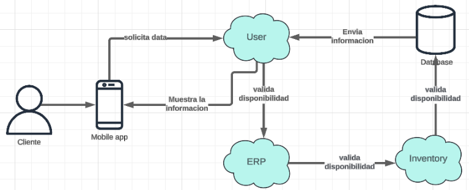

  

<h3 align="center"> Universidad Peruana de Ciencias Aplicadas</h3>
<h4 align="center"> Ingeniería de Software  </h4>
<h4 align="center"> Arquitectura de Foftware Emergentes </h4>
<h4 align="center"> Informe de Trabajo Final </h4>

### Startup: Debuggers
#### Team Members
- Arrunátegui Aguilar, Josué David 
- Causso Mariano, Giakomo Rodolfo
- Chero Eme, Eduardo Andre
- Dávila Ramirez, Yoimer Yanir
- Melgar Takahashi, Adrian Gonzalo
#### Sección: SI728
#### Royer Edelwer Rojas Malasquez
#### Producto: LockItem
#### Ciclo: 2024-02
<h4 align="center"> Agosto, 2024</h4>

___
# Registro de versiones del informe

| Versión | Fecha      | Autor            | Descripción de modificación                                                |
|---------|------------|------------------|----------------------------------------------------------------------------|
| 1.0     | 30/08/24   | Eduardo Chero    | Creación del archivo base en Markdown para el desarrollo del Final Project |

---
# Contenido 
- [Student Outcome](#student-outcome)
- [Capítulo I: Introducción](#capítulo-i-introducción)
  - [1.1. Startup Profile](#11-startup-profile)
    - [1.1.1. Descripción de la Startup](#111-descripción-de-la-startup)
    - [1.1.2. Perfiles de integrantes del equipo](#112-perfiles-de-integrantes-del-equipo)
  - [1.2. Solution Profile](#12-solution-profile)
    - [1.2.1 Antecedentes y problemática](#121-antecedentes-y-problemática)
    - [1.2.2 Lean UX Process](#122-lean-ux-process)
      - [1.2.2.1. Lean UX Problem Statements](#1221-lean-ux-problem-statements)
      - [1.2.2.2. Lean UX Assumptions](#1222-lean-ux-assumptions)
      - [1.2.2.3. Lean UX Hypothesis Statements](#1223-lean-ux-hypothesis-statements)
      - [1.2.2.4. Lean UX Canvas](#1224-lean-ux-canvas)
  - [1.3. Segmentos objetivo](#13-segmentos-objetivo)
- [Capítulo II: Requirements Elicitation \& Analysis](#capítulo-ii-requirements-elicitation--analysis)
  - [2.1. Competidores](#21-competidores)
    - [2.1.1. Análisis competitivo](#211-análisis-competitivo)
    - [2.1.2. Estrategias y tácticas frente a competidores](#212-estrategias-y-tácticas-frente-a-competidores)
  - [2.2. Entrevistas](#22-entrevistas)
    - [2.2.1. Diseño de entrevistas](#221-diseño-de-entrevistas)
    - [2.2.2. Registro de entrevistas](#222-registro-de-entrevistas)
    - [2.2.3. Análisis de entrevistas](#223-análisis-de-entrevistas)
  - [2.3. Needfinding](#23-needfinding)
    - [2.3.1. User Personas](#231-user-personas)
    - [2.3.2. User Task Matrix](#232-user-task-matrix)
    - [2.3.3. Empathy Mapping](#233-empathy-mapping)
    - [2.3.4. As-is Scenario Mapping](#234-as-is-scenario-mapping)
  - [2.4. Ubiquitous Language](#24-ubiquitous-language)
- [Capítulo III: Requirements Specification](#capítulo-iii-requirements-specification)
  - [3.1. To-Be Scenario Mapping](#31-to-be-scenario-mapping)
  - [3.2. User Stories](#32-user-stories)
  - [3.3. Impact Mapping](#33-impact-mapping)
  - [3.4. Product Backlog](#34-product-backlog)
- [Capítulo IV: Strategic-Level Software Design](#capítulo-iv-strategic-level-software-design)
  - [4.1. Strategic-Level Attribute-Driven Design](#41-strategic-level-attribute-driven-design)
    - [4.1.1. Design Purpose](#411-design-purpose)
    - [4.1.2. Attribute-Driven Design Inputs](#412-attribute-driven-design-inputs)
      - [4.1.2.1. Primary Functionality (Primary User Stories)](#4121-Primary-functionality-(-primary-user-stories-))
      - [4.1.2.2. Quality attribute Scenarios](#4122-quality-attribute-scenarios)
      - [4.1.2.3. Constraints](#4123-constraints)
    - [4.1.3. Architectural Drivers Backlog](#413-architectural-drivers-backlog)
    - [4.1.4. Architectural Design Decisions](#414-architectural-design-decisions)
    - [4.1.5. Quality Attribute Scenario Refinements](#415-quality-attribute-scenario-refinements)
  - [4.2. Strategic-Level Domain-Driven Design](#42-strategic-level-domain-driven-design)
    - [4.2.1. EventStorming](#421-eventstorming)
    - [4.2.2. Candidate Context Discovery](#422-candidate-context-discovery)
    - [4.2.3. Domain Message Flows Modeling](#423-domain-message-flows-modeling)
    - [4.2.4. Bounded Context Canvases](#424-bounded-context-canvases)
    - [4.2.5. Context Mapping](#425-context-mapping)
  - [4.3. Software Architecture](#43-software-architecture)
    - [4.3.1. Software Architecture System Landscape Diagram](#431-software-architecture-system-landscape-diagram)
    - [4.3.2. Software Architecture Context Level Diagrams](#432-software-architecture-context-level-diagrams)
    - [4.3.3. Software Architecture Container Level Diagrams](#433-software-architecture-container-level-diagrams)
    - [4.3.4. Software Architecture Deployment Diagrams](#434-software-architecture-deployment-diagrams)

---

# Student Outcome

| Criterio Específico                                                                             | Acciones Realizadas | Conclusiones |
|-------------------------------------------------------------------------------------------------|---------------------|--------------|
| ABET – EAC - Student Outcome 3: Capacidad de comunicarse efectivamente con un rango de audiencias.                                |                     |              |

---

# Capítulo I: Introducción
## 1.1. Startup Profile
### 1.1.1. Descripción de la Startup

Debuggers ha desarrollado **LockItem**, una solución basada en IoT que permite a los clientes de tiendas de ropa localizar prendas que han sido movidas de su lugar original. Mediante sensores integrados en las etiquetas de seguridad de las prendas, los usuarios pueden acceder al catálogo de la tienda a través de una app móvil, seleccionar el artículo que desean, y recibir la ubicación precisa en tiempo real. Esta tecnología mejora la experiencia de compra al reducir el tiempo de búsqueda y aumenta la eficiencia operativa de las tiendas. 

LockItem, desarrollado por Debuggers, no solo optimiza el flujo de clientes en los establecimientos, sino que también contribuye a una gestión de inventario más efectiva para los minoristas. Al ofrecer una experiencia de compra más fluida y tecnológicamente avanzada, Debuggers se posiciona como un innovador en la transformación digital del sector minorista, conectando el mundo físico y digital a través de soluciones IoT. 

**Misión:**

En Debuggers, nuestra misión es desarrollar soluciones tecnológicas innovadoras que conecten el mundo físico y digital, proporcionando a las empresas minoristas en el Perú herramientas basadas en IoT para una gestión eficiente de productos. Nos enfocamos en mejorar la experiencia de compra de los clientes, optimizando la localización de productos en tiempo real, y ayudando a nuestros socios comerciales a maximizar su eficiencia operativa. 

**Visión:**

Convertirnos en la empresa líder en la implementación de tecnologías IoT para el sector minorista en el Perú, impulsando una transformación digital que permita a las tiendas físicas adaptarse a los desafíos del futuro. Aspiramos a que nuestras soluciones revolucionen la gestión de inventarios y la experiencia de compra, estableciendo nuevos estándares en la industria minorista peruana y contribuyendo al crecimiento de un ecosistema comercial más moderno y eficiente. 

### 1.1.2. Perfiles de integrantes del equipo

| Integrante        | Arrunátegui Aguilar, Josué David                        |
|-------------------|---------------------------------------------------------|
| **Código:** U202111033   **Carrera:** Ingeniería de Software   **Acerca de mí:** Me gusta dibujar, tocar guitarra y jugar videojuegos. Tengo conocimiento en el desarrollo frontend con lenguajes como angular y vue.js, así como desarrollo móvil con flutter. Planeo especializarme en desarrollo web o como Analista de Datos. |  |

| Integrante        | Causso Mariano, Giakomo Rodolfo                         |
|-----------------------------------------------------------------------------|
| **Código:**     **Carrera:** Ingeniería de Software   **Acerca de mí:** |  |

| Integrante                                                                                                                                                                                                                                                                                                                               | Chero Eme, Eduardo Andre                                    |
|------------------------------------------------------------------------------------------------------------------------------------------------------------------------------------------------------------------------------------------------------------------------------------------------------------------------------------------|-------------------------------------------------------------|
| **Código:** U20201F282   **Carrera:** Ingeniería de software   **Acerca de mí:** Me gustan los videojuegos y las series, quiero especializarme en ciberseguridad para tener una ganancia estable mientras creo videojuegos aparte por pasión. Con experiencia en backend y en frontend con tecnologias como Spring Boot y Angular. |  |

| Integrante                                                                                                                                                                                                                                                                                  | Dávila Ramirez, Yoimer Yanir                              |
|---------------------------------------------------------------------------------------------------------------------------------------------------------------------------------------------------------------------------------------------------------------------------------------------|-----------------------------------------------------------|
| **Código:**  U20201B973    **Carrera:** Ingeniería de Software   **Acerca de mí:** Soy un apasionado de la programación, la tecnología y los videojuegos. Me encanta explorar nuevas herramientas y lenguajes de programación para resolver problemas de manera creativa y eficiente. |  |

| Integrante                                                                                                                                                                                                                                                                                                                               | Chero Eme, Eduardo Andre                                    |
|------------------------------------------------------------------------------------------------------------------------------------------------------------------------------------------------------------------------------------------------------------------------------------------------------------------------------------------|-------------------------------------------------------------|
| **Código:** U201819465   **Carrera:** Ingeniería de software   **Acerca de mí:** Soy un entusiasta de la tecnología en diversas facetas, y también disfruto colaborar en proyectos en equipo. En cuanto a mis habilidades, sobresale mi experiencia en liderazgo, conocimientos en metodologías ágiles, competencia en codificación utilizando lenguajes como HTML, CSS, JavaScript y Python, y experiencia en la gestión de bases de datos como MySQL, SQL Server y MongoDB. |  |

## 1.2. Solution Profile
### 1.2.1 Antecedentes y problemática
El solution profile utilizando la metodología **5W2H** (What, Why, Where, When, Who, How, How much) te ayudará a estructurar claramente tu propuesta de LockItem. A continuación te doy una guía detallada para que puedas desarrollarlo:

**1. What (Qué):** 

LockItem es una solución tecnológica basada en IoT que permite a los clientes localizar prendas de ropa dentro de tiendas físicas, mejorando la experiencia de compra. Utiliza sensores integrados en las etiquetas de seguridad de las prendas para identificar en tiempo real su ubicación dentro de la tienda, y presenta esa información a través de una aplicación móvil conectada. 

**2. Why (Por qué):** 

El problema que se busca resolver es la dificultad que enfrentan los clientes cuando las prendas son movidas de su ubicación original. Esto puede resultar en una experiencia de compra frustrante, pérdida de tiempo y, en algunos casos, en la decisión del cliente de no realizar la compra. Además, ayuda a las tiendas a optimizar la gestión de inventario y mejorar la eficiencia operativa. 

**3. Where (Dónde):** 

LockItem está pensado para el mercado minorista de ropa en el Perú. Las tiendas afiliadas serían aquellas que buscan optimizar la experiencia de compra física mediante tecnología, principalmente en grandes centros comerciales y tiendas de departamentos en áreas urbanas. 

**4. When (Cuándo):**

La solución está diseñada para ser implementada durante las etapas de alta demanda en las tiendas, como temporadas de rebajas, campañas navideñas o de vuelta a clases, cuando la búsqueda de productos es más caótica. Además, puede funcionar de manera continua para mejorar la experiencia del cliente en cualquier momento del año. 

**5. Who (Quiénes):**

Los usuarios principales de LockItem son los clientes de las tiendas afiliadas, quienes podrán localizar sus productos de manera eficiente. Por otro lado, los empleados de las tiendas también se beneficiarán al poder tener un mayor control sobre el inventario en tiempo real. Los socios comerciales incluyen las tiendas minoristas que buscan mejorar la experiencia de compra y optimizar la gestión de sus productos. 

**6. How (Cómo):**

La solución utiliza tecnología IoT mediante sensores instalados en las etiquetas de seguridad de las prendas. Estos sensores están conectados a una plataforma que se integra con una app móvil. Los clientes usan la app para buscar una prenda, y la app les muestra la ubicación exacta dentro de la tienda en tiempo real. Las tiendas afiliadas podrán implementar los sensores en sus sistemas de seguridad y vincularlos a la base de datos de productos. 

**7. How much (Cuánto cuesta):**

El costo del sistema dependerá del tamaño de la tienda y la cantidad de productos a sensar. Se contemplan costos iniciales de implementación de los sensores y la infraestructura IoT, junto con una suscripción mensual o anual para el mantenimiento de la plataforma y la app. Además, el precio puede variar dependiendo del nivel de personalización que requiera cada tienda afiliada. 

### 1.2.2 Lean UX Process
#### 1.2.2.1. Lean UX Problem Statements

**1. Problem Statement (Cliente):** 

Nuestro entorno evidencia que los clientes de tiendas de ropa en Perú a menudo experimentan frustración y descontento al no encontrar las prendas que buscan en su lugar habitual debido a que otros compradores las mueven dentro del establecimiento. Esto no solo genera una mala experiencia de compra, sino que, en algunos casos, los clientes optan por no adquirir el producto y abandonan la tienda sin realizar una compra. 

Hemos observado que un factor crítico que afecta a los clientes es la dificultad para localizar productos dentro de la tienda cuando han sido desplazados, lo que incrementa el tiempo invertido en la búsqueda y disminuye la satisfacción general con la experiencia de compra. 

**¿Cómo podemos diseñar una solución tecnológica que permita a los clientes localizar fácilmente las prendas dentro de la tienda, mejorando así su experiencia de compra y evitando que abandonen sin realizar una compra?**

**2. Problem Statement (Negocio):**

Nuestro entorno evidencia que las tiendas de ropa en Perú enfrentan desafíos para mantener sus prendas organizadas y fácilmente accesibles para los clientes, lo que impacta negativamente en la eficiencia operativa y en las ventas. La dificultad para rastrear el movimiento de las prendas dentro del establecimiento también provoca ineficiencias en la gestión del inventario y una experiencia insatisfactoria para los compradores. 

Hemos observado que un factor crítico que afecta a las tiendas es la incapacidad para monitorear en tiempo real la ubicación de las prendas que han sido movidas, lo que conlleva a pérdidas en ventas y una mayor carga operativa para los empleados encargados de la reubicación de productos. 

**¿Cómo podemos implementar una solución IoT eficiente que permita a las tiendas rastrear el movimiento de las prendas dentro del establecimiento y optimizar la gestión de inventarios mientras se mejora la experiencia del cliente?**

#### 1.2.2.2. Lean UX Assumptions

**Business Assumptions (Suposiciones de Negocio):** 

- Las tiendas minoristas estarán dispuestas a adoptar tecnologías IoT para mejorar la localización de productos, ya que ven valor en optimizar la experiencia de compra y la gestión de inventarios. 

- El mercado minorista en Perú tiene el presupuesto y los recursos para implementar una solución como LockItem, que implica sensores IoT, una app y la integración con sus sistemas de inventario existentes. 

- La mejora en la experiencia de compra llevará a un aumento en las ventas, ya que los clientes que encuentran lo que buscan rápidamente tienen más probabilidades de realizar compras y fidelizarse con la tienda. 

- Las tiendas estarán dispuestas a pagar por una suscripción o servicio continuo para mantener el sistema LockItem funcionando, incluyendo actualizaciones y mantenimiento del sistema. 

- Las tiendas que implementen LockItem mejorarán su competitividad en el mercado peruano, ya que estarán ofreciendo una solución innovadora que optimiza la experiencia del cliente. 

**User Assumptions (Suposiciones de Usuario):**

- Los clientes valoran el tiempo y la eficiencia cuando compran en tiendas físicas y están dispuestos a usar una app móvil que les ayude a localizar rápidamente las prendas que buscan. 

- Los usuarios confían en las soluciones tecnológicas y no tendrán problemas en adoptar la aplicación móvil para mejorar su experiencia de compra, siempre que esta sea intuitiva y fácil de usar. 

- Los clientes están frustrados por no encontrar las prendas en su lugar original, lo que les genera una experiencia de compra insatisfactoria y los motiva a buscar soluciones que mejoren ese aspecto. 

- Los usuarios están familiarizados con las aplicaciones móviles y con las tecnologías de localización, lo que facilitará la adopción de LockItem sin necesidad de un aprendizaje extenso. 

- Los usuarios están dispuestos a proporcionar datos básicos a través de la app (como ubicación en la tienda o preferencias de búsqueda) si esto les permite acceder a una experiencia de compra más eficiente y personalizada. 

#### 1.2.2.3. Lean UX Hypothesis Statements

Las hipótesis son afirmaciones que pueden probarse a través de experimentos y validaciones. Aquí algunas hipótesis para LockItem: 

Creemos que permitir a los clientes localizar rápidamente las prendas que buscan a través de la app será útil para compradores que valoran su tiempo, ya que les permitirá evitar frustraciones y optimizar su proceso de compra. Esto es importante porque facilitará la búsqueda de productos, reduciendo el tiempo en la tienda. Esperamos que esto incremente la satisfacción del cliente y como resultado, observemos un aumento en la probabilidad de compra en un 15%. 

Creemos que integrar sensores IoT en las prendas será beneficioso para los empleados de las tiendas que gestionan inventarios, ya que reducirá el tiempo invertido en reubicar productos y mejorará la precisión de los inventarios. Esto es importante porque permitirá una gestión más eficiente del stock. Esperamos que los empleados puedan dedicar más tiempo a otras tareas importantes y como resultado, se reducirá el tiempo invertido en la reubicación de prendas en un 25%. 

Creemos que proporcionar a las tiendas acceso a datos analíticos sobre el movimiento de productos será útil para los gerentes y encargados de piso, ya que les permitirá reorganizar mejor el espacio de ventas en función del comportamiento del cliente. Esto es importante porque optimizar la disposición de los productos aumentará las interacciones del cliente con los artículos. Esperamos que esto incremente las ventas en las áreas más estratégicas y como resultado, veamos un aumento de las ventas en estas áreas en un 10%. 

Creemos que permitir a los clientes recibir notificaciones sobre la reubicación o disponibilidad de productos en tiempo real será útil para compradores que están interesados en productos específicos, ya que les proporcionará información personalizada. Esto es importante porque ayudará a mantener a los clientes comprometidos con la tienda. Esperamos que esto aumente la frecuencia de visitas de los clientes y como resultado, incrementemos el tráfico en la tienda en un 12%. 

Creemos que mostrar la disponibilidad de tallas y colores en tiempo real en la app será útil para compradores indecisos o que buscan múltiples opciones, ya que podrán verificar la disponibilidad antes de dirigirse a la tienda o probarse las prendas. Esto es importante porque reducirá las consultas al personal de la tienda y acelerará el proceso de compra. Esperamos que esto mejore la eficiencia operativa y como resultado, disminuya las consultas al personal en un 20%. 

#### 1.2.2.4. Lean UX Canvas

Canvas link: [Lockitem canvas](https://miro.com/app/board/uXjVKhk9JzU=/?share_link_id=865796187242)

## 1.3. Segmentos objetivo

**1. Clientes de tiendas de ropa** 

Hombres y mujeres de entre 18 y 45 años, residentes en zonas urbanas de Perú, que prefieren comprar en tiendas físicas y valoran la rapidez y eficiencia al buscar productos. Estos clientes son usuarios familiarizados con smartphones y aplicaciones móviles, y buscan una experiencia de compra fluida y sin frustraciones. Están motivados por el deseo de ahorrar tiempo y obtener un servicio más eficiente mientras realizan sus compras en tiendas de ropa. 

**2. Dueños de tiendas de ropa:** 

Propietarios de tiendas de ropa, hombres y mujeres de entre 21 y 55 años, que buscan optimizar la gestión de sus inventarios y mejorar la experiencia de compra de sus clientes. Están familiarizados con la tecnología y dispuestos a adoptar soluciones innovadoras, como IoT y aplicaciones móviles, para mejorar la eficiencia operativa y aumentar las ventas. Estos dueños están motivados por la necesidad de reducir costos de mano de obra, mejorar el servicio al cliente, y mantenerse competitivos en el mercado minorista peruano. 

# Capítulo II: Requirements Elicitation & Analysis
## 2.1. Competidores
### 2.1.1. Análisis competitivo
### 2.1.2. Estrategias y tácticas frente a competidores
## 2.2. Entrevistas
### 2.2.1. Diseño de entrevistas
### 2.2.2. Registro de entrevistas
### 2.2.3. Análisis de entrevistas
## 2.3. Needfinding
### 2.3.1. User Personas
### 2.3.2. User Task Matrix
### 2.3.3. Empathy Mapping
### 2.3.4. As-is Scenario Mapping
## 2.4. Ubiquitous Language
# Capítulo III: Requirements Specification
## 3.1. To-Be Scenario Mapping
## 3.2. User Stories
## 3.3. Impact Mapping
## 3.4. Product Backlog
# Capítulo IV: Strategic-Level Software Design
## 4.1. Strategic-Level Attribute-Driven Design
### 4.1.1. Design Purpose
### 4.1.2. Attribute-Driven Design Inputs
#### 4.1.2.1. Primary Functionality (Primary User Stories)
#### 4.1.2.2. Quality attribute Scenarios
#### 4.1.2.3. Constraints

<table border="1" cellpadding="10">
  <thead>
    <tr>
      <th>Technical Story ID</th>
      <th>Título</th>
      <th>Descripción</th>
      <th>Criterios de Aceptación</th>
      <th>Relacionado con (Epic ID)</th>
    </tr>
  </thead>
  <tbody>
    <tr>
      <td>CS01</td>
      <td>Seguridad de Datos</td>
      <td>La seguridad es una prioridad. La información del cliente y del inventario debe ser protegida contra accesos no autorizados y cumplir con las normativas de protección de datos locales (GDPR/LPDP).</td>
      <td>DADO que un intento de acceso no autorizado es detectado, ENTONCES el sistema debe bloquear el acceso y notificar al administrador en menos de 1 minuto.</td>
      <td>EP02</td>
    </tr>
    <tr>
      <td>CS02</td>
      <td>Rendimiento de Respuesta</td>
      <td>El sistema debe ser capaz de responder rápidamente a las solicitudes de localización de prendas, sin comprometer la experiencia de usuario, independientemente de la carga del sistema.</td>
      <td>DADO que un cliente busque una prenda en la app, ENTONCES la ubicación debe mostrarse en menos de 2 segundos bajo condiciones normales de operación.</td>
      <td>EP01</td>
    </tr>
    <tr>
      <td>CS03</td>
      <td>Alta Disponibilidad</td>
      <td>El sistema debe asegurar alta disponibilidad, garantizando que la aplicación esté operativa incluso en casos de fallos de servidores o incrementos repentinos de tráfico.</td>
      <td>DADO que falle un servidor, ENTONCES el sistema debe redirigir las operaciones a un servidor de respaldo en menos de 10 segundos para asegurar continuidad de servicio.</td>
      <td>EP02</td>
    </tr>
    <tr>
      <td>CS04</td>
      <td>Escalabilidad Automática</td>
      <td>El sistema debe escalar automáticamente para soportar incrementos en el número de usuarios, asegurando un desempeño continuo sin degradación, particularmente durante eventos de alto tráfico como promociones o rebajas.</td>
      <td>DADO que el número de usuarios del sistema aumente significativamente, ENTONCES la infraestructura debe escalar automáticamente sin afectar el tiempo de respuesta, en menos de 5 minutos.</td>
      <td>EP02</td>
    </tr>
    <tr>
      <td>CS05</td>
      <td>Integración con Sistemas ERP</td>
      <td>El sistema debe integrarse de manera fluida con los sistemas ERP existentes en las tiendas, garantizando que los datos de inventario estén siempre sincronizados y actualizados en tiempo real.</td>
      <td>DADO que se realice una operación de inventario en el sistema ERP, ENTONCES los cambios deben reflejarse en el sistema <strong>LockItem</strong> en menos de 10 segundos.</td>
      <td>EP02</td>
    </tr>
    <tr>
      <td>CS06</td>
      <td>Compatibilidad de Dispositivos</td>
      <td>La aplicación móvil debe ser compatible con una amplia gama de dispositivos móviles y sistemas operativos para maximizar la cantidad de usuarios potenciales.</td>
      <td>DADO que un cliente utilice la app en dispositivos Android o iOS, ENTONCES la app debe funcionar de manera fluida y sin errores, manteniendo la interfaz responsive en todos los casos.</td>
      <td>EP01</td>
    </tr>
  </tbody>
</table>

### 4.1.3. Architectural Drivers Backlog

<table border="1" cellpadding="10">
  <thead>
    <tr>
      <th>Driver ID</th>
      <th>Título de Driver</th>
      <th>Descripción</th>
      <th>Importancia para Stakeholders</th>
      <th>Impacto en Architecture Technical Complexity</th>
    </tr>
  </thead>
  <tbody>
    <tr>
      <td>AD01</td>
      <td>Rendimiento en la Localización de Prendas</td>
      <td>El sistema debe permitir la localización rápida y precisa de prendas para mejorar la experiencia del cliente, mostrando la ubicación en menos de 2 segundos.</td>
      <td>High</td>
      <td>High</td>
    </tr>
    <tr>
      <td>AD02</td>
      <td>Seguridad de Datos</td>
      <td>La protección de la información del cliente y del inventario es crítica, cumpliendo con las normativas de privacidad y bloqueando accesos no autorizados.</td>
      <td>High</td>
      <td>High</td>
    </tr>
    <tr>
      <td>AD03</td>
      <td>Alta Disponibilidad</td>
      <td>El sistema debe asegurar su operatividad continua, incluso en caso de fallos de servidor o sobrecarga de tráfico, garantizando un tiempo de recuperación menor a 10 segundos.</td>
      <td>High</td>
      <td>High</td>
    </tr>
    <tr>
      <td>AD04</td>
      <td>Escalabilidad Automática</td>
      <td>La infraestructura debe escalar automáticamente para soportar aumentos en el número de usuarios sin afectar el rendimiento.</td>
      <td>Medium</td>
      <td>High</td>
    </tr>
    <tr>
      <td>AD05</td>
      <td>Integración con ERP</td>
      <td>El sistema debe integrarse con los sistemas ERP existentes en las tiendas, sincronizando el inventario en tiempo real con un desfase máximo de 10 segundos.</td>
      <td>High</td>
      <td>Medium</td>
    </tr>
    <tr>
      <td>AD06</td>
      <td>Compatibilidad con Dispositivos Móviles</td>
      <td>La app móvil debe ser compatible con una amplia gama de dispositivos, incluyendo sistemas operativos Android e iOS, y ofrecer una interfaz fluida y responsive.</td>
      <td>Medium</td>
      <td>Medium</td>
    </tr>
    <tr>
      <td>AD07</td>
      <td>Monitoreo de Stock en Tiempo Real</td>
      <td>El sistema debe mostrar el stock actualizado en tiempo real, permitiendo a los operadores ver la cantidad exacta de prendas disponibles en todo momento.</td>
      <td>Medium</td>
      <td>Medium</td>
    </tr>
  </tbody>
</table>

### 4.1.4. Architectural Design Decisions

<table border="1" cellpadding="10">
  <thead>
    <tr>
      <th>Driver ID</th>
      <th>Título de Driver</th>
      <th>Pattern 1</th>
      <th>Pro</th>
      <th>Con</th>
      <th>Pattern 2</th>
      <th>Pro</th>
      <th>Con</th>
      <th>Pattern 3</th>
      <th>Pro</th>
      <th>Con</th>
    </tr>
  </thead>
  <tbody>
    <tr>
      <td>AD01</td>
      <td>Rendimiento en la Localización de Prendas</td>
      <td>Event-Driven Architecture</td>
      <td>Alta capacidad de respuesta</td>
      <td>Complejidad en el manejo de eventos</td>
      <td>Microservices</td>
      <td>Escalabilidad independiente</td>
      <td>Mayor complejidad de gestión</td>
      <td>Monolithic</td>
      <td>Simplicidad de implementación</td>
      <td>Escalabilidad limitada</td>
    </tr>
    <tr>
      <td>AD02</td>
      <td>Seguridad de Datos</td>
      <td>Layered Security</td>
      <td>Defensa en profundidad</td>
      <td>Mayor coste de implementación</td>
      <td>Token-Based Authentication</td>
      <td>Menor latencia en autenticación</td>
      <td>Complejidad de integración</td>
      <td>OAuth 2.0</td>
      <td>Estándar ampliamente adoptado</td>
      <td>Configuración compleja</td>
    </tr>
    <tr>
      <td>AD03</td>
      <td>Alta Disponibilidad</td>
      <td>Load Balancing</td>
      <td>Distribución eficiente de tráfico</td>
      <td>Configuración inicial compleja</td>
      <td>Failover Clustering</td>
      <td>Redundancia de servidores</td>
      <td>Costo adicional en infraestructura</td>
      <td>Redundancy via Replication</td>
      <td>Alta disponibilidad de datos</td>
      <td>Sincronización lenta en grandes volúmenes</td>
    </tr>
    <tr>
      <td>AD04</td>
      <td>Escalabilidad Automática</td>
      <td>Horizontal Scaling</td>
      <td>Escalabilidad flexible</td>
      <td>Mayor complejidad de orquestación</td>
      <td>Vertical Scaling</td>
      <td>Simplicidad en administración</td>
      <td>Limitaciones físicas del hardware</td>
      <td>Containerization</td>
      <td>Implementación ágil y flexible</td>
      <td>Mayor uso de recursos</td>
    </tr>
    <tr>
      <td>AD05</td>
      <td>Integración con ERP</td>
      <td>RESTful API</td>
      <td>Interoperabilidad sencilla</td>
      <td>Limitaciones en manejo de grandes datos</td>
      <td>Message Queues</td>
      <td>Desacoplamiento de servicios</td>
      <td>Mayor latencia en la comunicación</td>
      <td>SOAP</td>
      <td>Estándar robusto</td>
      <td>Mayor sobrecarga en mensajes</td>
    </tr>
  </tbody>
</table>

### 4.1.5. Quality Attribute Scenario Refinements

## 4.2. Strategic-Level Domain-Driven Design
### 4.2.1. EventStorming

### 4.2.2. Candidate Context Discovery
Paso 1:  

Paso 2: 

Paso 3: 

Paso 4: 

Paso 5: 

Paso 6: 

Paso 7: 

### 4.2.3. Domain Message Flows Modeling
Escenario: Buscar Prenda  

Escenario: Ver Detalle Prenda  

Escenario: Localizar Prenda   

### 4.2.4. Bounded Context Canvases
### 4.2.5. Context Mapping
## 4.3. Software Architecture
### 4.3.1. Software Architecture System Landscape Diagram
### 4.3.2. Software Architecture Context Level Diagrams
### 4.3.3. Software Architecture Container Level Diagrams
### 4.3.4. Software Architecture Deployment Diagrams
