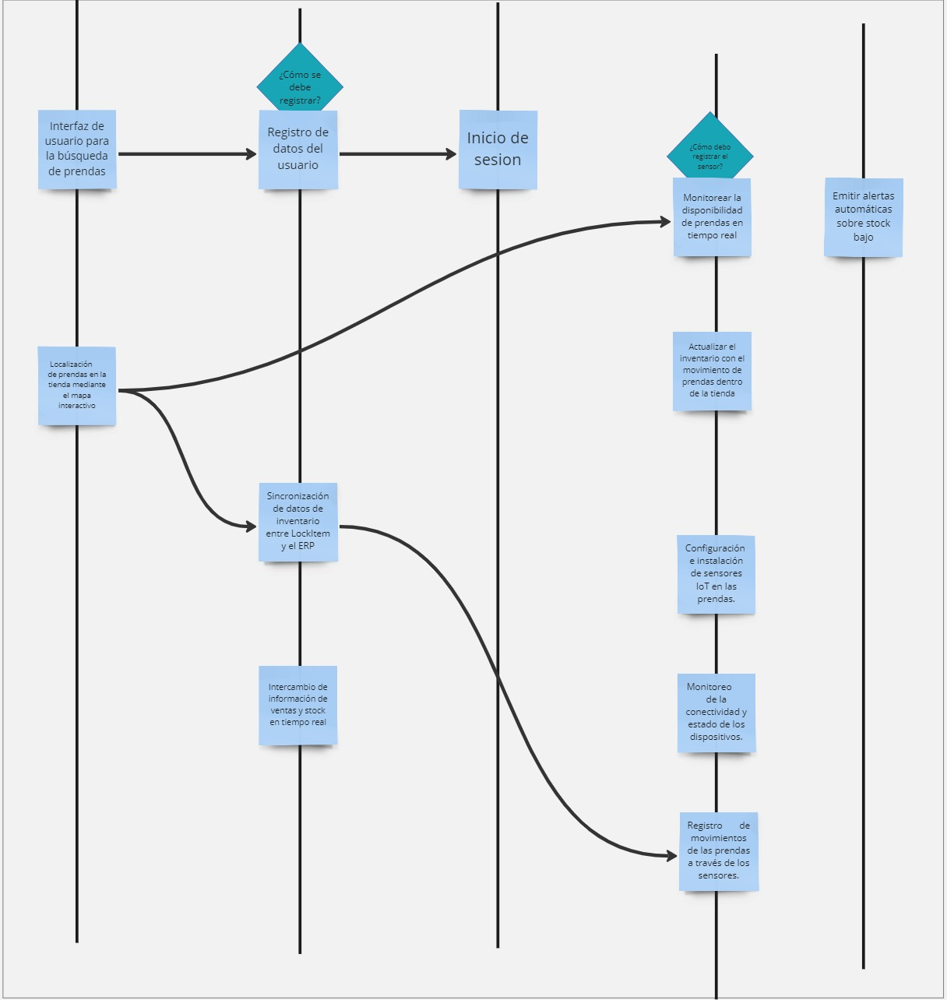
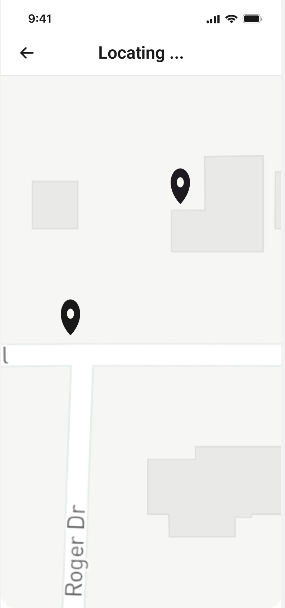

<p align="center">
  
</p>

<h3 align="center"> Universidad Peruana de Ciencias Aplicadas</h3>
<h4 align="center"> Ingeniería de Software  </h4>
<h4 align="center"> Arquitectura de Foftware Emergentes </h4>
<h4 align="center"> Informe de Trabajo Final </h4>

### Startup: Debuggers

#### Team Members

- Arrunátegui Aguilar, Josué David
- Causso Mariano, Giakomo Rodolfo
- Chero Eme, Eduardo Andre
- Dávila Ramirez, Yoimer Yanir
- Melgar Takahashi, Adrian Gonzalo

#### Sección: SI728

#### Royer Edelwer Rojas Malasquez

#### Producto: LockItem

#### Ciclo: 2024-02

<h4 align="center"> Agosto, 2024</h4>

___

# Registro de versiones del informe

| Versión | Fecha      | Autor             | Descripción de modificación                                                                           |
|---------|------------|-------------------|-------------------------------------------------------------------------------------------------------|
| 1.0     | 30/08/24   | Eduardo Chero     | Creación del archivo base en Markdown para el desarrollo del Final Project                            |
| 1.1     | 05/09/2024 | Adrian Melgar     | Desarrollo del Capítulo 1                                                                             |
| 1.2     | 06/09/2024 | Josue Arrunátegui | Desarrollo del Capítulo 2                                                                             |
| 1.3     | 07/09/2024 | Giakomo Causso    | Desarrollo del Capítulo 3 - Capitulo 4 hasta 4.1.2.2. Quality attribute Scenarios                     |
| 1.4     | 07/09/2024 | Eduardo Chero     | Desarrollo del 4.1.2.3. Constraints hasta 4.2.3. Domain Message Flows Modeling                        |
| 1.5     | 08/09/2024 | Yoimer Dávila     | Desarrollo del 4.2.4. Bounded Context Canvases hasta 4.3.4. Software Architecture Deployment Diagrams |
| 1.6     | 26/09/2024 | Adrian Melgar     | Desarrollo de todo el punto 5.3. Bounded Context: Inventory                                           |
| 1.7     | 02/11/2024 | Adrian Melgar     | Desarrollo de los puntos 7.1 al 7.1.3                                                                 |

---

# Contenido

- [Registro de versiones del informe](#registro-de-versiones-del-informe)
- [Contenido](#contenido)
- [Student Outcome](#student-outcome)
- [Capítulo I: Introducción](#capítulo-i-introducción)
  - [1.1. Startup Profile](#11-startup-profile)
    - [1.1.1. Descripción de la Startup](#111-descripción-de-la-startup)
    - [1.1.2. Perfiles de integrantes del equipo](#112-perfiles-de-integrantes-del-equipo)
  - [1.2. Solution Profile](#12-solution-profile)
    - [1.2.1 Antecedentes y problemática](#121-antecedentes-y-problemática)
    - [1.2.2 Lean UX Process](#122-lean-ux-process)
      - [1.2.2.1. Lean UX Problem Statements](#1221-lean-ux-problem-statements)
      - [1.2.2.2. Lean UX Assumptions](#1222-lean-ux-assumptions)
      - [1.2.2.3. Lean UX Hypothesis Statements](#1223-lean-ux-hypothesis-statements)
      - [1.2.2.4. Lean UX Canvas](#1224-lean-ux-canvas)
  - [1.3. Segmentos objetivo](#13-segmentos-objetivo)
- [Capítulo II: Requirements Elicitation \& Analysis](#capítulo-ii-requirements-elicitation--analysis)
  - [2.1. Competidores](#21-competidores)
    - [2.1.1. Análisis competitivo](#211-análisis-competitivo)
    - [2.1.2. Estrategias y tácticas frente a competidores](#212-estrategias-y-tácticas-frente-a-competidores)
  - [2.2. Entrevistas](#22-entrevistas)
    - [2.2.1. Diseño de entrevistas](#221-diseño-de-entrevistas)
    - [2.2.2. Registro de entrevistas](#222-registro-de-entrevistas)
    - [2.2.3. Análisis de entrevistas](#223-análisis-de-entrevistas)
  - [2.3. Needfinding](#23-needfinding)
    - [2.3.1. User Personas](#231-user-personas)
    - [2.3.2. User Task Matrix](#232-user-task-matrix)
    - [2.3.3. Empathy Mapping](#233-empathy-mapping)
    - [2.3.4. As-is Scenario Mapping](#234-as-is-scenario-mapping)
  - [2.4. Ubiquitous Language](#24-ubiquitous-language)
- [Capítulo III: Requirements Specification](#capítulo-iii-requirements-specification)
  - [3.1. To-Be Scenario Mapping](#31-to-be-scenario-mapping)
  - [3.2. User Stories](#32-user-stories)
  - [3.3. Impact Mapping](#33-impact-mapping)
  - [3.4. Product Backlog](#34-product-backlog)
- [Capítulo IV: Strategic-Level Software Design](#capítulo-iv-strategic-level-software-design)
  - [4.1. Strategic-Level Attribute-Driven Design](#41-strategic-level-attribute-driven-design)
    - [4.1.1. Design Purpose](#411-design-purpose)
    - [4.1.2. Attribute-Driven Design Inputs](#412-attribute-driven-design-inputs)
      - [4.1.2.1. Primary Functionality (Primary User Stories)](#4121-primary-functionality-primary-user-stories)
      - [4.1.2.2. Quality attribute Scenarios](#4122-quality-attribute-scenarios)
      - [4.1.2.3. Constraints](#4123-constraints)
    - [4.1.3. Architectural Drivers Backlog](#413-architectural-drivers-backlog)
    - [4.1.4. Architectural Design Decisions](#414-architectural-design-decisions)
    - [4.1.5. Quality Attribute Scenario Refinements](#415-quality-attribute-scenario-refinements)
  - [4.2. Strategic-Level Domain-Driven Design](#42-strategic-level-domain-driven-design)
    - [4.2.1. EventStorming](#421-eventstorming)
    - [4.2.2. Candidate Context Discovery](#422-candidate-context-discovery)
    - [4.2.3. Domain Message Flows Modeling](#423-domain-message-flows-modeling)
    - [4.2.4. Bounded Context Canvases](#424-bounded-context-canvases)
      - [User bounded context canvas](#user-bounded-context-canvas)
      - [Iot device management bounded context canvas](#iot-device-management-bounded-context-canvas)
      - [Inventory management bounded context canvas](#inventory-management-bounded-context-canvas)
      - [ERP integration bounded context canvas](#erp-integration-bounded-context-canvas)
    - [4.2.5. Context Mapping](#425-context-mapping)
  - [4.3. Software Architecture](#43-software-architecture)
    - [4.3.1. Software Architecture System Landscape Diagram](#431-software-architecture-system-landscape-diagram)
    - [4.3.2. Software Architecture Context Level Diagrams](#432-software-architecture-context-level-diagrams)
    - [4.3.3. Software Architecture Container Level Diagrams](#433-software-architecture-container-level-diagrams)
    - [4.3.4. Software Architecture Deployment Diagrams](#434-software-architecture-deployment-diagrams)
- [Capítulo V: Tactical-Level Software Design](#capítulo-v-tactical-level-software-design)
  - [5.1. Bounded Context: User](#51-bounded-context-user)
    - [5.1.1. Domain Layer](#511-domain-layer)
    - [5.1.2. Interface Layer](#512-interface-layer)
    - [5.1.3. Application Layer](#513-application-layer)
    - [5.1.4. Infrastructure Layer](#514-infrastructure-layer)
    - [5.1.5. Bounded Context Software Architecture Component Level Diagrams](#515-bounded-context-software-architecture-component-level-diagrams)
    - [5.1.6. Bounded Context Software Architecture Code Level Diagrams](#516-bounded-context-software-architecture-code-level-diagrams)
      - [5.1.6.1. Bounded Context Domain Layer Class Diagrams](#5161-bounded-context-domain-layer-class-diagrams)
      - [5.1.6.2. Bounded Context Database Design Diagram](#5162-bounded-context-database-design-diagram)
  - [5.2. Bounded Context: IoT device](#52-bounded-context-iot-device)
    - [5.2.1. Domain Layer](#521-domain-layer)
    - [5.2.2. Interface Layer](#522-interface-layer)
    - [5.2.3. Application Layer](#523-application-layer)
    - [5.2.4. Infrastructure Layer](#524-infrastructure-layer)
    - [5.2.5. Bounded Context Software Architecture Component Level Diagrams](#525-bounded-context-software-architecture-component-level-diagrams)
    - [5.2.6. Bounded Context Software Architecture Code Level Diagrams](#526-bounded-context-software-architecture-code-level-diagrams)
      - [5.2.6.1. Bounded Context Domain Layer Class Diagrams](#5261-bounded-context-domain-layer-class-diagrams)
      - [5.2.6.2. Bounded Context Database Design Diagram](#5262-bounded-context-database-design-diagram)
  - [5.3. Bounded Context: Inventory](#53-bounded-context-inventory)
    - [5.3.1. Domain Layer](#531-domain-layer)
    - [5.3.2. Interface Layer](#532-interface-layer)
    - [5.3.3. Application Layer](#533-application-layer)
    - [5.3.4. Infrastructure Layer](#534-infrastructure-layer)
    - [5.3.5. Bounded Context Software Architecture Component Level Diagrams](#535-bounded-context-software-architecture-component-level-diagrams)
    - [5.3.6. Bounded Context Software Architecture Code Level Diagrams](#536-bounded-context-software-architecture-code-level-diagrams)
      - [5.3.6.1. Bounded Context Domain Layer Class Diagrams](#5361-bounded-context-domain-layer-class-diagrams)
      - [5.3.6.2. Bounded Context Database Design Diagram](#5362-bounded-context-database-design-diagram)
  - [5.4. Bounded Context: ERP](#54-bounded-context-erp)
    - [5.4.1. Domain Layer](#541-domain-layer)
    - [1. ERPUser](#1-erpuser)
    - [2. ERPOrder](#2-erporder)
    - [5.4.2. Interface Layer](#542-interface-layer)
  - [Interfaces para ERPUser](#interfaces-para-erpuser)
    - [Interfaces](#interfaces)
    - [DTOs (Data Transfer Objects)](#dtos-data-transfer-objects)
    - [Response Objects](#response-objects)
  - [Interfaces para ERPOrder](#interfaces-para-erporder)
    - [Interfaces](#interfaces-1)
    - [DTOs (Data Transfer Objects)](#dtos-data-transfer-objects-1)
    - [Response Objects](#response-objects-1)
    - [5.4.3. Application Layer](#543-application-layer)
  - [Application Services para ERPUser](#application-services-para-erpuser)
    - [Servicios de Aplicación](#servicios-de-aplicación)
  - [Application Services para ERPOrder](#application-services-para-erporder)
    - [Servicios de Aplicación](#servicios-de-aplicación-1)
  - [Controladores](#controladores)
    - [UserController](#usercontroller)
    - [OrderController](#ordercontroller)
  - [Patrones de Diseño](#patrones-de-diseño)
  - [Manejo de Excepciones](#manejo-de-excepciones)
    - [5.4.4. Infrastructure Layer](#544-infrastructure-layer)
  - [Repositorios](#repositorios)
    - [UserRepository](#userrepository)
    - [OrderRepository](#orderrepository)
  - [Servicios de Infraestructura](#servicios-de-infraestructura)
    - [Servicios de Mensajería](#servicios-de-mensajería)
    - [Servicios de Conexión](#servicios-de-conexión)
  - [Seguridad y Autenticación](#seguridad-y-autenticación)
    - [SecurityService](#securityservice)
  - [Gestión de Configuraciones](#gestión-de-configuraciones)
    - [ConfigurationManager](#configurationmanager)
  - [Caching](#caching)
    - [CacheManager](#cachemanager)
  - [Logging](#logging)
    - [Logger](#logger)
    - [5.4.5. Bounded Context Software Architecture Component Level Diagrams](#545-bounded-context-software-architecture-component-level-diagrams)
    - [5.4.6. Bounded Context Software Architecture Code Level Diagrams](#546-bounded-context-software-architecture-code-level-diagrams)
      - [5.4.6.1. Bounded Context Domain Layer Class Diagrams](#5461-bounded-context-domain-layer-class-diagrams)
      - [5.4.6.2. Bounded Context Database Design Diagram](#5462-bounded-context-database-design-diagram)
- [Capítulo VI: Solution UX Design](#capítulo-vi-solution-ux-design)
  - [6.1. Style Guidelines](#61-style-guidelines)
    - [6.1.1. General Style Guidelines](#611-general-style-guidelines)
    - [6.1.2. Web, Mobile \& Devices Style Guidelines](#612-web-mobile--devices-style-guidelines)
  - [6.2. Information Architecture](#62-information-architecture)
    - [6.2.1. Labeling Systems](#621-labeling-systems)
    - [6.2.2. Searching Systems](#622-searching-systems)
    - [6.2.3. SEO Tags and Meta Tags](#623-seo-tags-and-meta-tags)
    - [6.2.4. Navigation Systems](#624-navigation-systems)
  - [6.3. Landing Page UI Design](#63-landing-page-ui-design)
    - [6.3.1. Landing Page Wireframe](#631-landing-page-wireframe)
    - [6.3.2. Landing Page Mock-up](#632-landing-page-mock-up)
  - [6.4. Applications UX/UI Design](#64-applications-uxui-design)
    - [6.4.1. Applications Wireframes](#641-applications-wireframes)
    - [6.4.2. Applications Wireflow Diagrams](#642-applications-wireflow-diagrams)
    - [6.4.3. Applications Mock-ups](#643-applications-mock-ups)
    - [6.4.4. Applications User Flow Diagrams](#644-applications-user-flow-diagrams)
  - [6.5. Applications Prototyping](#65-applications-prototyping)
- [Capítulo VII: Product Implementation, Validation \& Deployment](#capítulo-vii-product-implementation-validation--deployment)
  - [7.1. Software Configuration Management](#71-software-configuration-management)
    - [7.1.1. Software Development Environment Configuration](#711-software-development-environment-configuration)
    - [7.1.2. Source Code Management](#712-source-code-management)
    - [7.1.3. Source Code Style Guide \& Conventions](#713-source-code-style-guide--conventions)
    - [7.1.4. Software Deployment Configuration](#714-software-deployment-configuration)
  - [7.2. Solution Implementation](#72-solution-implementation)
    - [7.2.1. Sprint 1](#721-sprint-1)
    - [7.2.1.1. Sprint Planning 1](#7211-sprint-planning-1)
      - [7.2.1.2. Sprint Backlog 1.](#7212-sprint-backlog-1)
      - [7.2.1.3. Development Evidence for Sprint Review.](#7213-development-evidence-for-sprint-review)
      - [7.2.1.4. Testing Suite Evidence for Sprint Review.](#7214-testing-suite-evidence-for-sprint-review)
      - [7.2.1.5. Execution Evidence for Sprint Review.](#7215-execution-evidence-for-sprint-review)
      - [7.2.1.6. Services Documentation Evidence for Sprint Review.](#7216-services-documentation-evidence-for-sprint-review)
      - [7.2.1.7. Software Deployment Evidence for Sprint Review.](#7217-software-deployment-evidence-for-sprint-review)
      - [7.2.1.8. Team Collaboration Insights during Sprint.](#7218-team-collaboration-insights-during-sprint)
  - [7.3. Validation Interviews.](#73-validation-interviews)
    - [7.3.1. Diseño de Entrevistas.](#731-diseño-de-entrevistas)
    - [7.3.2. Registro de Entrevistas.](#732-registro-de-entrevistas)
    - [7.3.3. Evaluaciones según heurísticas.](#733-evaluaciones-según-heurísticas)


---

# Student Outcome

| Criterio Específico                                                                                | Acciones Realizadas                                                                                                                                                                                                                                                                                                                                                                                                                                                                                                                                                                                                                                                                                                                                                                                                                                                                                                                                                                                                                                                                                                                                                                                                                                                                                                                                                                                                                                                                                                                                                                                                                                                                                                                                                                                                                                                                                                                                                                                                                                                                                                                                                                                                                                                                                                                                                                                                                                                                                                                                                                                                                                                                                                                                                                                                                                                                                                                                                                                                                                                                                                                                                                                                                                                                                                                                                                                                                                                                                                                                                                                                                                                                                                                                                                                                                                                                                                                                                                                                                                                                                                                                                                                                                                                                                                                                                                                                                                                                                                                                                                                                                                                                                                                                                                                                                                                                                                                                                                                                                                                                                                                                                                                                                                                                                                                                                                                                                                                                                                                                                                            | Conclusiones                                                                                                                                                                                                                                                                                                                                                                                                                                                                                                                                                                                                                                                                                                                                                                                                                                                                                                                                                                                                                                                                                                                                                                                                                                                                                                                                                                                                                                                                                                                                                                                                                                                                                                                                                                                                                                                                                                                                                                                                                                                                                                                                                                                                                                                                                                                                                                                                                                                                                                                                                                                                                                                                                                                                                                                                                                                                                                                                                                                                                                                                                                                                                                                                                                                                                                                                                                                                                                                                                                                                                                                                                                                                                                                                                                                                                                                                                                                                                                                                                                                                                                                                                                                                                                                                                  |
|----------------------------------------------------------------------------------------------------|------------------------------------------------------------------------------------------------------------------------------------------------------------------------------------------------------------------------------------------------------------------------------------------------------------------------------------------------------------------------------------------------------------------------------------------------------------------------------------------------------------------------------------------------------------------------------------------------------------------------------------------------------------------------------------------------------------------------------------------------------------------------------------------------------------------------------------------------------------------------------------------------------------------------------------------------------------------------------------------------------------------------------------------------------------------------------------------------------------------------------------------------------------------------------------------------------------------------------------------------------------------------------------------------------------------------------------------------------------------------------------------------------------------------------------------------------------------------------------------------------------------------------------------------------------------------------------------------------------------------------------------------------------------------------------------------------------------------------------------------------------------------------------------------------------------------------------------------------------------------------------------------------------------------------------------------------------------------------------------------------------------------------------------------------------------------------------------------------------------------------------------------------------------------------------------------------------------------------------------------------------------------------------------------------------------------------------------------------------------------------------------------------------------------------------------------------------------------------------------------------------------------------------------------------------------------------------------------------------------------------------------------------------------------------------------------------------------------------------------------------------------------------------------------------------------------------------------------------------------------------------------------------------------------------------------------------------------------------------------------------------------------------------------------------------------------------------------------------------------------------------------------------------------------------------------------------------------------------------------------------------------------------------------------------------------------------------------------------------------------------------------------------------------------------------------------------------------------------------------------------------------------------------------------------------------------------------------------------------------------------------------------------------------------------------------------------------------------------------------------------------------------------------------------------------------------------------------------------------------------------------------------------------------------------------------------------------------------------------------------------------------------------------------------------------------------------------------------------------------------------------------------------------------------------------------------------------------------------------------------------------------------------------------------------------------------------------------------------------------------------------------------------------------------------------------------------------------------------------------------------------------------------------------------------------------------------------------------------------------------------------------------------------------------------------------------------------------------------------------------------------------------------------------------------------------------------------------------------------------------------------------------------------------------------------------------------------------------------------------------------------------------------------------------------------------------------------------------------------------------------------------------------------------------------------------------------------------------------------------------------------------------------------------------------------------------------------------------------------------------------------------------------------------------------------------------------------------------------------------------------------------------------------------------------------------------------------------------|-----------------------------------------------------------------------------------------------------------------------------------------------------------------------------------------------------------------------------------------------------------------------------------------------------------------------------------------------------------------------------------------------------------------------------------------------------------------------------------------------------------------------------------------------------------------------------------------------------------------------------------------------------------------------------------------------------------------------------------------------------------------------------------------------------------------------------------------------------------------------------------------------------------------------------------------------------------------------------------------------------------------------------------------------------------------------------------------------------------------------------------------------------------------------------------------------------------------------------------------------------------------------------------------------------------------------------------------------------------------------------------------------------------------------------------------------------------------------------------------------------------------------------------------------------------------------------------------------------------------------------------------------------------------------------------------------------------------------------------------------------------------------------------------------------------------------------------------------------------------------------------------------------------------------------------------------------------------------------------------------------------------------------------------------------------------------------------------------------------------------------------------------------------------------------------------------------------------------------------------------------------------------------------------------------------------------------------------------------------------------------------------------------------------------------------------------------------------------------------------------------------------------------------------------------------------------------------------------------------------------------------------------------------------------------------------------------------------------------------------------------------------------------------------------------------------------------------------------------------------------------------------------------------------------------------------------------------------------------------------------------------------------------------------------------------------------------------------------------------------------------------------------------------------------------------------------------------------------------------------------------------------------------------------------------------------------------------------------------------------------------------------------------------------------------------------------------------------------------------------------------------------------------------------------------------------------------------------------------------------------------------------------------------------------------------------------------------------------------------------------------------------------------------------------------------------------------------------------------------------------------------------------------------------------------------------------------------------------------------------------------------------------------------------------------------------------------------------------------------------------------------------------------------------------------------------------------------------------------------------------------------------------------------------------|
| ABET – EAC - Student Outcome 3: Capacidad de comunicarse efectivamente con un rango de audiencias. | *Giakomo Rodolfo Causso Mariano*<br>**TB1**<br>La aplicación de la metodología Domain-Driven Design (DDD) durante el desarrollo permitió enfocar el diseño del software en torno a los dominios del negocio de tiendas de ropa. Esto incluyó la creación de modelos de dominio que reflejan fielmente los procesos y necesidades de las tiendas, facilitando así un desarrollo más orientado y coherente con las necesidades reales del usuario final. La colaboración continua con stakeholders del proyecto garantizó que los modelos y el software desarrollado alinearan precisamente con los requisitos y expectativas del negocio.<br><br>*Giakomo Rodolfo Causso Mariano*<br>**TP1**<br> Desarrollé interfaces y servicios de aplicación para la integración de ERP en el proyecto LockItem, gestionando la lógica de negocio y asegurando operaciones de datos eficientes y seguras para usuarios y órdenes. Implementé patrones de diseño y estrategias de seguridad para proteger los datos y facilitar su uso por diferentes audiencias, desde técnicos hasta usuarios finales. <br><br> *Eduardo André Chero Emé*<br>**TB1:**<br>El desarrollo del event Storming nos ayudó para tener una visualizacion más definida de nuestros bounded context para una mejor implementación en el código. Clasificar los escenarios mediante el modelado de Message flows y generar los Bounded Context Canvas nos brindan un mejor entendimiento de las variables, conexiones y propisitos de los bounded context que impementamos.<br>**TP1:**<br><br>Para esta entrega desarrollé la sección del modelado de la landing page, app web y app movil en figma con ayuda del equipo para un mejor entendimiento de la aplicación.<br><br>*Adrian Gonzalo Melgar Takahashi*<br>**TB1:**<br>Durante el desarrollo de mi proyecto, estructuré la comunicación para distintas audiencias. En la Descripción de la Startup y los perfiles del equipo, destaqué información clave para inversionistas y colaboradores. En el Solution Profile, presenté los antecedentes y problemática de forma clara, y en el Lean UX Process, expuse los Problem Statements y Hypothesis Statements de manera visual para facilitar su comprensión por parte de usuarios técnicos y no técnicos. Estas acciones garantizaron una comunicación efectiva y adaptada a cada grupo.<br>**TP:**<br>En esta entrega, desarrollé el Bounded Context de **Inventory**, abordando las capas de **Domain**, **Interface**, **Application** e **Infrastructure**. Elaboré diagramas de arquitectura a nivel de componentes y de código, incluyendo los **Diagramas de Clase de la Capa de Dominio** y el **Diagrama de Diseño de Base de Datos**. Estos materiales fueron diseñados para comunicar de manera efectiva la estructura y funcionalidad del módulo de inventario a diferentes miembros del equipo y stakeholders.<br><br> *Josué David Arrunátegui Aguilar*<br>**TB1**<br> Durante el desarrollo del proyecto LockItem, tuve la oportunidad de comunicarme con diversas audiencias, incluyendo clientes y usuarios finales. Llevé a cabo entrevistas para entender sus necesidades, desarrollé user personas y user task matrices, lo que me permitió adaptar nuestras soluciones a sus expectativas. Esta experiencia me ayudó a transmitir ideas complejas de forma clara, tanto a miembros técnicos del equipo como a personas sin formación técnica, mejorando así la comunicación efectiva en el proyect<br>**TP:**<br>En esta entrega, desarrollé el bounded context de IoT Device, abarcando las capas de dominio, aplicación, interfaz e infraestructura. Elaboré diagramas de base de datos, clases y componentes para representar de manera clara la estructura del sistema. Estas actividades me permitieron comunicarme efectivamente con un rango de audiencias, desde miembros técnicos del equipo hasta stakeholders no técnicos, asegurando que todos comprendieran la funcionalidad y la alineación del proyecto con sus objetivos. <br><br>*Yoimer Yanir Davila Ramirez*<br>**TB1**<br>Para esta primera entrega, siguiendo DDD y una comunicación efectiva se desarrollaron los Bounded Context Canvases , donde se identificaron y definieron los límites claros de cada contexto dentro del sistema, estableciendo sus responsabilidades y flujos de información. Además, se crearon los diagramas de la arquitectura de software, los cuales ilustran cómo los componentes del sistema interactuan, seleccionando las tecnologías adecuadas para asegurar la escalabilidad y eficiencia del sistema. Estas actividades incluyeron reuniones con las partes interesadas para validar los contextos y diagramas, garantizando la alineación con los objetivos del proyecto. <br>**TP1**<br> En esta entrega, se llevó a cabo un diseño de software a nivel táctico, donde se definieron y documentaron los Bounded Contexts para la aplicación LockItem, yo me encarge del contexto User. Se elaboraron descripciones de las diferentes capas, como la capa de dominio, interfaz, aplicación e infraestructura, lo que permitió una representación clara de la estructura del sistema. Además, se crearon diagramas de arquitectura de software a nivel de componentes y código, que visualizan la interacción entre los elementos de este contexto. Para asegurar que estas decisiones técnicas se alinearan con las expectativas y requisitos del proyecto se realizaron sesiones de retroalimentación, fomentando un diálogo constante que contribuyó a afinar el desarrollo del proyecto. | *Giakomo Rodolfo Causso Mariano* <br>**TB1**<br> La adopción de DDD mejoró significativamente nuestra precisión en la implementación del software y en la alineación con los objetivos del negocio, asegurando que cada funcionalidad desarrollada proporcionara valor real y tangible a los usuarios finales.Este enfoque destaca cómo una metodología de desarrollo específica puede influir positivamente en la claridad del diseño y la efectividad de la implementación, lo que es relevante para tus criterios de ABET en cuanto a comunicación efectiva y adaptación a un rango de audiencias.<br><br>*Giakomo Rodolfo Causso Mariano*<br>**TP1**<br>Mi contribución demuestra una capacidad efectiva de comunicarme con un rango diverso de audiencias, esencial para el éxito de la implementación tecnológica en entornos empresariales y la mejora continua de la experiencia del usuario final. <br><br> *Eduardo André Chero Emé*<br>**TB1:**<br> La presente entrega sirvió para validar que la solución propuesta es adecuada para los segmentos objetivo abordados, esto en base al trabajo colaborativo realizado durante las entrevistas y el análisis de estas.<br>**TP:**<br><br>Nos comunicacmos de una mejor manera para detallar como debe verse nuestras aplicaciones para un mejor entendimiento del usuario.<br><br>*Adrian Gonzalo Melgar Takahashi*<br>**TB1:**<br> Las acciones realizadas durante el desarrollo del proyecto permitieron una comunicación efectiva y adaptada a las necesidades de cada audiencia. Desde la presentación clara de la startup y su equipo hasta la exposición visual de los aspectos técnicos en el Lean UX Process, logré transmitir la información de manera precisa y comprensible, lo que contribuyó al entendimiento general del proyecto y facilitó su avance exitoso con el apoyo de todos los involucrados.<br>**TP:**<br>Mediante este trabajo, mejoré mi capacidad para comunicar conceptos técnicos complejos de forma clara y adaptada a diversas audiencias, facilitando la comprensión compartida y promoviendo la colaboración efectiva en el proyecto.<br><br> Josué David Arrunátegui Aguilar<br>**TB1**<br> Durante el desarrollo del proyecto LockItem, tuve la oportunidad de comunicarme con diversas audiencias, incluyendo clientes y usuarios finales. Llevé a cabo entrevistas para entender sus necesidades, desarrollé user personas y user task matrices, lo que me permitió adaptar nuestras soluciones a sus expectativas. Esta experiencia me ayudó a transmitir ideas complejas de forma clara, tanto a miembros técnicos del equipo como a personas sin formación técnica, mejorando así la comunicación efectiva en el proyect<br>**TP**<br>La implementación del bounded context de IoT Device permitió establecer una estructura clara y precisa dentro del sistema, facilitando la comunicación tanto con el equipo técnico como con los stakeholders. El enfoque en la definición de cada capa y la elaboración de diagramas detallados aseguró que todos los involucrados tuvieran una comprensión compartida de la funcionalidad del sistema. Esta experiencia destaca cómo la capacidad de comunicar conceptos técnicos a diversas audiencias contribuyó al éxito del proyecto, alineándose con los objetivos de implementación y los requisitos del negocio. <br><br> *Yoimer Yanir Davila Ramirez*<br>**TB1**<br> El desarrollo de los canvases facilitó una mejor comprensión de los límites y responsabilidades dentro del sistema, mejorando la comunicación entre los equipos técnicos y no técnicos. Los diagramas permitieron optimizar los componentes del sistema, asegurando una base sólida para su futura escalabilidad y adaptabilidad, cumpliendo con los requisitos de sostenibilidad y rendimiento del proyecto. <br>**TP1**<br>La implementación de los Bounded Contexts ha sido crucial para establecer un marco claro que delimita las responsabilidades y la interacción entre las diferentes partes del sistema LockItem. Esto no solo ha mejorado la comunicación entre los equipos técnicos y no técnicos, sino que también ha permitido una visualización efectiva de la arquitectura del software, facilitando la identificación de posibles áreas de mejora. |

---

# Capítulo I: Introducción

## 1.1. Startup Profile

### 1.1.1. Descripción de la Startup

Debuggers ha desarrollado **LockItem**, una solución basada en IoT que permite a los clientes de tiendas de ropa
localizar prendas que han sido movidas de su lugar original. Mediante sensores integrados en las etiquetas de seguridad
de las prendas, los usuarios pueden acceder al catálogo de la tienda a través de una app móvil, seleccionar el artículo
que desean, y recibir la ubicación precisa en tiempo real. Esta tecnología mejora la experiencia de compra al reducir el
tiempo de búsqueda y aumenta la eficiencia operativa de las tiendas.

LockItem, desarrollado por Debuggers, no solo optimiza el flujo de clientes en los establecimientos, sino que también
contribuye a una gestión de inventario más efectiva para los minoristas. Al ofrecer una experiencia de compra más fluida
y tecnológicamente avanzada, Debuggers se posiciona como un innovador en la transformación digital del sector minorista,
conectando el mundo físico y digital a través de soluciones IoT.

**Misión:**

En Debuggers, nuestra misión es desarrollar soluciones tecnológicas innovadoras que conecten el mundo físico y digital,
proporcionando a las empresas minoristas en el Perú herramientas basadas en IoT para una gestión eficiente de productos.
Nos enfocamos en mejorar la experiencia de compra de los clientes, optimizando la localización de productos en tiempo
real, y ayudando a nuestros socios comerciales a maximizar su eficiencia operativa.

**Visión:**

Convertirnos en la empresa líder en la implementación de tecnologías IoT para el sector minorista en el Perú, impulsando
una transformación digital que permita a las tiendas físicas adaptarse a los desafíos del futuro. Aspiramos a que
nuestras soluciones revolucionen la gestión de inventarios y la experiencia de compra, estableciendo nuevos estándares
en la industria minorista peruana y contribuyendo al crecimiento de un ecosistema comercial más moderno y eficiente.

### 1.1.2. Perfiles de integrantes del equipo

| Integrante                                                                                                                                                                                                                                                                                                                              | Arrunátegui Aguilar, Josué David                        |
|-----------------------------------------------------------------------------------------------------------------------------------------------------------------------------------------------------------------------------------------------------------------------------------------------------------------------------------------|---------------------------------------------------------|
| **Código:** U202111033 <br> **Carrera:** Ingeniería de Software <br> **Acerca de mí:** Me gusta dibujar, tocar guitarra y jugar videojuegos. Tengo conocimiento en el desarrollo frontend con lenguajes como angular y vue.js, así como desarrollo móvil con flutter. Planeo especializarme en desarrollo web o como Analista de Datos. |  |

| Integrante                                                                                                                                                                                                                                                                                                                                                                                                                                                                                                      | Causso Mariano, Giakomo Rodolfo                           |
|-----------------------------------------------------------------------------------------------------------------------------------------------------------------------------------------------------------------------------------------------------------------------------------------------------------------------------------------------------------------------------------------------------------------------------------------------------------------------------------------------------------------|-----------------------------------------------------------|
| **Código:** U202118374  <br>  **Carrera:** Ingeniería de Software <br> **Acerca de mí:** Me gusta programar y en el progreso que obtuve respecto a mis conocimientos académicos, pude aprender lenguajes como Java, JavaScript, C++, C#, SQL, HTML y CSS. Dentro del desarrollo de la carrera de Ingeniería de software puede tener un mayor concepto referente a proyectos y gracias a eso es sido capaz de desarrollar habilidades como el liderazgo, compañerismo, compromiso, responsabilidad y creatividad |  |

| Integrante                                                                                                                                                                                                                                                                                                                               | Chero Eme, Eduardo Andre                                    |
|------------------------------------------------------------------------------------------------------------------------------------------------------------------------------------------------------------------------------------------------------------------------------------------------------------------------------------------|-------------------------------------------------------------|
| **Código:** U20201F282 <br> **Carrera:** Ingeniería de software <br> **Acerca de mí:** Me gustan los videojuegos y las series, quiero especializarme en ciberseguridad para tener una ganancia estable mientras creo videojuegos aparte por pasión. Con experiencia en backend y en frontend con tecnologias como Spring Boot y Angular. |  |

| Integrante                                                                                                                                                                                                                                                                                  | Dávila Ramirez, Yoimer Yanir                              |
|---------------------------------------------------------------------------------------------------------------------------------------------------------------------------------------------------------------------------------------------------------------------------------------------|-----------------------------------------------------------|
| **Código:**  U20201B973 <br>  **Carrera:** Ingeniería de Software <br> **Acerca de mí:** Soy un apasionado de la programación, la tecnología y los videojuegos. Me encanta explorar nuevas herramientas y lenguajes de programación para resolver problemas de manera creativa y eficiente. |  |

| Integrante                                                                                                                                                                                                                                                                                                                                                                                                                                                                          | Melgar Takahashi, Adrian Gonzalo                                                                         |
|-------------------------------------------------------------------------------------------------------------------------------------------------------------------------------------------------------------------------------------------------------------------------------------------------------------------------------------------------------------------------------------------------------------------------------------------------------------------------------------|----------------------------------------------------------------------------------------------------------|
| **Código:** U201819465 <br> **Carrera:** Ingeniería de software <br> **Acerca de mí:** Soy un entusiasta de la tecnología en diversas facetas, y también disfruto colaborar en proyectos en equipo. En cuanto a mis habilidades, sobresale mi experiencia en liderazgo, conocimientos en metodologías ágiles, competencia en codificación utilizando lenguajes como HTML, CSS, JavaScript y Python, y experiencia en la gestión de bases de datos como MySQL, SQL Server y MongoDB. |  |

## 1.2. Solution Profile

### 1.2.1 Antecedentes y problemática

El solution profile utilizando la metodología **5W2H** (What, Why, Where, When, Who, How, How much) te ayudará a
estructurar claramente tu propuesta de LockItem. A continuación te doy una guía detallada para que puedas desarrollarlo:

**1. What (Qué):**

LockItem es una solución tecnológica basada en IoT que permite a los clientes localizar prendas de ropa dentro de
tiendas físicas, mejorando la experiencia de compra. Utiliza sensores integrados en las etiquetas de seguridad de las
prendas para identificar en tiempo real su ubicación dentro de la tienda, y presenta esa información a través de una
aplicación móvil conectada.

**2. Why (Por qué):**

El problema que se busca resolver es la dificultad que enfrentan los clientes cuando las prendas son movidas de su
ubicación original. Esto puede resultar en una experiencia de compra frustrante, pérdida de tiempo y, en algunos casos,
en la decisión del cliente de no realizar la compra. Además, ayuda a las tiendas a optimizar la gestión de inventario y
mejorar la eficiencia operativa.

**3. Where (Dónde):**

LockItem está pensado para el mercado minorista de ropa en el Perú. Las tiendas afiliadas serían aquellas que buscan
optimizar la experiencia de compra física mediante tecnología, principalmente en grandes centros comerciales y tiendas
de departamentos en áreas urbanas.

**4. When (Cuándo):**

La solución está diseñada para ser implementada durante las etapas de alta demanda en las tiendas, como temporadas de
rebajas, campañas navideñas o de vuelta a clases, cuando la búsqueda de productos es más caótica. Además, puede
funcionar de manera continua para mejorar la experiencia del cliente en cualquier momento del año.

**5. Who (Quiénes):**

Los usuarios principales de LockItem son los clientes de las tiendas afiliadas, quienes podrán localizar sus productos
de manera eficiente. Por otro lado, los empleados de las tiendas también se beneficiarán al poder tener un mayor control
sobre el inventario en tiempo real. Los socios comerciales incluyen las tiendas minoristas que buscan mejorar la
experiencia de compra y optimizar la gestión de sus productos.

**6. How (Cómo):**

La solución utiliza tecnología IoT mediante sensores instalados en las etiquetas de seguridad de las prendas. Estos
sensores están conectados a una plataforma que se integra con una app móvil. Los clientes usan la app para buscar una
prenda, y la app les muestra la ubicación exacta dentro de la tienda en tiempo real. Las tiendas afiliadas podrán
implementar los sensores en sus sistemas de seguridad y vincularlos a la base de datos de productos.

**7. How much (Cuánto cuesta):**

El costo del sistema dependerá del tamaño de la tienda y la cantidad de productos a sensar. Se contemplan costos
iniciales de implementación de los sensores y la infraestructura IoT, junto con una suscripción mensual o anual para el
mantenimiento de la plataforma y la app. Además, el precio puede variar dependiendo del nivel de personalización que
requiera cada tienda afiliada.

### 1.2.2 Lean UX Process

#### 1.2.2.1. Lean UX Problem Statements

**1. Problem Statement (Cliente):**

Nuestro entorno evidencia que los clientes de tiendas de ropa en Perú a menudo experimentan frustración y descontento al
no encontrar las prendas que buscan en su lugar habitual debido a que otros compradores las mueven dentro del
establecimiento. Esto no solo genera una mala experiencia de compra, sino que, en algunos casos, los clientes optan por
no adquirir el producto y abandonan la tienda sin realizar una compra.

Hemos observado que un factor crítico que afecta a los clientes es la dificultad para localizar productos dentro de la
tienda cuando han sido desplazados, lo que incrementa el tiempo invertido en la búsqueda y disminuye la satisfacción
general con la experiencia de compra.

**¿Cómo podemos diseñar una solución tecnológica que permita a los clientes localizar fácilmente las prendas dentro de
la tienda, mejorando así su experiencia de compra y evitando que abandonen sin realizar una compra?**

**2. Problem Statement (Negocio):**

Nuestro entorno evidencia que las tiendas de ropa en Perú enfrentan desafíos para mantener sus prendas organizadas y
fácilmente accesibles para los clientes, lo que impacta negativamente en la eficiencia operativa y en las ventas. La
dificultad para rastrear el movimiento de las prendas dentro del establecimiento también provoca ineficiencias en la
gestión del inventario y una experiencia insatisfactoria para los compradores.

Hemos observado que un factor crítico que afecta a las tiendas es la incapacidad para monitorear en tiempo real la
ubicación de las prendas que han sido movidas, lo que conlleva a pérdidas en ventas y una mayor carga operativa para los
empleados encargados de la reubicación de productos.

**¿Cómo podemos implementar una solución IoT eficiente que permita a las tiendas rastrear el movimiento de las prendas
dentro del establecimiento y optimizar la gestión de inventarios mientras se mejora la experiencia del cliente?**

#### 1.2.2.2. Lean UX Assumptions

**Business Assumptions (Suposiciones de Negocio):**

- Las tiendas minoristas estarán dispuestas a adoptar tecnologías IoT para mejorar la localización de productos, ya que
  ven valor en optimizar la experiencia de compra y la gestión de inventarios.

- El mercado minorista en Perú tiene el presupuesto y los recursos para implementar una solución como LockItem, que
  implica sensores IoT, una app y la integración con sus sistemas de inventario existentes.

- La mejora en la experiencia de compra llevará a un aumento en las ventas, ya que los clientes que encuentran lo que
  buscan rápidamente tienen más probabilidades de realizar compras y fidelizarse con la tienda.

- Las tiendas estarán dispuestas a pagar por una suscripción o servicio continuo para mantener el sistema LockItem
  funcionando, incluyendo actualizaciones y mantenimiento del sistema.

- Las tiendas que implementen LockItem mejorarán su competitividad en el mercado peruano, ya que estarán ofreciendo una
  solución innovadora que optimiza la experiencia del cliente.

**User Assumptions (Suposiciones de Usuario):**

- Los clientes valoran el tiempo y la eficiencia cuando compran en tiendas físicas y están dispuestos a usar una app
  móvil que les ayude a localizar rápidamente las prendas que buscan.

- Los usuarios confían en las soluciones tecnológicas y no tendrán problemas en adoptar la aplicación móvil para mejorar
  su experiencia de compra, siempre que esta sea intuitiva y fácil de usar.

- Los clientes están frustrados por no encontrar las prendas en su lugar original, lo que les genera una experiencia de
  compra insatisfactoria y los motiva a buscar soluciones que mejoren ese aspecto.

- Los usuarios están familiarizados con las aplicaciones móviles y con las tecnologías de localización, lo que
  facilitará la adopción de LockItem sin necesidad de un aprendizaje extenso.

- Los usuarios están dispuestos a proporcionar datos básicos a través de la app (como ubicación en la tienda o
  preferencias de búsqueda) si esto les permite acceder a una experiencia de compra más eficiente y personalizada.

#### 1.2.2.3. Lean UX Hypothesis Statements

Las hipótesis son afirmaciones que pueden probarse a través de experimentos y validaciones. Aquí algunas hipótesis para
LockItem:

Creemos que permitir a los clientes localizar rápidamente las prendas que buscan a través de la app será útil para
compradores que valoran su tiempo, ya que les permitirá evitar frustraciones y optimizar su proceso de compra. Esto es
importante porque facilitará la búsqueda de productos, reduciendo el tiempo en la tienda. Esperamos que esto incremente
la satisfacción del cliente y como resultado, observemos un aumento en la probabilidad de compra en un 15%.

Creemos que integrar sensores IoT en las prendas será beneficioso para los empleados de las tiendas que gestionan
inventarios, ya que reducirá el tiempo invertido en reubicar productos y mejorará la precisión de los inventarios. Esto
es importante porque permitirá una gestión más eficiente del stock. Esperamos que los empleados puedan dedicar más
tiempo a otras tareas importantes y como resultado, se reducirá el tiempo invertido en la reubicación de prendas en un
25%.

Creemos que proporcionar a las tiendas acceso a datos analíticos sobre el movimiento de productos será útil para los
gerentes y encargados de piso, ya que les permitirá reorganizar mejor el espacio de ventas en función del comportamiento
del cliente. Esto es importante porque optimizar la disposición de los productos aumentará las interacciones del cliente
con los artículos. Esperamos que esto incremente las ventas en las áreas más estratégicas y como resultado, veamos un
aumento de las ventas en estas áreas en un 10%.

Creemos que permitir a los clientes recibir notificaciones sobre la reubicación o disponibilidad de productos en tiempo
real será útil para compradores que están interesados en productos específicos, ya que les proporcionará información
personalizada. Esto es importante porque ayudará a mantener a los clientes comprometidos con la tienda. Esperamos que
esto aumente la frecuencia de visitas de los clientes y como resultado, incrementemos el tráfico en la tienda en un 12%.

Creemos que mostrar la disponibilidad de tallas y colores en tiempo real en la app será útil para compradores indecisos
o que buscan múltiples opciones, ya que podrán verificar la disponibilidad antes de dirigirse a la tienda o probarse las
prendas. Esto es importante porque reducirá las consultas al personal de la tienda y acelerará el proceso de compra.
Esperamos que esto mejore la eficiencia operativa y como resultado, disminuya las consultas al personal en un 20%.

#### 1.2.2.4. Lean UX Canvas


Canvas link: [Lockitem canvas](https://miro.com/app/board/uXjVKhk9JzU=/?share_link_id=865796187242)

## 1.3. Segmentos objetivo

**1. Clientes de tiendas de ropa**

Hombres y mujeres de entre 18 y 45 años, residentes en zonas urbanas de Perú, que prefieren comprar en tiendas físicas y
valoran la rapidez y eficiencia al buscar productos. Estos clientes son usuarios familiarizados con smartphones y
aplicaciones móviles, y buscan una experiencia de compra fluida y sin frustraciones. Están motivados por el deseo de
ahorrar tiempo y obtener un servicio más eficiente mientras realizan sus compras en tiendas de ropa.

**2. Dueños de tiendas de ropa:**

Propietarios de tiendas de ropa, hombres y mujeres de entre 21 y 55 años, que buscan optimizar la gestión de sus
inventarios y mejorar la experiencia de compra de sus clientes. Están familiarizados con la tecnología y dispuestos a
adoptar soluciones innovadoras, como IoT y aplicaciones móviles, para mejorar la eficiencia operativa y aumentar las
ventas. Estos dueños están motivados por la necesidad de reducir costos de mano de obra, mejorar el servicio al cliente,
y mantenerse competitivos en el mercado minorista peruano.

# Capítulo II: Requirements Elicitation & Analysis

## 2.1. Competidores

* **Pricer:** Pricer utiliza etiquetas electrónicas de precio (ESL) para ayudar a los minoristas a actualizar precios y
  gestionar inventarios en tiempo real, mejorando la eficiencia operativa.
* **Neurolabs:** Neurolabs emplea visión artificial y aprendizaje automático para controlar inventarios en tiempo real y
  predecir el comportamiento de los consumidores sin necesidad de etiquetas físicas.

### 2.1.1. Análisis competitivo

<table border="1" cellpadding="10" cellspacing="0" style="margin-left: auto; margin-right: auto;">
  <tr>
    <th colspan="6">Competitive Analysis Landscape</th>
  </tr>
  <tr>
    <td colspan="2" rowspan="2">¿Por qué llevar a cabo este análisis?</td>
    <td colspan="4">El objetivo que tenemos con este análisis es conocer de mejor manera a nuestra competencia y así poder evaluar nuestras oportunidades y ventajas como empresa buscando poder destacar sobre las otras</td>
  </tr>
  <tr>
    <td colspan="4">¿Qué aporte de valor podría ofrecer nuestro producto en contraste al resto de competidores? </td>
  </tr>
  <tr>
   <td colspan="2"></td>
    <td>LockItem</td>
    <td>Pricer</td>
    <td>Neurolabs</td>
  </tr>
  <tr>
    <td rowspan="2">Perfil</td>
    <td>Overview</td>
    <td>Solución IoT para la localización de productos movidos en tiendas de ropa</td>
    <td>Ofrece etiquetas electrónicas de precios para minoristas</td>
    <td>Utiliza visión artificial para la gestión de inventarios</td>
  </tr>
  <tr>
    <td>Ventaja competitiva ¿Que valor ofrece a los clientes?</td>
    <td>Locaclización en tiempo real mediante sensores IoT en prendas</td>
    <td>Automatización de precios e inventarios, con actualizaciones en tiempo real</td>
    <td>Análisis predictivo y control sin necesidad de etiquetas físicas</td>
  </tr>
  <tr>
    <td rowspan="2">Perfil de Marketing</td>
    <td>Mercado objetivo</td>
    <td>Hombres y mujeres entre 18 y 45 años. Tiendas de ropa en Perú</td>
    <td>Minoristas globales, especialmente supermercados y tiendas grandes</td>
    <td>Minoristas que buscan automatizar la gestión de inventorios sin contacto</td>
  </tr>
  <tr>
    <td>Estrategias de marketing</td>
    <td>Enfocada en la eficiencia operativa y mejora de la experiencia del cliente</td>
    <td>Se posiciona como líder en automatización y eficiencia en minoristas </td>
    <td>Apuesta por la innovación y la automatización sin contacto </td>
  </tr>
  <tr>
    <td rowspan="3">Perfil de Producto</td>
    <td>Productos & Servicios</td>
    <td>Sensores IoT para etiquetas de prendas y app de localización en tiempo real</td>
    <td>Sensores IoT para etiquetas de prendas y app de localización en tiempo rea</td>
    <td>Visión artificial, IA para monitoreo de inventarios y comportamiento</td>
  </tr>
  <tr>
    <td>Precios & Costos</td>
    <td>Costos basados en suscripción y sensores según el tamaño de la tienda </td>
    <td>Dependiendo del tamaño de la tienda y volumen de etiquetas necesarias </td>
    <td>Costo de implementación de IA y software personalizado </td>
  </tr>
  <tr>
    <td>Canales de distribucion (Web y/o Movil)</td>
    <td>App móvil y web para tiendas minoristas </td>
    <td>Plataforma web y hardware de etiquetas electrónicas </td>
    <td>Plataforma basada en web con integración a sistemas de inventario </td>
  </tr>
  <tr>
    <td rowspan="5">Analisis SWOT</td>
    <td colspan="5">Realice esto para su startup y sus competidores. Sus fortalezas deberían apoyar sus
    oportunidades y contribuir a lo que ustedes definen como su posible ventaja
    competitiva. </td>
  </tr>
  <tr>
    <td>Fortalezas</td>
    <td>Integración IoT sencilla con sistema de seguridad; mejora la experiencia de compra</td>
    <td>Reducción de costos operativos, optimización de inventarios y precios en tiempo real </td>
    <td>Automatización sin necesidad de etiquetas, precisión en el monitoreo </td>
  </tr>
  <tr>
    <td>Debilidades</td>
    <td> Dependencia de hardware específico en las tiendas </td>
    <td>Costo elevado de instalación inicial de etiquetas electrónicas </td>
    <td>Necesidad de grandes volúmenes de datos para un análisis preciso </td>
  </tr>
  <tr>
    <td>Oportunidades</td>
    <td>Expansión a otros sectores minoristas más allá de la ropa </td>
    <td>Ampliar el uso de la tecnología a mercados emergentes </td>
    <td>Ampliar la tecnología para otros usos, como la personalización de experiencias </td>
  </tr>
  <tr>
    <td>Amenazas</td>
    <td>Competencia en tecnologías IoT de otros mercados </td>
    <td>Nuevas soluciones de bajo costo en el mercado de etiquetas electrónicas </td>
    <td>Competidores que ofrezcan IA con mejores modelos predictivos </td>
  </tr>
</table>

### 2.1.2. Estrategias y tácticas frente a competidores

* Diferenciar la oferta destacando la integración con sistemas de seguridad, para asegurar la protección de productos en
  tiendas, además de la localización en tiempo real
* Expandir el mercado objetivo más allá de tiendas de ropa, incluyendo otros sectores minoristas, para diversificar el
  riesgo y aprovechar nuevas oportunidades
* Fortalecer la experiencia del cliente mediante la mejora continua de la app móvil, asegurando que sea intuitiva y
  ofrezca funcionalidades adicionales como reportes personalizados
* Desarrollar alianzas estratégicas con proveedores de hardware y software para reducir costos de implementación y
  mejorar la escalabilidad del sistema
* Innovar en la tecnología IoT de sensores para ofrecer soluciones que requieran menos mantenimiento y sean más
  adaptables a diferentes entornos de tienda
* Optimizar la estrategia de precios para ofrecer opciones de suscripción flexible, permitiendo a las tiendas ajustar su
  inversión según el tamaño y el volumen de la tienda

## 2.2. Entrevistas

### 2.2.1. Diseño de entrevistas

**Clientes de tiendas de ropa:**

* ¿Qué desafíos enfrentas cuando buscas una prenda específica en una tienda de ropa?
* ¿Qué aspectos de la experiencia de compra te resultan más frustrantes?
* ¿Utilizas alguna aplicación o herramienta para ayudarte en las compras?
* ¿Qué funcionalidades esperas de una aplicación de tienda para mejorar tu experiencia de compra?
* ¿Qué tan importante es para ti poder localizar rápidamente las prendas en una tienda?
* ¿Cómo crees que la tecnología de localización podría mejorar tu experiencia de compra?
* ¿Qué características considerarías más valiosas en una solución de localización de prendas?
* ¿Qué tipo de información te gustaría recibir en una aplicación de tienda?
* ¿Alguna vez has usado una tecnología similar en tiendas? ¿Cómo fue tu experiencia?
* ¿Qué mejorarías en las soluciones actuales que has visto o usado?

**Dueños de Tiendas de Ropa:**

* ¿Cómo gestionan actualmente el inventario en su tienda?
* ¿Qué desafíos enfrentan con el seguimiento de prendas y el manejo de inventarios?
* ¿Qué tipo de tecnologías utilizan para la gestión de inventarios y la experiencia del cliente?
* ¿Qué tan abiertos están a adoptar nuevas tecnologías como la localización de prendas mediante IoT?
* ¿Cómo creen que una solución de localización de prendas podría beneficiar a su tienda?
* ¿Qué funcionalidades específicas les interesan en una solución de localización?
* ¿Cuál es su presupuesto para nuevas tecnologías y soluciones?
* ¿Cómo evalúan el retorno de inversión (ROI) para la adopción de nuevas tecnologías?
* ¿Qué aspectos consideran cruciales para la implementación de nuevas tecnologías en su tienda?
* ¿Qué tipo de soporte esperan durante y después de la implementación?

### 2.2.2. Registro de entrevistas

**Clientes de tiendas de ropa:**

<table>
  <tr>
    <th>Nombres y Apellidos: </th>
    <th>María Cabrejos</th>
  </tr>
  <tr>
    <td>Edad:</td>
    <td>20</td>
  </tr>
  <tr>
    <td>Dirección:</td>
    <td>Ate, Lima</td>
  </tr>
  <tr>
    <td colspan="2"></td>
  </tr>
  <tr>
    <td colspan="2"><a href="https://upcedupe-my.sharepoint.com/:v:/g/personal/u20201f282_upc_edu_pe/Ea6bbVRTFMtGgmDkj3lckCUB045u87yXwcfunU-3HQ5KRg?e=wb0eE2&nav=eyJyZWZlcnJhbEluZm8iOnsicmVmZXJyYWxBcHAiOiJTdHJlYW1XZWJBcHAiLCJyZWZlcnJhbFZpZXciOiJTaGFyZURpYWxvZy1MaW5rIiwicmVmZXJyYWxBcHBQbGF0Zm9ybSI6IldlYiIsInJlZmVycmFsTW9kZSI6InZpZXcifX0%3D" target="_blank">MS Stream - Comprador 1</a></td>
  </tr>
  <tr>
    <td colspan="2">Entrevistador: Josué David Arrunátegui Aguilar </td>
  </tr>
  <tr>
    <td colspan="2">Resumen: María Cabrejos, de 20 años, comenta que al comprar ropa enfrenta dificultades para encontrar prendas de su talla y color, sumado a la falta de organización en algunas tiendas. Considera frustrantes las largas filas en probadores y cajas. Aunque no usa aplicaciones de tienda con frecuencia, le gustaría que mejoren la localización de productos, ofrezcan información sobre descuentos y permitan escanear prendas para más detalles. Sugiere mejorar la precisión del inventario en tiempo real y hacer las interfaces más intuitivas para facilitar el proceso de compra. </td>
  </tr>
</table>

|                        | **Descripcion**                                                                                                                                                                                                                                                                                                                                                                                                                                                                                                                                                                                                                                                                                                                                                                 |
|------------------------|---------------------------------------------------------------------------------------------------------------------------------------------------------------------------------------------------------------------------------------------------------------------------------------------------------------------------------------------------------------------------------------------------------------------------------------------------------------------------------------------------------------------------------------------------------------------------------------------------------------------------------------------------------------------------------------------------------------------------------------------------------------------------------|
| **Nombre y apellidos** | Diego Ancajima                                                                                                                                                                                                                                                                                                                                                                                                                                                                                                                                                                                                                                                                                                                                                            |
| **Edad**               | 21                                                                                                                                                                                                                                                                                                                                                                                                                                                                                                                                                                                                                                                                                                                                                                              |
| **Evidencia**          |                                                                                                                                                                                                                                                                                                                                                                                                                                                                                                                                                                                                                                                                                                                      |
| **Duracion del video** | 02:50                                                                                                                                                                                                                                                                                                                                                                                                                                                                                                                                                                                                                                                                                                                                                                            |
| **URL**                | [MS Stream - Comprador 2](https://upcedupe-my.sharepoint.com/:v:/g/personal/u20201f282_upc_edu_pe/ETnFqc77aM5NnYcJaFXkrJ4B0jNSsqfaRhplHrIOAK6W5Q?nav=eyJyZWZlcnJhbEluZm8iOnsicmVmZXJyYWxBcHAiOiJPbmVEcml2ZUZvckJ1c2luZXNzIiwicmVmZXJyYWxBcHBQbGF0Zm9ybSI6IldlYiIsInJlZmVycmFsTW9kZSI6InZpZXciLCJyZWZlcnJhbFZpZXciOiJNeUZpbGVzTGlua0NvcHkifX0&e=Za8Z8W)                                                                                                                                                                                                                                                                                                                                                                                                                               |
| **Entrevistador**      | Eduardo André Chero Emé                                                                                                                                                                                                                                                                                                                                                                                                                                                                                                                                                                                                                                                                                                                                                     |
| **Resumen**            | Diego cuando quiere comprar una prenda suele ir a la tienda, pero pierde tiempo buscándola, pero a veces no puede encontrarla, y eso le molesta ya que pierde el tiempo, considera que nuestra aplicación serviría para mejorar la rapidez en la que encuentra la prenda que desea. |

|                        | **Descripcion**                                                                                                                                                                                                                                                                                                                                                                                                                                                                                                                                                                                                                                                                                                                                                                 |
|------------------------|---------------------------------------------------------------------------------------------------------------------------------------------------------------------------------------------------------------------------------------------------------------------------------------------------------------------------------------------------------------------------------------------------------------------------------------------------------------------------------------------------------------------------------------------------------------------------------------------------------------------------------------------------------------------------------------------------------------------------------------------------------------------------------|
| **Nombre y apellidos** | Heylen Vallejo Ramos                                                                                                                                                                                                                                                                                                                                                                                                                                                                                                                                                                                                                                                                                                                                                            |
| **Edad**               | 20                                                                                                                                                                                                                                                                                                                                                                                                                                                                                                                                                                                                                                                                                                                                                                              |
| **Evidencia**          |                                                                                                                                                                                                                                                                                                                                                                                                                                                                                                                                                                                                                                                                                                                      |
| **Duracion del video** | 3:37                                                                                                                                                                                                                                                                                                                                                                                                                                                                                                                                                                                                                                                                                                                                                                            |
| **URL**                | [MS Stream - Comprador 3](https://upcedupe-my.sharepoint.com/:v:/g/personal/u20201f282_upc_edu_pe/EV4EdL4UoA9Ho6vFLT6wXm8BnHKLWkY7i49ifWuEY7HVZw?e=5A6bhb&nav=eyJyZWZlcnJhbEluZm8iOnsicmVmZXJyYWxBcHAiOiJTdHJlYW1XZWJBcHAiLCJyZWZlcnJhbFZpZXciOiJTaGFyZURpYWxvZy1MaW5rIiwicmVmZXJyYWxBcHBQbGF0Zm9ybSI6IldlYiIsInJlZmVycmFsTW9kZSI6InZpZXcifX0%3D)                                                                                                                                                                                                                                                                                                                                                                                                                               |
| **Entrevistador**      | Yoimer Yanir Davila Ramirez                                                                                                                                                                                                                                                                                                                                                                                                                                                                                                                                                                                                                                                                                                                                                     |
| **Resumen**            | Heylen, estudiante de ingeniería civil, tiene dificultades para comprar ropa específica debido a las largas visitas a las tiendas y a la frustración de no encontrar los artículos deseados en el color y la talla adecuados, lo que supone una pérdida de tiempo. A pesar de utilizar las aplicaciones de las tiendas, Heylen sigue teniendo problemas con la disponibilidad de existencias, ya que estas aplicaciones no reflejan con exactitud el inventario de las tiendas físicas, lo que aumenta la frustración. Se sugiere mejorar la funcionalidad de la aplicación utilizando tecnología de localización para mostrar la disponibilidad en tiendas específicas y ofrecer funciones para comparar modelos, precios y ubicaciones para mejorar la experiencia de compra. |


**Dueños de Tiendas de Ropa:**

| Atributo                | Descripción                                                                                                                                                                                                                                                                                                                                                                                                                                                                                                                                                                                                                                                                                                                                                                                                                                                                                                                                                                                                                                                                                                                                                                                                                                                                                                                                                                                                                                                                                                                                                                                         |
|-------------------------|-----------------------------------------------------------------------------------------------------------------------------------------------------------------------------------------------------------------------------------------------------------------------------------------------------------------------------------------------------------------------------------------------------------------------------------------------------------------------------------------------------------------------------------------------------------------------------------------------------------------------------------------------------------------------------------------------------------------------------------------------------------------------------------------------------------------------------------------------------------------------------------------------------------------------------------------------------------------------------------------------------------------------------------------------------------------------------------------------------------------------------------------------------------------------------------------------------------------------------------------------------------------------------------------------------------------------------------------------------------------------------------------------------------------------------------------------------------------------------------------------------------------------------------------------------------------------------------------------------|
| **Nombres y Apellidos** | Nicole Gallardo                                                                                                                                                                                                                                                                                                                                                                                                                                                                                                                                                                                                                                                                                                                                                                                                                                                                                                                                                                                                                                                                                                                                                                                                                                                                                                                                                                                                                                                                                                                                                                                     |
| **Edad**                | 21                                                                                                                                                                                                                                                                                                                                                                                                                                                                                                                                                                                                                                                                                                                                                                                                                                                                                                                                                                                                                                                                                                                                                                                                                                                                                                                                                                                                                                                                                                                                                                                                  |
| **Dirección**           | San Isidro                                                                                                                                                                                                                                                                                                                                                                                                                                                                                                                                                                                                                                                                                                                                                                                                                                                                                                                                                                                                                                                                                                                                                                                                                                                                                                                                                                                                                                                                                                                                                                                          |
| Evidencia               |                                                                                                                                                                                                                                                                                                                                                                                                                                                                                                                                                                                                                                                                                                                                                                                                                                                                                                                                                                                                                                                                                                                                                                                                                                                                                                                                                                                                                                                                                                                                                                          |
| **Duración del video**  | 07:20                                                                                                                                                                                                                                                                                                                                                                                                                                                                                                                                                                                                                                                                                                                                                                                                                                                                                                                                                                                                                                                                                                                                                                                                                                                                                                                                                                                                                                                                                                                                                                                               |
| **URL**                 | [MS Stream - Dueño 1](https://upcedupe-my.sharepoint.com/:v:/g/personal/u20201f282_upc_edu_pe/EUQUx-d0G71PtaqzQ1TqAqEBhaWx3Tc41315Qg-QnGY89g?nav=eyJyZWZlcnJhbEluZm8iOnsicmVmZXJyYWxBcHAiOiJPbmVEcml2ZUZvckJ1c2luZXNzIiwicmVmZXJyYWxBcHBQbGF0Zm9ybSI6IldlYiIsInJlZmVycmFsTW9kZSI6InZpZXciLCJyZWZlcnJhbFZpZXciOiJNeUZpbGVzTGlua0NvcHkifX0&e=zCTznY)                                                                                                                                                                                                                                                                                                                                                                                                                                                                                                                                                                                                                                                                                                                                                                                                                                                                                                                                                                                                                                                                                                                                                                                                                                                                                                                                                                                                                                                                                                                                              |
| **Entrevistador**       | Giakomo Rodolfo Causso Mariano                                                                                                                                                                                                                                                                                                                                                                                                                                                                                                                                                                                                                                                                                                                                                                                                                                                                                                                                                                                                                                                                                                                                                                                                                                                                                                                                                                                                                                                                                                                                                                      |
| **Resumen**             | Nicole Gallardo, una joven empresaria de San Isidro, Lima, maneja su propia tienda de ropa utilizando software especializado para la gestión de inventarios, complementado ocasionalmente con conteo físico. Los principales desafíos que enfrenta incluyen el robo de inventario y la capacitación del personal en nuevas tecnologías, especialmente durante períodos de alta demanda como fiestas o rebajas. Actualmente, emplea hojas de cálculo y redes sociales para gestionar inventarios y la atención al cliente, respectivamente. Aunque reticente a las innovaciones por los costos adicionales, Nicole está abierta a adoptar tecnologías que mejoren la eficiencia y productividad sin imponer grandes cargas financieras. Ve un valor particular en las soluciones de localización de prendas mediante IoT, que podrían agilizar la localización de productos y mejorar el servicio al cliente. Nicole valora funcionalidades como la sincronización en tiempo real para el registro exacto de ubicaciones de las prendas y una plataforma escalable que se adapte al crecimiento del negocio. Con un presupuesto de inversión de $20 a $70, evalúa nuevas tecnologías considerando su costo-beneficio y la recuperación de la inversión. Para la implementación de nuevas tecnologías, es crucial la seguridad en la migración de datos y el cumplimiento de los objetivos del negocio. Post-implementación, espera un soporte técnico que incluya resolución de problemas, ajustes según pruebas y soporte continuo para la capacitación del personal y actualizaciones del sistema. |

| Atributo                | Descripción                                                                                                                                                                                                                                                                                                                                                                                                                                                                                                                                                                                                                                                                                                                                                                                                                                                                                                                                                                                   |
|-------------------------|-----------------------------------------------------------------------------------------------------------------------------------------------------------------------------------------------------------------------------------------------------------------------------------------------------------------------------------------------------------------------------------------------------------------------------------------------------------------------------------------------------------------------------------------------------------------------------------------------------------------------------------------------------------------------------------------------------------------------------------------------------------------------------------------------------------------------------------------------------------------------------------------------------------------------------------------------------------------------------------------------|
| **Nombres y Apellidos** | Araceli Gallardo                                                                                                                                                                                                                                                                                                                                                                                                                                                                                                                                                                                                                                                                                                                                                                                                                                                                                                                                                                              |
| **Edad**                | 20                                                                                                                                                                                                                                                                                                                                                                                                                                                                                                                                                                                                                                                                                                                                                                                                                                                                                                                                                                                            |
| **Dirección**           | Comas                                                                                                                                                                                                                                                                                                                                                                                                                                                                                                                                                                                                                                                                                                                                                                                                                                                                                                                                                                                         |
| Evidencia               |                                                                                                                                                                                                                                                                                                                                                                                                                                                                                                                                                                                                                                                                                                                                                                                                                                                                                                                                                                    |
| **Duración del video**  | 06:36                                                                                                                                                                                                                                                                                                                                                                                                                                                                                                                                                                                                                                                                                                                                                                                                                                                                                                                                                                                         |
| **URL**                 | [MS Stream - Dueño 2](https://upcedupe-my.sharepoint.com/:v:/g/personal/u20201f282_upc_edu_pe/EUS-OON3nXVHg6Z81VaSVAoBm6ae1ZgMPtdbE0a-7guAVw?nav=eyJyZWZlcnJhbEluZm8iOnsicmVmZXJyYWxBcHAiOiJPbmVEcml2ZUZvckJ1c2luZXNzIiwicmVmZXJyYWxBcHBQbGF0Zm9ybSI6IldlYiIsInJlZmVycmFsTW9kZSI6InZpZXciLCJyZWZlcnJhbFZpZXciOiJNeUZpbGVzTGlua0NvcHkifX0&e=fjJxKU)                                                                                                                                                                                                                                                                                                                                                                                                                                                                                                                                                                                                                                                                                                                                                                                                                                                                                                                                  |
| **Entrevistador**       | Giakomo Rodolfo Causso Mariano                                                                                                                                                                                                                                                                                                                                                                                                                                                                                                                                                                                                                                                                                                                                                                                                                                                                                                                                                                |
| **Resumen**             | Aracely Gallardo, quien estudia contabilidad en Comas y dirige una tienda de venta de ropa al por mayor y menor, maneja su inventario con métodos manuales y un software básico. Aunque estos métodos son funcionales, enfrenta desafíos como la lentitud para localizar prendas y desórdenes que afectan la disponibilidad del producto, lo que impacta negativamente en la experiencia del cliente. Interesada en mejorar esta situación, está abierta a adoptar nuevas tecnologías como el IoT para una mejor organización y acceso rápido al stock, tanto para el personal como para los clientes. Evalúa las inversiones en tecnología basándose en su capacidad para aumentar la eficiencia y las ventas, con un presupuesto flexible que se ajusta al impacto esperado de las soluciones. Espera que cualquier nueva tecnología implementada sea eficaz, fácil de usar y mantenga la integridad de los datos importantes, con un soporte técnico que sea eficiente pero no disruptivo. |

| Atributo                | Descripción                                                                                                                                                                                                                                                                                                                                                                                                                                                                                                                                                                                                                                                                                                                                                                                                                                                                                                                                                             |
|-------------------------|-------------------------------------------------------------------------------------------------------------------------------------------------------------------------------------------------------------------------------------------------------------------------------------------------------------------------------------------------------------------------------------------------------------------------------------------------------------------------------------------------------------------------------------------------------------------------------------------------------------------------------------------------------------------------------------------------------------------------------------------------------------------------------------------------------------------------------------------------------------------------------------------------------------------------------------------------------------------------|
| **Nombres y Apellidos** | Piero Palomino                                                                                                                                                                                                                                                                                                                                                                                                                                                                                                                                                                                                                                                                                                                                                                                                                                                                                                                                                          |
| **Edad**                | 24                                                                                                                                                                                                                                                                                                                                                                                                                                                                                                                                                                                                                                                                                                                                                                                                                                                                                                                                                                      |
| Evidencia               |                                                                                                                                                                                                                                                                                                                                                                                                                                                                                                                                                                                                                                                                                                                                                                                                                                                                                                                         |
| **Duración del video**  | 06:36                                                                                                                                                                                                                                                                                                                                                                                                                                                                                                                                                                                                                                                                                                                                                                                                                                                                                                                                                                   |
| **URL**                 | [MS Stream - Dueño 3](https://upcedupe-my.sharepoint.com/:v:/g/personal/u20201f282_upc_edu_pe/EaD1jEtgQdFIhhgRzIXlR9sBufkZ0KmqtETwCqguvwVcdQ?e=Yn3Jcc&nav=eyJyZWZlcnJhbEluZm8iOnsicmVmZXJyYWxBcHAiOiJTdHJlYW1XZWJBcHAiLCJyZWZlcnJhbFZpZXciOiJTaGFyZURpYWxvZy1MaW5rIiwicmVmZXJyYWxBcHBQbGF0Zm9ybSI6IldlYiIsInJlZmVycmFsTW9kZSI6InZpZXcifX0%3D)                                                                                                                                                                                                                                                                                                                                                                                                                                                                                                                                                                                                                           |
| **Entrevistador**       | Adrian Gonzalo Melgar Takahashi                                                                                                                                                                                                                                                                                                                                                                                                                                                                                                                                                                                                                                                                                                                                                                                                                                                                                                                                         |
| **Resumen**             | Piero Palomino, dueño de una tienda de ropa actualmente maneja todo su inventario mediante un Excel, a pesar de que este método le funciona nos menciona que debido a que el proceso es altamente manual suelen ocurrir errores al momento de hacer el inventario. Al escuchar nuestra propuesta de solución IOT se mostró altamente interesado y pensaba como podría implementarlo en su negocio. Nos recalca que lo principal que necesitaría de nuestra solución, aparte de la localización de prendas a tiempo real, es que le muestre el inventario que tiene de cada prenda y que este pueda ser actualizado de manera rápido y fácil. Piero indica que en su empresa le gusta adaptar nuevas tecnologías y que tienen un budget de entre 6000 a 7000 dólares. También nos enfatiza la importancia que cualquier implementación/ construcción necesaria en el local sea terminada en el menor tiempo posible para así no molestar a los compradores de la tienda. |


### 2.2.3. Análisis de entrevistas

**Clientes de tiendas de ropa:**

Las entrevistas con los clientes revelan que enfrentan dificultades al comprar ropa, principalmente relacionadas con la
organización en las tiendas y la localización de prendas. María Cabrejos expresa frustración por no encontrar tallas y
colores específicos, además de las largas filas en probadores y cajas, sugiriendo que una aplicación que brinde
información precisa sobre inventario y descuentos mejoraría su experiencia de compra. Diego, por su parte, resalta la
pérdida de tiempo al buscar productos en la tienda, y ve en una solución tecnológica una forma de agilizar este proceso.
En conjunto, estos comentarios destacan la necesidad de una herramienta que optimice la localización de productos y
ofrezca una experiencia de compra más eficiente.

**Dueños de tiendas de ropa:**

Los dueños de tiendas de ropa, como Nicole Gallardo, Aracely Gallardo y Piero Palomino, enfrentan desafíos comunes en la
gestión de inventarios, destacando problemas como el robo, errores por procesos manuales y la lentitud en la
localización de prendas. Mientras Nicole ya utiliza software especializado, valora soluciones IoT que mejoren la
precisión y rapidez del inventario en tiempo real, con énfasis en la eficiencia, bajo costo y soporte
post-implementación. Aracely, que usa métodos más tradicionales, también ve en la tecnología una oportunidad para
optimizar la organización de su tienda, siempre que sea sencilla y rentable. Piero, por su parte, muestra gran interés
en adoptar tecnologías IoT, resaltando la importancia de una rápida actualización del inventario y una implementación
eficiente que no afecte la experiencia de los clientes. Los tres coinciden en la necesidad de soluciones tecnológicas
que mejoren la eficiencia operativa sin generar grandes complicaciones.

## 2.3. Needfinding

### 2.3.1. User Personas

**Clientes de tiendas de ropa**


**Dueños de tiendas de ropa**


### 2.3.2. User Task Matrix

<table>
  <tr>
    <th colspan="3">User Persona 1: Clientes de tiendas de ropa </th>
  </tr>
  <tr>
    <td>Descripción</td>
    <td>Frecuencia</td>
    <td>Importancia</td>
  </tr>
  <tr>
    <td>Buscar prendas específicas en la tienda</td>
    <td>Often</td>
    <td>High</td>
  </tr>
  <tr>
    <td>Recibir alertas de promociones</td>
    <td>Sometime</td>
    <td>Medium</td>
  </tr>
  <tr>
    <td>Obtener información de stock</td>
    <td>Often</td>
    <td>High</td>
  </tr>
</table>

<table>
  <tr>
    <th colspan="3">User Persona 2: Dueños de Tiendas de Ropa</th>
  </tr>
  <tr>
    <td>Descripción</td>
    <td>Frecuencia</td>
    <td>Importancia</td>
  </tr>
  <tr>
    <td>Gestionar el inventario de la tienda</td>
    <td>Often</td>
    <td>High</td>
  </tr>
  <tr>
    <td>Monitorear la ubicación de las prendas</td>
    <td>Often</td>
    <td>High</td>
  </tr>
  <tr>
    <td>Analizar las preferencias de los clientes</td>
    <td>Sometime</td>
    <td>Medium</td>
  </tr>
</table>

### 2.3.3. Empathy Mapping

**Clientes de tiendas de ropa**


**Dueños de tiendas de ropa**


### 2.3.4. As-is Scenario Mapping

**Clientes de tiendas de ropa**

<table>
  <tr>
    <th>Steps</th>
    <th>Buscando una prenda específica en la tienda</th>
    <th>Solicitando ayuda al personal</th>
    <th>Completando la compra o desistiendo</th>
  </tr>
  <tr>
    <td>Doing</td>
    <td>Recorre diferentes áreas de la tienda, deteniéndose a buscar entre varias prendas</td>
    <td>Le pide a un empleado de la tienda que le ayude a localizar el producto específico</td>
    <td>Analiza si el producto encontrado es lo que busca y si su experiencia fue satisfactoria</td>
  </tr>
  <tr>
    <td>Thinking</td>
    <td>Espero que esté disponible</td>
    <td>¿Por qué es tan difícil encontrar lo que necesito?</td>
    <td>¿Debería seguir buscando?</td>
  </tr>
  <tr>
    <td>Feeling</td>
    <td>Frustración</td>
    <td>Esperanza</td>
    <td>Satisfacción o decepción</td>
  </tr>
</table>

**Dueños de tiendas de ropa**

<table>
  <tr>
    <th>Steps</th>
    <th>Supervisando el inventario</th>
    <th>Recibiendo quejas o solicitudes de los clientes</th>
    <th>Evaluando mejoras operativas</th>
  </tr>
  <tr>
    <td>Doing</td>
    <td>Se asegura de que las prendas estén bien distribuidas y visibles en las diferentes secciones</td>
    <td>Responde a los empleados que reportan quejas o problemas con la ubicación de productos</td>
    <td>Observa cómo la falta de organización afecta las ventas y el rendimiento general de la tienda</td>
  </tr>
  <tr>
    <td>Thinking</td>
    <td>¿Cómo puedo mejorar la experiencia de compra?</td>
    <td>Esta situación podría costarnos ventas</td>
    <td>¿Debo invertir en una solución tecnológica?</td>
  </tr>
  <tr>
    <td>Feeling</td>
    <td>Frustración</td>
    <td>Motivación</td>
    <td>Alivio o ansiedad</td>
  </tr>
</table>

## 2.4. Ubiquitous Language

En el contexto de la startup LockItem, se ha definido un lenguaje compartido que permite una mejor comunicación entre
desarrolladores, diseñadores, clientes, y usuarios. Estos son algunos de los términos clave:

* **Prenda:** Hace referencia a cualquier tipo de vestimenta disponible en la tienda. Las prendas pueden ser localizadas
  a través del sistema.
* **Cliente:** Persona que ingresa a la tienda y busca una prenda específica. El cliente puede solicitar ayuda para
  encontrar el producto que desea.
* **Inventario:** Conjunto de todas las prendas disponibles en la tienda. La gestión del inventario es esencial para
  asegurar que los productos estén localizados y disponibles para los clientes.
* **Localizador de Prendas:** Sistema que permite a los usuarios, ya sea el personal de la tienda o los clientes,
  encontrar la ubicación exacta de una prenda en tiempo real dentro de la tienda.
* **Sensor IoT:** Dispositivos instalados en las prendas que permiten el rastreo en tiempo real, ayudando a determinar
  la ubicación precisa de cada artículo en el inventario.

# Capítulo III: Requirements Specification

## 3.1. To-Be Scenario Mapping

- Segmento de los clientes de tiendas de ropa:


- Segmento de los dueños de tiendas de ropa:


## 3.2. User Stories

- Epicas

| Epic ID | Título                                   | Descripción                                                                                                                                                                      |
|---------|------------------------------------------|----------------------------------------------------------------------------------------------------------------------------------------------------------------------------------|
| EP01    | Optimización de la Experiencia de Compra | Como gerente de tienda, quiero que los clientes puedan localizar rápidamente las prendas desplazadas para mejorar la experiencia de compra y aumentar las ventas.                |
| EP02    | Gestión de Inventario                    | Como encargado de inventario, necesito una herramienta que me permita rastrear el movimiento de las prendas en tiempo real para mantener el orden y la precisión del inventario. |
| EP03    | Integración Tecnológica                  | Como CTO, quiero integrar tecnología IoT dentro de las operaciones de la tienda sin interrumpir las actividades diarias para asegurar una transición suave y funcional.          |
| EP04    | Seguridad y Privacidad de Datos          | Como responsable de seguridad, requiero que la aplicación garantice la seguridad de los datos de los usuarios y cumpla con las regulaciones de privacidad.                       |
| EP05    | Personalización de la Aplicación         | Como usuario, deseo personalizar la aplicación en términos de notificaciones y preferencias de búsqueda para facilitar mi experiencia de compra.                                 |

- UserStories

| User Story ID | Título                                        | Descripción                                                                                                                              | Criterios de Aceptación                                                                                                                                                                                                     | Relacionado con (Epic ID) |
|---------------|-----------------------------------------------|------------------------------------------------------------------------------------------------------------------------------------------|-----------------------------------------------------------------------------------------------------------------------------------------------------------------------------------------------------------------------------|---------------------------|
| US01          | Localización de prendas                       | Como cliente, quiero poder localizar fácilmente prendas específicas usando la app para ahorrar tiempo en la tienda.                      | Escenario 1: Localizar una prenda. DADO que tengo la app abierta, CUANDO ingreso el nombre de la prenda en la búsqueda, ENTONCES se me muestra la ubicación exacta de la prenda en el mapa de la tienda.                    | EP01                      |
| US02          | Notificaciones de disponibilidad              | Como cliente, quiero recibir notificaciones sobre la disponibilidad de prendas que busco.                                                | Escenario 1: Recibir notificaciones de disponibilidad. DADO que una prenda buscada está de nuevo en stock, CUANDO la prenda está disponible, ENTONCES recibo una notificación en tiempo real.                               | EP01                      |
| US03          | Búsqueda rápida en la app                     | Como cliente, quiero utilizar una función de búsqueda rápida para encontrar prendas en la app.                                           | Escenario 1: Búsqueda rápida de prenda. DADO que ingreso el nombre de la prenda en la búsqueda, CUANDO selecciono buscar, ENTONCES los resultados aparecen en menos de 3 segundos.                                          | EP01                      |
| US04          | Mapas interactivos de la tienda               | Como cliente, quiero ver un mapa interactivo de la tienda en la app para dirigirme directamente a la prenda deseada.                     | Escenario 1: Usar el mapa interactivo. DADO que busco la ubicación de una prenda, CUANDO selecciono la prenda en la app, ENTONCES el mapa me guía directamente a su ubicación.                                              | EP01                      |
| US05          | Reserva de prendas                            | Como cliente, quiero reservar prendas a través de la app antes de llegar a la tienda.                                                    | Escenario 1: Reservar una prenda. DADO que encuentro la prenda que quiero, CUANDO selecciono la opción de reservar, ENTONCES la prenda queda reservada bajo mi nombre y recibo una confirmación.                            | EP01                      |
| US06          | Monitor de stock en tiempo real               | Como encargado de inventario, necesito ver el stock actualizado en tiempo real.                                                          | Escenario 1: Verificar stock en tiempo real. DADO que accedo al panel de control de inventario, CUANDO consulto el stock de una prenda, ENTONCES veo el número actualizado de unidades disponibles.                         | EP02                      |
| US07          | Alertas de stock bajo                         | Como encargado de inventario, quiero recibir alertas cuando el stock de ciertas prendas sea bajo.                                        | Escenario 1: Recibir alerta de stock bajo. DADO que el stock de una prenda específica baja del mínimo establecido, CUANDO esto sucede, ENTONCES recibo una alerta en la interfaz de la app.                                 | EP02                      |
| US08          | Seguimiento de prendas robadas                | Como encargado de seguridad, quiero rastrear las prendas que han sido robadas o perdidas.                                                | Escenario 1: Rastrear una prenda robada. DADO que se reporta una prenda como robada, CUANDO consulto el sistema, ENTONCES puedo ver el último lugar donde fue detectada por los sensores.                                   | EP02                      |
| US09          | Reportes de inventario                        | Como gerente de tienda, quiero generar reportes automáticos de inventario para análisis periódicos.                                      | Escenario 1: Generar un reporte de inventario. DADO que es fin de mes, CUANDO selecciono generar reporte de inventario, ENTONCES el sistema produce un reporte detallado que puedo exportar.                                | EP02                      |
| US10          | Integración con sistemas ERP                  | Como CTO (Chief Technology Officer), quiero que la app se integre con los sistemas ERP existentes para mejorar la gestión de inventario. | Escenario 1: Integrar con ERP. DADO que necesito sincronizar los datos de inventario, CUANDO configuro la integración con el ERP, ENTONCES la app se sincroniza sin errores y soporta las funciones principales del ERP.    | EP02                      |
| US11          | Implementación de hardware IoT                | Como técnico, necesito instalar y configurar el hardware IoT sin interrumpir las ventas diarias.                                         | Escenario 1: Instalar hardware IoT. DADO que el hardware ha llegado, CUANDO lo instalo durante el horario de menor afluencia, ENTONCES la instalación se completa sin afectar las operaciones de venta.                     | EP03                      |
| US12          | Pruebas de sistema en la tienda               | Como ingeniero de pruebas, quiero realizar pruebas de sistema en un entorno de tienda real.                                              | Escenario 1: Probar el sistema en la tienda. DADO que el sistema está instalado, CUANDO realizo pruebas funcionales, ENTONCES todas las funciones operan como se espera sin fallos.                                         | EP03                      |
| US13          | Soporte técnico continuo                      | Como gerente de tienda, quiero garantizar un soporte técnico continuo para la solución IoT.                                              | Escenario 1: Obtener soporte técnico. DADO que encuentro un problema técnico, CUANDO contacto al soporte, ENTONCES recibo asistencia en menos de 2 horas.                                                                   | EP03                      |
| US14          | Capacitación del personal                     | Como gerente de RRHH, quiero que el personal reciba capacitación sobre cómo usar la tecnología IoT.                                      | Escenario 1: Capacitar al personal. DADO que nuevo hardware ha sido instalado, CUANDO organizo una sesión de capacitación, ENTONCES el personal demuestra comprensión y eficiencia en el uso del sistema.                   | EP03                      |
| US15          | Evaluación de impacto tecnológico             | Como CTO, quiero evaluar el impacto de la tecnología IoT en las operaciones diarias de la tienda.                                        | Escenario 1: Evaluar el impacto tecnológico. DADO que la tecnología ha sido implementada por un trimestre, CUANDO reviso los reportes de rendimiento, ENTONCES veo mejoras cuantificables en la eficiencia operativa.       | EP03                      |
| US16          | Inicio de Sesión Seguro                       | Como usuario, quiero iniciar sesión de manera segura para proteger mi cuenta y datos personales.                                         | Escenario 1: Iniciar sesión con seguridad. DADO que ingreso mi usuario y contraseña, CUANDO selecciono iniciar sesión, ENTONCES debo recibir una confirmación de acceso seguro.                                             | EP04                      |
| US17          | Cerrar Sesión                                 | Como usuario, quiero poder cerrar sesión de manera segura para asegurar que mi cuenta no quede accesible a otros.                        | Escenario 1: Cerrar sesión de forma segura. DADO que he terminado de usar la aplicación, CUANDO selecciono cerrar sesión, ENTONCES mi sesión debe terminarse y la app debe cerrarse.                                        | EP04                      |
| US18          | Gestión de Privacidad de Datos                | Como usuario, quiero gestionar mis preferencias de privacidad para controlar cómo se usan mis datos personales.                          | Escenario 1: Ajustar preferencias de privacidad. DADO que accedo a la configuración de mi cuenta, CUANDO modifico mis preferencias de privacidad, ENTONCES los cambios deben guardarse y respetarse.                        | EP04                      |
| US19          | Verificación de Seguridad en Cambios Críticos | Como usuario, quiero que se verifiquen los cambios críticos mediante autenticación adicional para aumentar la seguridad.                 | Escenario 1: Verificar cambios críticos. DADO que intento cambiar información sensible (como mi contraseña), CUANDO envío el cambio, ENTONCES debo ser verificado a través de un segundo factor antes de aplicar el cambio. | EP04                      |
| US20          | Alertas de Seguridad                          | Como usuario, quiero recibir alertas de seguridad si se detecta actividad sospechosa en mi cuenta.                                       | Escenario 1: Recibir alertas de actividad sospechosa. DADO que se detecta un intento de inicio de sesión inusual, CUANDO esto ocurre, ENTONCES debo recibir una alerta inmediata para tomar medidas.                        | EP04                      |
| US21          | Personalización de notificaciones             | Como usuario, quiero personalizar las notificaciones que recibo para mejorar mi experiencia de uso.                                      | Escenario 1: Ajustar notificaciones. DADO que quiero controlar las alertas que recibo, CUANDO modifico mis preferencias en la app, ENTONCES las notificaciones se ajustan según mis especificaciones.                       | EP05                      |
| US22          | Temas y colores de la app                     | Como usuario, quiero cambiar los temas y colores de la app para que se ajuste a mis preferencias visuales.                               | Escenario 1: Cambiar tema de la app. DADO que deseo personalizar la interfaz, CUANDO selecciono un nuevo tema en la configuración, ENTONCES la app refleja mi elección inmediatamente.                                      | EP05                      |
| US23          | Configuración de perfil                       | Como usuario nuevo, quiero configurar mi perfil fácilmente para comenzar a usar la app rápidamente.                                      | Escenario 1: Configurar perfil. DADO que estoy configurando mi perfil por primera vez, CUANDO ingreso mi información básica, ENTONCES la app guarda mi perfil sin errores.                                                  | EP05                      |
| US24          | Favoritos y listas de deseos                  | Como cliente, quiero guardar prendas en favoritos o listas de deseos para acceder a ellas rápidamente en futuras visitas.                | Escenario 1: Añadir prendas a favoritos. DADO que encuentro una prenda que me gusta, CUANDO la añado a mi lista de deseos, ENTONCES puedo acceder a ella rápidamente desde mi perfil.                                       | EP05                      |
| US25          | Feedback y valoraciones                       | Como usuario, quiero dejar feedback y valorar la app para compartir mi experiencia con otros usuarios.                                   | Escenario 1: Dejar feedback. DADO que he usado la app y quiero compartir mi experiencia, CUANDO escribo una reseña y la califico, ENTONCES otros usuarios pueden ver mi feedback en la app.                                 | EP05                      |

## 3.3. Impact Mapping


## 3.4. Product Backlog

| Orden | User Story ID                                      | Description                                                                                                     | Story Points (1 / 2 / 3 / 5 / 8) |
|-------|----------------------------------------------------|-----------------------------------------------------------------------------------------------------------------|----------------------------------|
| 1     | Implementación de Autenticación Segura             | Desarrollar un sistema de autenticación robusto con multi-factor.                                               | 8                                |
| 2     | Gestión de Inventario en Tiempo Real               | Permitir a las tiendas visualizar y gestionar el inventario en tiempo real.                                     | 8                                |
| 3     | Alertas de Stock Bajo                              | Configurar alertas automáticas para cuando el inventario de ciertas prendas esté bajo.                          | 5                                |
| 4     | Localización de Prendas                            | Desarrollar la funcionalidad para que los clientes puedan localizar prendas mediante la app.                    | 8                                |
| 5     | Integración con ERP (Enterprise Resource Planning) | Integrar la solución LockItem con sistemas ERP de las tiendas.                                                  | 8                                |
| 6     | Reportes de Ventas y Análisis                      | Generar reportes automatizados de ventas y ofrecer análisis de tendencias.                                      | 5                                |
| 7     | Personalización de la Aplicación                   | Permitir a los usuarios personalizar la interfaz y las notificaciones de la app.                                | 3                                |
| 8     | Sistema de Reservas de Prendas                     | Desarrollar un sistema para que los clientes puedan reservar prendas a través de la app.                        | 5                                |
| 9     | Auditorías de Seguridad                            | Implementar auditorías de seguridad regulares y correcciones basadas en sus resultados.                         | 5                                |
| 10    | Soporte Técnico Continuo                           | Establecer un servicio de soporte técnico 24/7 para las tiendas.                                                | 3                                |
| 11    | Capacitación del Personal                          | Desarrollar materiales y sesiones de capacitación para el personal de las tiendas sobre cómo utilizar LockItem. | 2                                |
| 12    | Mejoras de UI/UX                                   | Mejorar la interfaz de usuario y la experiencia del usuario basada en el feedback de los usuarios.              | 5                                |
| 13    | Actualizaciones de Seguridad                       | Implementar actualizaciones de seguridad para proteger los datos de los usuarios.                               | 5                                |
| 14    | Cifrado de Datos                                   | Asegurar que todos los datos sensibles estén cifrados tanto en tránsito como en reposo.                         | 8                                |
| 15    | Monitoreo de Actividad del Usuario                 | Desarrollar herramientas para que los gerentes puedan monitorear la actividad de los usuarios en la app         | 3                                |

# Capítulo IV: Strategic-Level Software Design

## 4.1. Strategic-Level Attribute-Driven Design

El objetivo es diseñar una solución que mejore la experiencia de compra en tiendas de ropa mediante el uso de tecnología
IoT para la localización precisa de prendas. Esto no solo facilitará la búsqueda de productos por parte de los clientes,
sino que también optimizará la gestión de inventarios y la operación general de las tiendas.

### 4.1.1. Design Purpose

El propósito del diseño de LockItem es desarrollar una solución que integra tecnología IoT con la experiencia de compra
en tiendas de ropa, abordando desafíos específicos que afectan tanto a clientes como a los operadores de las tiendas.
Este diseño busca resolver dos problemas principales:

1. Dificultad de los Clientes para Localizar Prendas: Frecuentemente, las prendas de ropa no se encuentran en su lugar
   esperado debido a que otros clientes las mueven. Esto puede llevar a una experiencia de compra frustrante y a un
   aumento en el tiempo que los clientes pasan en la tienda, lo cual a veces resulta en la pérdida de ventas cuando los
   clientes deciden no realizar una compra.

2. Gestión Ineficiente del Inventario por Parte de las Tiendas: La dificultad para rastrear el movimiento de las prendas
   dentro de la tienda conlleva a ineficiencias en la gestión del inventario y requiere un esfuerzo adicional del
   personal para reorganizar las prendas.

Objetivos del Diseño:

- Mejorar la Experiencia de Compra del Cliente: Mediante sensores integrados en las etiquetas de seguridad (piochas),
  LockItem permitirá a los clientes localizar rápidamente cualquier prenda a través de una aplicación móvil, mostrando
  su ubicación exacta dentro de la tienda en tiempo real.

- Optimizar la Gestión de Inventario: La solución proporcionará a las tiendas una herramienta efectiva para monitorear
  la ubicación de las prendas en tiempo real, mejorando la precisión del inventario y reduciendo el tiempo necesario
  para gestionarlo.

- Integración con Sistemas Existentes: LockItem se diseñará para integrarse sin problemas con los sistemas ERP (
  Enterprise Resource Planning) de las tiendas, asegurando que la información del inventario esté siempre actualizada y
  sea accesible.

Beneficios Esperados:

- Reducción en el Tiempo de Búsqueda de los Clientes: Al proporcionar a los clientes una herramienta para localizar
  rápidamente las prendas, esperamos reducir significativamente el tiempo que pasan en la tienda, mejorando así su
  satisfacción y aumentando las probabilidades de que realicen compras.

- Eficiencia Operativa Mejorada: Con mejor visibilidad del inventario y menor necesidad de reorganización manual, las
  tiendas pueden operar más eficientemente, lo que se traduce en costos operativos reducidos y menos errores en el
  manejo del inventario.

- Experiencia de Compra Mejorada: Al eliminar uno de los principales puntos de fricción en la experiencia de compra en
  tiendas de ropa, LockItem ayudará a mejorar la satisfacción general del cliente, incentivando a los clientes a volver
  y potencialmente aumentando la fidelidad del cliente.

Este diseño se alinea estrechamente con la misión de Debuggers de proporcionar soluciones tecnológicas innovadoras que
conectan el mundo físico y digital, mejorando las operaciones de las empresas minoristas y la experiencia de sus
clientes.

### 4.1.2. Attribute-Driven Design Inputs

La metodología de diseño basada en atributos (ADD) es fundamental para asegurar que la solución LockItem sea robusta,
escalable y satisfaga las necesidades tanto de los usuarios finales como de las tiendas asociadas. Esta sección describe
los tres tipos de inputs utilizados en el proceso de ADD para el diseño de LockItem, cada uno enfocado en distintos
aspectos críticos del sistema.

Inputs para el Proceso de Diseño con ADD:

- Funcionalidad Primaria (Historias de Usuario Primarias)

- Escenarios de Atributos de Calidad

- Restricciones

#### 4.1.2.1. Primary Functionality (Primary User Stories)

| Epic / User Story ID | Título                          | Descripción                                                                                                         | Criterios de Aceptación                                                                                                                                                                                  | Relacionado con (Epic ID) |
|----------------------|---------------------------------|---------------------------------------------------------------------------------------------------------------------|----------------------------------------------------------------------------------------------------------------------------------------------------------------------------------------------------------|---------------------------|
| US01                 | Localización de prendas         | Como cliente, quiero poder localizar fácilmente prendas específicas usando la app para ahorrar tiempo en la tienda. | Escenario 1: Localizar una prenda. DADO que tengo la app abierta, CUANDO ingreso el nombre de la prenda en la búsqueda, ENTONCES se me muestra la ubicación exacta de la prenda en el mapa de la tienda. | EP01                      |
| US06                 | Monitor de stock en tiempo real | Como encargado de inventario, necesito ver el stock actualizado en tiempo real.                                     | Escenario 1: Verificar stock en tiempo real. DADO que accedo al panel de control de inventario, CUANDO consulto el stock de una prenda, ENTONCES veo el número actualizado de unidades disponibles.      | EP02                      |

#### 4.1.2.2. Quality attribute Scenarios

| Atributo       | Fuente                  | Estímulo                            | Artefacto         | Entorno              | Respuesta                                           | Medida                           |
|----------------|-------------------------|-------------------------------------|-------------------|----------------------|-----------------------------------------------------|----------------------------------|
| Rendimiento    | Usuario                 | Solicitud de localización de prenda | Sistema LockItem  | App en tiempo real   | Mostrar ubicación en menos de 2 segundos            | Tiempo de respuesta < 2 segundos |
| Seguridad      | Ataque externo          | Intento de acceso no autorizado     | Servidor de datos | Operación normal     | Bloqueo de acceso y alerta al administrador         | Tiempo de detección < 1 minuto   |
| Disponibilidad | Sistema                 | Fallo de un servidor                | Servidores        | Operación bajo carga | Re-direccionamiento a servidor backup               | Recuperación < 10 segundos       |
| Usabilidad     | Cliente                 | Interacción con la interfaz         | App móvil         | Uso diario           | Interfaz intuitiva y responsive                     | Tasa de error < 1%               |
| Escalabilidad  | Crecimiento del sistema | Aumento en el número de usuarios    | Sistema LockItem  | Expansión comercial  | Escalar automáticamente sin degradar el rendimiento | Tiempo de escalado < 5 minutos   |

#### 4.1.2.3. Constraints

<table border="1" cellpadding="10">
  <thead>
    <tr>
      <th>Technical Story ID</th>
      <th>Título</th>
      <th>Descripción</th>
      <th>Criterios de Aceptación</th>
      <th>Relacionado con (Epic ID)</th>
    </tr>
  </thead>
  <tbody>
    <tr>
      <td>CS01</td>
      <td>Seguridad de Datos</td>
      <td>La seguridad es una prioridad. La información del cliente y del inventario debe ser protegida contra accesos no autorizados y cumplir con las normativas de protección de datos locales (GDPR/LPDP).</td>
      <td>DADO que un intento de acceso no autorizado es detectado, ENTONCES el sistema debe bloquear el acceso y notificar al administrador en menos de 1 minuto.</td>
      <td>EP02</td>
    </tr>
    <tr>
      <td>CS02</td>
      <td>Rendimiento de Respuesta</td>
      <td>El sistema debe ser capaz de responder rápidamente a las solicitudes de localización de prendas, sin comprometer la experiencia de usuario, independientemente de la carga del sistema.</td>
      <td>DADO que un cliente busque una prenda en la app, ENTONCES la ubicación debe mostrarse en menos de 2 segundos bajo condiciones normales de operación.</td>
      <td>EP01</td>
    </tr>
    <tr>
      <td>CS03</td>
      <td>Alta Disponibilidad</td>
      <td>El sistema debe asegurar alta disponibilidad, garantizando que la aplicación esté operativa incluso en casos de fallos de servidores o incrementos repentinos de tráfico.</td>
      <td>DADO que falle un servidor, ENTONCES el sistema debe redirigir las operaciones a un servidor de respaldo en menos de 10 segundos para asegurar continuidad de servicio.</td>
      <td>EP02</td>
    </tr>
    <tr>
      <td>CS04</td>
      <td>Escalabilidad Automática</td>
      <td>El sistema debe escalar automáticamente para soportar incrementos en el número de usuarios, asegurando un desempeño continuo sin degradación, particularmente durante eventos de alto tráfico como promociones o rebajas.</td>
      <td>DADO que el número de usuarios del sistema aumente significativamente, ENTONCES la infraestructura debe escalar automáticamente sin afectar el tiempo de respuesta, en menos de 5 minutos.</td>
      <td>EP02</td>
    </tr>
    <tr>
      <td>CS05</td>
      <td>Integración con Sistemas ERP</td>
      <td>El sistema debe integrarse de manera fluida con los sistemas ERP existentes en las tiendas, garantizando que los datos de inventario estén siempre sincronizados y actualizados en tiempo real.</td>
      <td>DADO que se realice una operación de inventario en el sistema ERP, ENTONCES los cambios deben reflejarse en el sistema <strong>LockItem</strong> en menos de 10 segundos.</td>
      <td>EP02</td>
    </tr>
    <tr>
      <td>CS06</td>
      <td>Compatibilidad de Dispositivos</td>
      <td>La aplicación móvil debe ser compatible con una amplia gama de dispositivos móviles y sistemas operativos para maximizar la cantidad de usuarios potenciales.</td>
      <td>DADO que un cliente utilice la app en dispositivos Android o iOS, ENTONCES la app debe funcionar de manera fluida y sin errores, manteniendo la interfaz responsive en todos los casos.</td>
      <td>EP01</td>
    </tr>
  </tbody>
</table>

### 4.1.3. Architectural Drivers Backlog

<table border="1" cellpadding="10">
  <thead>
    <tr>
      <th>Driver ID</th>
      <th>Título de Driver</th>
      <th>Descripción</th>
      <th>Importancia para Stakeholders</th>
      <th>Impacto en Architecture Technical Complexity</th>
    </tr>
  </thead>
  <tbody>
    <tr>
      <td>AD01</td>
      <td>Rendimiento en la Localización de Prendas</td>
      <td>El sistema debe permitir la localización rápida y precisa de prendas para mejorar la experiencia del cliente, mostrando la ubicación en menos de 2 segundos.</td>
      <td>High</td>
      <td>High</td>
    </tr>
    <tr>
      <td>AD02</td>
      <td>Seguridad de Datos</td>
      <td>La protección de la información del cliente y del inventario es crítica, cumpliendo con las normativas de privacidad y bloqueando accesos no autorizados.</td>
      <td>High</td>
      <td>High</td>
    </tr>
    <tr>
      <td>AD03</td>
      <td>Alta Disponibilidad</td>
      <td>El sistema debe asegurar su operatividad continua, incluso en caso de fallos de servidor o sobrecarga de tráfico, garantizando un tiempo de recuperación menor a 10 segundos.</td>
      <td>High</td>
      <td>High</td>
    </tr>
    <tr>
      <td>AD04</td>
      <td>Escalabilidad Automática</td>
      <td>La infraestructura debe escalar automáticamente para soportar aumentos en el número de usuarios sin afectar el rendimiento.</td>
      <td>Medium</td>
      <td>High</td>
    </tr>
    <tr>
      <td>AD05</td>
      <td>Integración con ERP</td>
      <td>El sistema debe integrarse con los sistemas ERP existentes en las tiendas, sincronizando el inventario en tiempo real con un desfase máximo de 10 segundos.</td>
      <td>High</td>
      <td>Medium</td>
    </tr>
    <tr>
      <td>AD06</td>
      <td>Compatibilidad con Dispositivos Móviles</td>
      <td>La app móvil debe ser compatible con una amplia gama de dispositivos, incluyendo sistemas operativos Android e iOS, y ofrecer una interfaz fluida y responsive.</td>
      <td>Medium</td>
      <td>Medium</td>
    </tr>
    <tr>
      <td>AD07</td>
      <td>Monitoreo de Stock en Tiempo Real</td>
      <td>El sistema debe mostrar el stock actualizado en tiempo real, permitiendo a los operadores ver la cantidad exacta de prendas disponibles en todo momento.</td>
      <td>Medium</td>
      <td>Medium</td>
    </tr>
  </tbody>
</table>

### 4.1.4. Architectural Design Decisions

<table border="1" cellpadding="10">
  <thead>
    <tr>
      <th>Driver ID</th>
      <th>Título de Driver</th>
      <th>Pattern 1</th>
      <th>Pro</th>
      <th>Con</th>
      <th>Pattern 2</th>
      <th>Pro</th>
      <th>Con</th>
      <th>Pattern 3</th>
      <th>Pro</th>
      <th>Con</th>
    </tr>
  </thead>
  <tbody>
    <tr>
      <td>AD01</td>
      <td>Rendimiento en la Localización de Prendas</td>
      <td>Event-Driven Architecture</td>
      <td>Alta capacidad de respuesta</td>
      <td>Complejidad en el manejo de eventos</td>
      <td>Microservices</td>
      <td>Escalabilidad independiente</td>
      <td>Mayor complejidad de gestión</td>
      <td>Monolithic</td>
      <td>Simplicidad de implementación</td>
      <td>Escalabilidad limitada</td>
    </tr>
    <tr>
      <td>AD02</td>
      <td>Seguridad de Datos</td>
      <td>Layered Security</td>
      <td>Defensa en profundidad</td>
      <td>Mayor coste de implementación</td>
      <td>Token-Based Authentication</td>
      <td>Menor latencia en autenticación</td>
      <td>Complejidad de integración</td>
      <td>OAuth 2.0</td>
      <td>Estándar ampliamente adoptado</td>
      <td>Configuración compleja</td>
    </tr>
    <tr>
      <td>AD03</td>
      <td>Alta Disponibilidad</td>
      <td>Load Balancing</td>
      <td>Distribución eficiente de tráfico</td>
      <td>Configuración inicial compleja</td>
      <td>Failover Clustering</td>
      <td>Redundancia de servidores</td>
      <td>Costo adicional en infraestructura</td>
      <td>Redundancy via Replication</td>
      <td>Alta disponibilidad de datos</td>
      <td>Sincronización lenta en grandes volúmenes</td>
    </tr>
    <tr>
      <td>AD04</td>
      <td>Escalabilidad Automática</td>
      <td>Horizontal Scaling</td>
      <td>Escalabilidad flexible</td>
      <td>Mayor complejidad de orquestación</td>
      <td>Vertical Scaling</td>
      <td>Simplicidad en administración</td>
      <td>Limitaciones físicas del hardware</td>
      <td>Containerization</td>
      <td>Implementación ágil y flexible</td>
      <td>Mayor uso de recursos</td>
    </tr>
    <tr>
      <td>AD05</td>
      <td>Integración con ERP</td>
      <td>RESTful API</td>
      <td>Interoperabilidad sencilla</td>
      <td>Limitaciones en manejo de grandes datos</td>
      <td>Message Queues</td>
      <td>Desacoplamiento de servicios</td>
      <td>Mayor latencia en la comunicación</td>
      <td>SOAP</td>
      <td>Estándar robusto</td>
      <td>Mayor sobrecarga en mensajes</td>
    </tr>
  </tbody>
</table>

### 4.1.5. Quality Attribute Scenario Refinements

## 4.2. Strategic-Level Domain-Driven Design

### 4.2.1. EventStorming


### 4.2.2. Candidate Context Discovery

Paso 1: <br>

Paso 2:<br>

Paso 3:<br>

Paso 4:<br>

Paso 5:<br>

Paso 6:<br>

Paso 7:<br>


### 4.2.3. Domain Message Flows Modeling

Escenario: Buscar Prenda <br>
 <br>
Escenario: Ver Detalle Prenda <br>
 <br>
Escenario: Localizar Prenda  <br>
 <br>

### 4.2.4. Bounded Context Canvases

#### User bounded context canvas


#### Iot device management bounded context canvas


#### Inventory management bounded context canvas


#### ERP integration bounded context canvas


### 4.2.5. Context Mapping

## 4.3. Software Architecture

### 4.3.1. Software Architecture System Landscape Diagram


### 4.3.2. Software Architecture Context Level Diagrams


### 4.3.3. Software Architecture Container Level Diagrams


### 4.3.4. Software Architecture Deployment Diagrams


# Capítulo V: Tactical-Level Software Design

## 5.1. Bounded Context: User

### 5.1.1. Domain Layer

| Nombre    | User                                                                                                          |             |
|-----------|---------------------------------------------------------------------------------------------------------------|-------------|
| Categoria | Entity                                                                                                        |             |
| Proposito | Representar a los usuarios que interactúan con el sistema, como los clientes que buscan prendas en la tienda. |             |
|           | Atributos                                                                                                     |             |
| Nombre    | Tipo de dato                                                                                                  | Visibilidad |
| Id        | Integer                                                                                                       | Public      |
| Name      | String                                                                                                        | Public      |
| Email     | String                                                                                                        | Public      |
| Password  | String                                                                                                        | Private     |
| Role      | Enum                                                                                                          | Public      |
| CreatedAt | DateTime                                                                                                      | Public      |

| Nombre         | LoginSession                                                                                                                                                                 |             |
|----------------|------------------------------------------------------------------------------------------------------------------------------------------------------------------------------|-------------|
| Categoria      | Value Object                                                                                                                                                                 |             |
| Proposito      | Almacenar la información de la sesión activa del usuario una vez que ha iniciado sesión, incluyendo los datos de validación de credenciales y tiempo de inicio de la sesión. |             |
| Atributos      |                                                                                                                                                                              |             |
| Nombre         | Tipo de dato                                                                                                                                                                 | Visibilidad |
| UserId         | Integer                                                                                                                                                                      | Public      |
| LoginTime      | DateTime                                                                                                                                                                     | Private     |
| ExpirationTime | DateTime                                                                                                                                                                     | Private     |
| IsActive       | Boolean                                                                                                                                                                      | Public      |

| Nombre    | SearchQuery                                                                                                                                |             |
|-----------|--------------------------------------------------------------------------------------------------------------------------------------------|-------------|
| Categoria | Value Object                                                                                                                               |             |
| Proposito | Almacenar la información de las consultas de búsqueda realizadas por los usuarios en la tienda para localizar prendas movidas de su lugar. |             |
| Atributos |                                                                                                                                            |             |
| Nombre    | Tipo de dato                                                                                                                               | Visibilidad |
| Text      | String                                                                                                                                     | Public      |
| Timestamp | DateTime                                                                                                                                   | Public      |
| Filters   | JSON                                                                                                                                       | Public      |

### 5.1.2. Interface Layer

| Nombre          | UserController                                                                                                                           |             |
|-----------------|------------------------------------------------------------------------------------------------------------------------------------------|-------------|
| Categoria       | Controller                                                                                                                               |             |
| Proposito       | Gestionar las operaciones relacionadas con la creación, modificación y eliminación de usuarios, así como el inicio y cierre de sesiones. |             |
| Metodos         |                                                                                                                                          |             |
| Nombre          | Tipo de retorno                                                                                                                          | Visibilidad |
| Register(data)  | Response                                                                                                                                 | Public      |
| Login(data)     | Response                                                                                                                                 | Public      |
| Logout(session) | Response                                                                                                                                 | Public      |
| Update(data)    | Response                                                                                                                                 | Public      |
| Delete(data)    | Response                                                                                                                                 | Public      |

| Nombre                 | SearchController                                                                                                                                 |             |
|------------------------|--------------------------------------------------------------------------------------------------------------------------------------------------|-------------|
| Categoria              | Controller                                                                                                                                       |             |
| Proposito              | Gestionar las consultas de búsqueda de los usuarios, facilitando la localización de prendas en la tienda y la aplicación de filtros de búsqueda. |             |
| Metodos                |                                                                                                                                                  |             |
| Nombre                 | Tipo de retorno                                                                                                                                  | Visibilidad |
| Search(query, filters) | Response                                                                                                                                         | Public      |

### 5.1.3. Application Layer

| Event Handlers             |                                                                                                                                                                                        |
|----------------------------|----------------------------------------------------------------------------------------------------------------------------------------------------------------------------------------|
| Nombre                     | Proposito                                                                                                                                                                              |
| UserRegisteredEventHandler | Manejar el evento que se genera cuando un usuario se registra en el sistema, desencadenando acciones como el envío de correos de bienvenida o la creación de perfiles predeterminados. |
| UserLoggedInEventHandler   | Manejar el evento que ocurre cuando un usuario inicia sesión, activando procesos como el registro del inicio de sesión o la actualización del estado del usuario.                      |

| Commands            |                                                                                                                                     |
|---------------------|-------------------------------------------------------------------------------------------------------------------------------------|
| Nombre              | Proposito                                                                                                                           |
| RegisterUserCommand | Ejecutar el proceso de registro de un nuevo usuario, incluyendo la validación de los datos y la creación del usuario en el sistema. |                                                                                                                      |
| LoginUserCommand    | Ejecutar el proceso de inicio de sesión de un usuario, validando las credenciales y creando una nueva sesión activa.                |                                                                                                 |
| SearchCommand       | Ejecutar el proceso de búsqueda de la prenda.                                                                                       |

| Dto                                                 |                                                                                                                            |
|-----------------------------------------------------|----------------------------------------------------------------------------------------------------------------------------|
| Nombre                                              | Proposito                                                                                                                  |
| UserDto                                             | Transferir los datos de los usuarios entre las diferentes capas de la aplicación, asegurando una                           |
| representación consistente de los datos de usuario. |                                                                                                                            |
| SearchQueryDto                                      | Transferir los datos de las consultas de búsqueda realizadas por los usuarios entre las diferentes capas de la aplicación. |                                                                                                    |
| SearchCommand                                       | Ejecutar el proceso de búsqueda de la prenda.                                                                              |

| Validator                 |                                                                                                                                 |
|---------------------------|---------------------------------------------------------------------------------------------------------------------------------|
| Nombre                    | Proposito                                                                                                                       |
| UserRegistrationValidator | Validar los datos introducidos por el usuario durante el proceso de registro, asegurando que cumplan con las reglas de negocio. |                                                                                           |
| LoginValidator            | Validar las credenciales de inicio de sesión de un usuario, asegurando que la información proporcionada sea correcta y válida.  |                                                                                                                                 |

### 5.1.4. Infrastructure Layer

| Nombre            | UserRepository                                                                                                                                                  |             |
|-------------------|-----------------------------------------------------------------------------------------------------------------------------------------------------------------|-------------|
| Categoria         | Repository                                                                                                                                                      |             |
| Proposito         | Gestionar el acceso y la persistencia de los datos de los usuarios en el sistema. Permite almacenar actualizar, eliminar y buscar usuarios en la base de datos. |             |      
| Metodos           |                                                                                                                                                                 |             |
| Nombre            | Tipo de retorno                                                                                                                                                 | Visibilidad |
| FindById(data)    | User                                                                                                                                                            | Public      |
| FindByEmail(data) | User                                                                                                                                                            | Public      |
| Save(user)        | void                                                                                                                                                            | Public      |
| Update(data)      | void                                                                                                                                                            | Public      |
| Delete(data)      | void                                                                                                                                                            | Public      |

| Nombre        | SearchQueryRepository                                        |             |
|---------------|--------------------------------------------------------------|-------------|
| Categoria     | Repository                                                   |             |
| Proposito     | Manejar las búsqueda de prendas realizadas por los usuarios. |             |
| Metodos       |                                                              |             |
| Nombre        | Tipo de retorno                                              | Visibilidad |
| Search(query) | Location                                                     | Public      |

### 5.1.5. Bounded Context Software Architecture Component Level Diagrams


### 5.1.6. Bounded Context Software Architecture Code Level Diagrams

#### 5.1.6.1. Bounded Context Domain Layer Class Diagrams


#### 5.1.6.2. Bounded Context Database Design Diagram


## 5.2. Bounded Context: IoT device

El bounded context IoT Device Management se encarga de gestionar dispositivos IoT dentro de una tienda, permitiendo
rastrear prendas y otros elementos en tiempo real. Además, garantiza la correcta operación de los sensores y su
actualización para mantener un seguimiento preciso y continuo de los objetos en la tienda.

### 5.2.1. Domain Layer

El domain layer en el contexto de IoT Device Management contiene la lógica central del negocio relacionada con la
gestión de dispositivos IoT y sensores dentro de un entorno controlado. Aquí se definen las entidades clave y los
servicios relacionados con las operaciones de monitoreo y mantenimiento de los dispositivos.

* **Dispositivo IoT:** Representa un dispositivo IoT utilizado en la tienda para rastrear objetos en tiempo real. Cada
  dispositivo tiene un identificador único, tipo, ubicación dentro de la tienda, estado de conectividad, y la última
  fecha de actualización.
* **Sensor:** Es una entidad dentro de un DispositivoIoT que captura información del entorno (por ejemplo, la ubicación
  de las prendas). Los sensores tienen un tipo específico, valor de lectura actual, estado y fecha de la última lectura.
* **Estado del Sensor:** Describe el estado actual del sensor (activo, inactivo, en mantenimiento, con errores), lo cual
  permite identificar problemas y activar políticas de mantenimiento si es necesario.
* **Mantenimiento y Actualización:** Servicio que gestiona las políticas de actualización de firmware y las tareas de
  mantenimiento programadas para los dispositivos IoT y sus sensores, asegurando que estos siempre estén funcionando
  correctamente.
* **Evento de Actualización de Sensor:** Evento que se dispara cuando un sensor actualiza su estado o envía una nueva
  lectura. Este evento desencadena acciones en otros componentes del sistema para procesar o almacenar la nueva
  información.

### 5.2.2. Interface Layer

La interface layer expone puntos de interacción para los usuarios y otros sistemas que necesitan gestionar o consultar
información de los dispositivos IoT. Incluye las interfaces para obtener información sobre el estado de los dispositivos
y sensores, así como las actualizaciones en tiempo real.

* **Registrar Dispositivo IoT:** Una interfaz que permite añadir un nuevo dispositivo IoT al sistema, especificando
  detalles como su ubicación y tipo.
* **Actualizar Estado de Sensor:** Permite enviar o recibir actualizaciones sobre el estado de un sensor específico en
  tiempo real, capturando valores como el estado de conectividad, la ubicación, o la información de lectura de los
  sensores.
* **Consultar Estado de Dispositivo:** Una interfaz para consultar el estado actual de un dispositivo IoT o sus sensores
  asociados. Esta interfaz también permite recibir notificaciones en tiempo real sobre actualizaciones críticas.
* **Dashboard de Monitoreo en Tiempo Real:** Una interfaz visual que permite a los usuarios monitorear en tiempo real el
  estado de los dispositivos IoT, mostrando información como el estado de la conectividad, lecturas actuales, y
  cualquier alerta relacionada con el mantenimiento o fallo del dispositivo/sensor.

### 5.2.3. Application Layer

La application layer coordina el comportamiento del sistema entre el dominio y las interfaces. Encapsula la lógica de
negocio relevante y asegura que se sigan las reglas definidas en la gestión y monitoreo de los dispositivos IoT y
sensores.

* **Gestión de Mantenimiento y Actualización de Dispositivos:** Un servicio que coordina el proceso de actualización de
  firmware de los dispositivos IoT y la planificación de las tareas de mantenimiento. Este servicio garantiza que los
  dispositivos estén siempre operativos y en la última versión de firmware.
* **Monitoreo de Estado en Tiempo Real:** Orquesta la recolección y monitoreo continuo de datos en tiempo real sobre el
  estado de los dispositivos y sensores. Además, coordina las actualizaciones de los estados de los dispositivos con el
  sistema de monitoreo central, activando alertas si se detectan anomalías.
* **Notificaciones de Eventos Críticos:** Gestiona las notificaciones y alertas sobre eventos críticos, como fallos en
  los sensores, desconexiones de los dispositivos o actualizaciones exitosas de firmware. Estas notificaciones se envían
  al dashboard de monitoreo en tiempo real o a otras partes interesadas.

### 5.2.4. Infrastructure Layer

La infrastructure layer gestiona las interacciones con los servicios de infraestructura, como bases de datos, servicios
en la nube y comunicación con otros sistemas. En el contexto de IoT Device Management, se manejan los siguientes
aspectos:

* **Base de Datos de Dispositivos y Sensores:** Una base de datos que almacena información sobre los dispositivos IoT,
  como su ubicación, estado de conectividad, tipo de dispositivo, y el estado y las lecturas actuales de sus sensores.
  Aquí también se almacenan los logs de eventos y actualizaciones de los dispositivos.
* **Mensajería en Tiempo Real (Kafka):** Para manejar la comunicación en tiempo real entre dispositivos y el sistema
  central.
* **Almacenamiento de Logs de Mantenimiento:** Un servicio que almacena los logs de mantenimiento y actualización de los
  dispositivos, manteniendo un historial de todos los cambios y actualizaciones que han ocurrido para fines de auditoría
  y diagnóstico.

### 5.2.5. Bounded Context Software Architecture Component Level Diagrams

Diagrama de componentes para el bounded context de IoT device:


### 5.2.6. Bounded Context Software Architecture Code Level Diagrams

#### 5.2.6.1. Bounded Context Domain Layer Class Diagrams

Diagrama de clases para el bounded context de IoT device:


#### 5.2.6.2. Bounded Context Database Design Diagram

Diagrama del modelado de la base de datos para el bounded context de IoT device:


## 5.3. Bounded Context: Inventory

### 5.3.1. Domain Layer

<table>
  <tr style="text-align: center;">
    <th>Nombre</th>
    <th colspan="2">Item</th>
  </tr>
  <tbody>
    <tr style="text-align: center;">
      <td>Categoria</td>
      <td colspan="2">Entity</td>
    </tr>
    <tr style="text-align: center;">
      <td>Proposito</td>
      <td colspan="2">Representa las prendas en las que se han instalado sensores IoT para su seguimiento dentro del inventario</td>
    </tr>
    <tr>
      <td colspan="3" style="text-align: center;">Atributos</td>
    </tr>
    <tr style="text-align: center;">
      <td>Nombre</td>
      <td>Tipo de dato</td>
      <td>Visibilidad</td>
    </tr>
    <tr style="text-align: center;">
      <td>Id</td>
      <td>Integer</td>
      <td>Public</td>
    </tr>
    <tr style="text-align: center;">
      <td>Name</td>
      <td>String</td>
      <td>Public</td>
    </tr>
    <tr style="text-align: center;">
      <td>SensorId</td>
      <td>Integer</td>
      <td>Public</td>
    </tr>
    <tr style="text-align: center;">
      <td>Status</td>
      <td>Enum</td>
      <td>Public</td>
    </tr>
    <tr style="text-align: center;">
      <td>Location</td>
      <td>String</td>
      <td>Public</td>
    </tr>
    <tr style="text-align: center;">
      <td>LastUpdate</td>
      <td>DateTime</td>
      <td>Public</td>
    </tr>
  </tbody>
</table>
</br>
<table>
   <tr style="text-align: center;">
      <th>Nombre</th>
      <th colspan="2">Stock</th>
   </tr>
   <tbody>
      <tr style="text-align: center;">
         <td>Categoria</td>
         <td colspan="2">Value Object</td>
      </tr>
      <tr style="text-align: center;">
         <td>Proposito</td>
         <td colspan="2">Monitorea la conectividad y el estado del sensor IoT asociado a cada prenda, asegurando que el sistema tenga datos actualizados de las prendas en tiempo real</td>
      </tr>
      <tr>
         <td colspan="3" style="text-align: center;">Atributos</td>
      </tr>
      <tr style="text-align: center;">
         <td>Nombre</td>
         <td>Tipo de dato</td>
         <td>Visibilidad</td>
      </tr>
      <tr style="text-align: center;">
         <td>ItemId</td>
         <td>Integer</td>
         <td>Public</td>
      </tr>
      <tr style="text-align: center;">
         <td>SensorStatus</td>
         <td>Boolean</td>
         <td>Public</td>
      </tr>
      <tr style="text-align: center;">
         <td>LastConnection</td>
         <td>DateTime</td>
         <td>Public</td>
      </tr>
      <tr style="text-align: center;">
         <td>IsOperational</td>
         <td>Boolean</td>
         <td>Public</td>
      </tr>
   </tbody>
</table>
</br>
<table>
   <tr style="text-align: center;">
      <th>Nombre</th>
      <th colspan="2">Alert</th>
   </tr>
   <tbody>
      <tr style="text-align: center;">
         <td>Categoria</td>
         <td colspan="2">Value Object</td>
      </tr>
      <tr style="text-align: center;">
         <td>Proposito</td>
         <td colspan="2">Almacena información relacionada con los movimientos no autorizados o cambios de ubicación detectados por los sensores IoT instalados en las prendas</td>
      </tr>
      <tr>
         <td colspan="3" style="text-align: center;">Atributos</td>
      </tr>
      <tr style="text-align: center;">
         <td>Nombre</td>
         <td>Tipo de dato</td>
         <td>Visibilidad</td>
      </tr>
      <tr style="text-align: center;">
         <td>ItemId</td>
         <td>Integer</td>
         <td>Public</td>
      </tr>
      <tr style="text-align: center;">
         <td>DetectedTime</td>
         <td>DateTime</td>
         <td>Public</td>
      </tr>
      <tr style="text-align: center;">
         <td>AlertType</td>
         <td>Enum</td>
         <td>Public</td>
      </tr>
      <tr style="text-align: center;">
         <td>Location</td>
         <td>String</td>
         <td>Public</td>
      </tr>
      <tr style="text-align: center;">
         <td>Resolved</td>
         <td>Boolean</td>
         <td>Public</td>
      </tr>
   </tbody>
</table>
</br>
El Domain Layer de Inventory Management define las entidades clave, así como los objetos de valor que modelan los elementos principales del sistema. Cada entidad tiene un propósito específico y atributos que permiten gestionar el inventario de prendas con sensores IoT. A continuación, se detalla la función de cada entidad y objeto de valor: 

**Entidades:**
**Item (Entity):**

- **Propósito:** Esta entidad representa las prendas que cuentan con sensores IoT instalados para su seguimiento dentro
  del inventario. Es el componente central del sistema, permitiendo rastrear la ubicación y el estado de las prendas en
  tiempo real.
- Atributos:
    - Id: Identificador único de la prenda.
    - Name: Nombre o descripción de la prenda.
    - SensorId: Identificador del sensor IoT instalado en la prenda.
    - Status: Estado actual de la prenda (usualmente basado en un Enum que podría incluir estados como "Disponible", "
      Movida", etc.).
    - Location: Ubicación física de la prenda en la tienda o almacén.
    - LastUpdate: Fecha y hora de la última actualización de la ubicación de la prenda.

</br>

**Stock (Value Object):**

- **Propósito:** Este objeto de valor monitorea la conectividad y el estado del sensor IoT asociado a cada prenda.
  Asegura que el sistema tenga datos actualizados sobre la operatividad del sensor.
- Atributos:
    - ItemId: Identificador del ítem al que está asociado el stock.
    - SensorStatus: Estado del sensor (booleano que indica si el sensor está activo).
    - LastConnection: Fecha y hora de la última vez que el sensor se conectó al sistema.
    - IsOperational: Indica si el sensor está operando correctamente.

</br>

**Objetos de Valor:**
**Alert (Value Object):**

- **Propósito:** Almacena la información relacionada con movimientos no autorizados o cambios de ubicación detectados
  por los sensores IoT instalados en las prendas. Se activa cuando hay una anomalía en la ubicación de una prenda.
- Atributos:
    - ItemId: Identificador de la prenda que generó la alerta.
    - DetectedTime: Fecha y hora en la que se detectó la alerta.
    - AlertType: Tipo de alerta generada (usualmente basado en un Enum, como "Movimiento Detectado" o "Conexión
      Perdida").
    - Location: Ubicación de la prenda cuando se detectó la alerta.
    - Resolved: Estado de la alerta (booleano que indica si la alerta ha sido resuelta o no).

### 5.3.2. Interface Layer

En este apartado, se definen las interfaces que permiten la interacción entre el sistema y los usuarios o sistemas
externos. Estas interfaces permiten realizar operaciones sobre las prendas, el stock y las alertas, asegurando que el
sistema de inventario se mantenga actualizado y operativo.

**ItemController**

Interfaz que permite gestionar las operaciones relacionadas con las prendas en el inventario, como la creación,
actualización y eliminación de ítems.

<table><thead>
  <tr>
    <th>Nombre</th>
    <th>Descripción</th>
    <th>Métodos</th>
  </tr></thead>
<tbody>
  <tr>
    <td rowspan="4">ItemController</td>
    <td rowspan="4">Gestiona las prendas en el inventario</td>
    <td><code>createItem()</code></td>
  </tr>
  <tr>
    <td><code>getItemById()</code></td>
  </tr>
  <tr>
    <td><code>updateItem()</code></td>
  </tr>
  <tr>
    <td><code>deleteItem()</code></td>
  </tr>
</tbody>
</table>

**Métodos:**

- `createItem()`: Crea una nueva prenda en el sistema con los datos proporcionados.
- `getItemById()`: Obtiene la información de una prenda específica basada en su identificador.
- `updateItem()`: Actualiza los detalles de una prenda existente en el inventario.
- `deleteItem()`: Elimina una prenda del inventario, desactivando su sensor IoT.

**StockController**

Interfaz que permite monitorear y gestionar el estado de conectividad y operatividad de los sensores IoT asociados a las
prendas en el inventario.

<table><thead>
  <tr>
    <th>Nombre</th>
    <th>Descripción</th>
    <th>Métodos</th>
  </tr></thead>
<tbody>
  <tr>
    <td rowspan="2">StockController</td>
    <td rowspan="2">Gestiona el estado de los sensores IoT</td>
    <td><code>getStockStatus()</code></td>
  </tr>
  <tr>
    <td><code>updateStockStatus()</code></td>
  </tr>
</tbody>
</table>

**Métodos:**

- `getStockStatus()`: Consulta el estado del sensor de una prenda (si está operativo o desconectado).
- `updateStockStatus()`: Actualiza el estado del sensor, notificando si está activo o ha fallado.

**AlertController**

Interfaz que gestiona las alertas generadas por movimientos no autorizados o fallos en los sensores, y permite su
resolución.

<table><thead>
  <tr>
    <th>Nombre</th>
    <th>Descripción</th>
    <th>Métodos</th>
  </tr></thead>
<tbody>
  <tr>
    <td rowspan="3">AlertController</td>
    <td rowspan="3">Gestiona las alertas del sistema</td>
    <td><code>getAllAlerts()</code></td>
  </tr>
  <tr>
    <td><code>resolveAlert()</code></td>
  </tr>
  <tr>
    <td><code>createAlert()</code></td>
  </tr>
</tbody>
</table>

**Métodos:**

- `getAllAlerts()`: Obtiene una lista de todas las alertas activas en el sistema.
- `resolveAlert()`: Marca una alerta como resuelta tras haber sido gestionada.
- `createAlert()`: Genera una nueva alerta en el sistema cuando se detecta un evento inusual, como un movimiento de una
  prenda fuera de su lugar asignado.

### 5.3.3. Application Layer

En esta sección se definen los CommandHandlers y EventHandlers que controlan la ejecución de comandos y el manejo de
eventos en el sistema de Inventory Management. Estos manejadores son responsables de coordinar las operaciones sobre las
prendas, el estado de los sensores y las alertas generadas.

- `CreateItemCommandHandler`: Controla la creación de nuevos ítems en el inventario. Ejecuta la lógica de negocio
  necesaria para registrar una nueva prenda con un sensor IoT.
- `UpdateItemCommandHandler`: Se encarga de la actualización de los datos de una prenda en el inventario, gestionando
  cambios en su estado o ubicación.
- `GenerateAlertCommandHandler`: Controla la generación de alertas cuando se detecta un evento anómalo, como un
  movimiento no autorizado o la desconexión de un sensor.
- `ResolveAlertCommandHandler`: Se encarga de la resolución de alertas, actualizando su estado a "resuelta" una vez que
  el incidente ha sido gestionado por el sistema o el personal.

### 5.3.4. Infrastructure Layer

En esta sección se presentan las clases encargadas de conectar la infraestructura del sistema de Inventory Management
con los repositorios de datos, facilitando el acceso a la base de datos y la integración con los servicios externos.

- `ItemRepository`: Intercambio de datos entre la entidad Item y la base de datos. Esta clase permite crear, leer,
  actualizar y eliminar información de las prendas en el inventario.
- `StockRepository`: Gestiona la persistencia de los datos relacionados con el estado de los sensores IoT asociados a
  las prendas. A través de esta clase, el sistema puede consultar y actualizar el estado de los sensores en la base de
  datos.
- `AlertRepository`: Intercambio de datos entre la entidad Alert y la base de datos. Se encarga de almacenar y recuperar
  las alertas generadas por los eventos del sistema, como movimientos no autorizados o desconexión de sensores.

### 5.3.5. Bounded Context Software Architecture Component Level Diagrams


### 5.3.6. Bounded Context Software Architecture Code Level Diagrams

#### 5.3.6.1. Bounded Context Domain Layer Class Diagrams


#### 5.3.6.2. Bounded Context Database Design Diagram


## 5.4. Bounded Context: ERP

| Nombre                             | ERPUser                                  |
|------------------------------------|------------------------------------------|
| Descripción                        | Representa un usuario en el sistema ERP. |
| **Atributos**                      | **Tipo de Dato**                         |
| userId                             | int                                      |
| username                           | String                                   |
| email                              | String                                   |
| **Relaciones**                     | **Tipo**                                 |
| getUserDetails()                   | String                                   |
| updateUserDetails(details: String) | void                                     |

| Nombre                            | ERPOrder                                |
|-----------------------------------|-----------------------------------------|
| Descripción                       | Representa una orden en el sistema ERP. |
| **Atributos**                     | **Tipo de Dato**                        |
| orderId                           | int                                     |
| userId                            | int                                     |
| orderDate                         | Date                                    |
| status                            | String                                  |
| **Relaciones**                    | **Tipo**                                |
| getOrderDetails()                 | String                                  |
| updateOrderStatus(status: String) | void                                    |

| Nombre                        | ERPInventory                                |
|-------------------------------|---------------------------------------------|
| Descripción                   | Representa un inventario en el sistema ERP. |
| **Atributos**                 | **Tipo de Dato**                            |
| userId                        | int                                         |
| productId                     | int                                         |
| stockLevel                    | int                                         |
| **Relaciones**                | **Tipo**                                    |
| getStockLevel()               | int                                         |
| updateStockLevel(change: int) | void                                        |

### 5.4.1. Domain Layer

En un Domain Layer, es fundamental determinar cuáles son las entidades y los agregados. En este caso, tanto `ERPUser`
como `ERPOrder` pueden tratarse como entidades separadas, ya que ambas tienen identificadores únicos y sus ciclos de
vida pueden ser independientes. Además, se podría considerar que `ERPOrder` forma parte de un agregado más grande que
incluya elementos relacionados con transacciones o detalles de productos.

### 1. ERPUser

**Atributos:**

- `userId` (int): Identificador único del usuario.
- `username` (String): Nombre de usuario.
- `email` (String): Correo electrónico del usuario.

**Métodos:**

- `getUserDetails()`: String - Devuelve una representación en cadena de los detalles del usuario.
- `updateUserDetails(String details)`: void - Actualiza los detalles del usuario según los parámetros proporcionados.

### 2. ERPOrder

**Atributos:**

- `orderId` (int): Identificador único de la orden.
- `userId` (int): Identificador del usuario asociado a la orden.
- `orderDate` (Date): Fecha en que se realizó la orden.
- `status` (String): Estado actual de la orden (por ejemplo, 'Pendiente', 'Completada', 'Cancelada').

**Métodos:**

- `getOrderDetails()`: String - Devuelve una descripción detallada de la orden.
- `updateOrderStatus(String status)`: void - Cambia el estado de la orden.

### 5.4.2. Interface Layer

## Interfaces para ERPUser

### Interfaces

**IUserService**

**Descripción:** Interfaz que define las operaciones permitidas para los objetos ERPUser.

**Métodos:**

- `createUser(UserDTO user)`: UserResponse - Crea un nuevo usuario en el sistema.
- `updateUser(int userId, UserDTO userDetails)`: UserResponse - Actualiza los detalles de un usuario existente.
- `deleteUser(int userId)`: void - Elimina un usuario del sistema.
- `getUserById(int userId)`: UserDTO - Obtiene los detalles de un usuario por su identificador.
- `listUsers()`: List<UserDTO> - Lista todos los usuarios registrados en el sistema.

### DTOs (Data Transfer Objects)

**UserDTO**

**Atributos:**

- `userId` (int)
- `username` (String)
- `email` (String)

### Response Objects

**UserResponse**

**Atributos:**

- `success` (boolean)
- `message` (String)
- `userId` (int)

## Interfaces para ERPOrder

### Interfaces

**IOrderService**

**Descripción:** Interfaz para gestionar las órdenes dentro del sistema ERP.

**Métodos:**

- `createOrder(OrderDTO order)`: OrderResponse - Registra una nueva orden en el sistema.
- `updateOrderStatus(int orderId, String status)`: OrderResponse - Actualiza el estado de una orden existente.
- `getOrderById(int orderId)`: OrderDTO - Obtiene los detalles de una orden por su identificador.
- `listOrdersByUser(int userId)`: List<OrderDTO> - Lista todas las órdenes asociadas a un usuario específico.

### DTOs (Data Transfer Objects)

**OrderDTO**

**Atributos:**

- `orderId` (int)
- `userId` (int)
- `orderDate` (Date)
- `status` (String)

### Response Objects

**OrderResponse**

**Atributos:**

- `success` (boolean)
- `message` (String)
- `orderId` (int)

### 5.4.3. Application Layer

## Application Services para ERPUser

### Servicios de Aplicación

**UserService**

**Descripción:** Servicio que implementa la lógica de aplicación necesaria para gestionar los usuarios en el sistema
ERP.

**Responsabilidades:**

- Administrar la creación, actualización, recuperación y eliminación de usuarios.
- Validar la entrada de datos antes de pasarla a la capa de dominio.
- Manejar transacciones y asegurar la consistencia de los datos.
- Aplicar políticas de seguridad, como autenticación y autorización para las operaciones de usuario.

**Métodos:**

- `createUser(UserDTO user)`: UserResponse
- `updateUser(int userId, UserDTO userDetails)`: UserResponse
- `deleteUser(int userId)`: void
- `getUserById(int userId)`: UserDTO
- `listUsers()`: List<UserDTO>

## Application Services para ERPOrder

### Servicios de Aplicación

**OrderService**

**Descripción:** Servicio que implementa la lógica de aplicación para la gestión de órdenes en el sistema ERP.

**Responsabilidades:**

- Procesar nuevas órdenes y actualizaciones de estado.
- Validar datos y reglas de negocio específicas antes de interactuar con la capa de dominio.
- Asegurar la integridad de las transacciones y manejar la consistencia de la base de datos.
- Implementar lógicas de notificación y alertas relacionadas con el estado de las órdenes.

**Métodos:**

- `createOrder(OrderDTO order)`: OrderResponse
- `updateOrderStatus(int orderId, String status)`: OrderResponse
- `getOrderById(int orderId)`: OrderDTO
- `listOrdersByUser(int userId)`: List<OrderDTO>

## Controladores

**Controladores Sugeridos:**

### UserController

**Métodos:**

- Rutas para crear, obtener, actualizar y eliminar usuarios.

### OrderController

**Métodos:**

- Rutas para manejar la creación de órdenes, actualización de estado, y recuperación de detalles de órdenes.

## Patrones de Diseño

- **Command Pattern** para encapsular toda la información necesaria para realizar una operación o desencadenar un evento
  en la aplicación.
- **Repository Pattern** para abstraer la lógica de acceso a datos de la capa de dominio, utilizado por los servicios de
  aplicación para interactuar con la base de datos.

## Manejo de Excepciones

El Application Layer también debe manejar las excepciones de manera centralizada para asegurar respuestas coherentes y
proporcionar un manejo de errores adecuado.

### 5.4.4. Infrastructure Layer

## Repositorios

### UserRepository

**Descripción:** Encargado de las operaciones CRUD para ERPUser.

**Métodos:**

- `add(User user)`: void
- `update(User user)`: void
- `findById(int userId)`: User
- `deleteById(int userId)`: void
- `listAll()`: List<User>

### OrderRepository

**Descripción:** Maneja las operaciones CRUD para ERPOrder.

**Métodos:**

- `add(Order order)`: void
- `update(Order order)`: void
- `findById(int orderId)`: Order
- `deleteById(int orderId)`: void
- `listByUserId(int userId)`: List<Order>

## Servicios de Infraestructura

### Servicios de Mensajería

**MessagingService**

**Descripción:** Provee funcionalidades para enviar y recibir mensajes entre distintas partes del sistema, facilitando
la integración asincrónica y el desacoplamiento de componentes.

**Uso:**

- Notificaciones de cambio de estado de órdenes.
- Eventos de creación o eliminación de usuarios.

### Servicios de Conexión

**ERPIntegrationService**

**Descripción:** Facilita la integración con sistemas ERP externos para sincronizar datos como inventarios y registros
de transacciones.

**Métodos:**

- `syncInventory()`
- `syncOrders()`

## Seguridad y Autenticación

### SecurityService

**Descripción:** Gestiona la seguridad del sistema, incluyendo autenticación y autorización.

**Funcionalidades:**

- `authenticateUser(credentials)`: User
- `authorizeAction(user, action)`: boolean

## Gestión de Configuraciones

### ConfigurationManager

**Descripción:** Administra la configuración del sistema, asegurando que los parámetros de operación sean fácilmente
configurables y centralizados.

**Uso:**

- Configuración de conexiones a la base de datos.
- Configuraciones de seguridad y parámetros de integración ERP.

## Caching

### CacheManager

**Descripción:** Mejora el rendimiento del sistema mediante el almacenamiento en caché de datos frecuentemente
accedidos, como los detalles de usuario o estados de órdenes.

**Funcionalidades:**

- `put(key, value)`
- `get(key)`: value
- `invalidate(key)`

## Logging

### Logger

**Descripción:** Proporciona mecanismos para registrar actividades y errores en el sistema, facilitando la auditoría y
el diagnóstico de problemas.

**Funcionalidades:**

- `logInfo(message)`
- `logError(message, exception)`

### 5.4.5. Bounded Context Software Architecture Component Level Diagrams

A continuación, presentamos el component level diagram:


### 5.4.6. Bounded Context Software Architecture Code Level Diagrams

#### 5.4.6.1. Bounded Context Domain Layer Class Diagrams

A continuación, presentamos el diagrama de clases del dominio:


#### 5.4.6.2. Bounded Context Database Design Diagram

A continuación, presentamos el diagrama de base de datos:


------

# Capítulo VI: Solution UX Design

## 6.1. Style Guidelines

El diseño de las aplicaciones web y móviles debe basarse en un enfoque elegante y simple que promueva la claridad y la
facilidad de uso en pantallas más pequeñas. El desorden visual debe evitarse para que los usuarios puedan concentrarse
en sus tareas principales. Para garantizar una experiencia de usuario coherente en toda la aplicación, la consistencia
es esencial en todos los aspectos del diseño, incluidos colores, tipografía y espaciado.

### 6.1.1. General Style Guidelines

Para que los usuarios puedan concentrarse en ver las prendas para buscar, LockItem busca un diseño limpio y minimalista.
A su vez, debe mantener un diseño coherente en elementos como colores, tipografía y espaciado para que la aplicación
tenga una experiencia coherente.


### 6.1.2. Web, Mobile & Devices Style Guidelines

El diseño de la aplicación web para el trabajador de la tienda no difiere mucho a la aplicación móvil para el usuario,
ambos tienen un mismo estandar visual que facilita su entendimiento para ambos.

Diseño del home para la versión web:


Diseño de la sección de catalogo para la versión móvil:


## 6.2. Information Architecture

### 6.2.1. Labeling Systems

Para las etiquetas se trata de minizar el numero de palabras y manteniendo un entendimiento claro, ademas implementamos
iconos que dan a entender ciertas
funciones, como los íconos del bottom navbar o la de busqueda o fecha.

<div align="center">
    
</div>

<div align="center">
    
</div>

<div>
    
</div>

### 6.2.2. Searching Systems

Para la version web debera dirigirse a la ventana de busqueda 'Search' pa la cual aparecera un buscador donde podra
ingresar el nombre de alguna prenda.


Para la versión móvil debera presionar en el botón de mismo nombre en donde ingresará los datos de la prenda.


### 6.2.3. SEO Tags and Meta Tags

Para mejorar la visibilidad y accesibilidad de la experiencia web en motores de búsqueda, se implementarán SEO Tags y
Meta Tags adecuados. Las principales páginas, como el Landing Page y la aplicación web, contarán con etiquetas de Title,
Description, Keywords y Author que reflejen el contenido y los objetivos del sitio. Ejemplo de etiquetas:

- Title: "LockItem - Localiza tus prendas fácilmente"
- Meta Description: "LockItem te permite encontrar prendas de tu catálogo favorito en tiendas cercanas. Descarga la
  aplicación para una experiencia de compra sin esfuerzo."
- Keywords: "localización de prendas, tienda de ropa, app para tiendas, inventario de prendas"
-

En cuanto a las aplicaciones móviles, se aplicarán elementos de ASO (App Store Optimization), como el App Title,
Keywords, Subtitle, y Description, para garantizar que la aplicación sea fácilmente localizable en las tiendas de
aplicaciones.

### 6.2.4. Navigation Systems

Para la navegación en la Lading Page será por un navbar el cual dirigrá a las secciones principales.


De igual manera para la app web tendrá un navbar el cual tendrá 3 secciones especiales para el trabajador.


Por último la versión móvil tendra un bottom navbar dividido en cuatro secciones


## 6.3. Landing Page UI Design

### 6.3.1. Landing Page Wireframe

A continuación, diseñamos el cómo sería el wireframe de nuestra landing page usando Figma


### 6.3.2. Landing Page Mock-up

Para la presentación del mock-up tomamos en cuenta la tonalidad de colores que habíamos elegido previamente.


## 6.4. Applications UX/UI Design

### 6.4.1. Applications Wireframes

La representación mediante wireframes de nuestra app web se basa en 3 secciones principales:

- Home: Donde el trabajador podra revisar el inventario de las prendas.

  

- Search: Sirve para buscar alguna prenda en concreto

  

- Account: Seccion en la cual el trabajador verá sus datos y podra editarlos.

  

Para la versión móvil contamos con 4 vistas principales

- Home: En esta vista el usuario primero elige la tienda afiliada y luego se le muestra su catálogo disponible.

  

  

- Search: Sección en la cual el usuario podrá buscar una prenda en específico.

  

- Saved: En esta sección se guardan las prendas que llamaron la atención del usuario.

  

- Account: Pestaña donde se encuenta los datos del usuario.

  

### 6.4.2. Applications Wireflow Diagrams

| USER FLOW Nro. 1 |                  |
|------------------|------------------|
| User             | Cliente          |
| Goal             | Localizar prenda |

Cuando el cliente elija la prenda que desee le dara al botón 'Locate' y le mostrar un mapeo de dónde se encuentra la
prenda.


| USER FLOW Nro. 2 |               |
|------------------|---------------|
| User             | Cliente       |
| Goal             | Buscar prenda |

Cuando el cliente quiera buscar una prenda en especifico, le dará al botón 'Search' y escribirá el nombre de la prenda.


| USER FLOW Nro. 3 |         |
|------------------|---------|
| User             | Cliente |
| Goal             | Mapa    |

Al momento que el cliente busque la prenda el mapa le mostrará con un ícono rojo en que parte de la tienda se encuentra.



| USER FLOW Nro. 4 |            |
|------------------|------------|
| User             | Trabajador |
| Goal             | Inventario |

Cuando el trabajador quiera ver cuantas prenda tiene en stock, simplemente deberá elegir alguna y se mostrará un
apartado lateral con los detalles de esta prenda, incluido su stock disponible.


| USER FLOW Nro. 5 |                  |
|------------------|------------------|
| User             | Cliente          |
| Goal             | Inicio de sesión |

Cuando el usaurio quiera acceder a la aplicación móvil, debera iniciar sesión ingrersando su correo y contraseña.


| USER FLOW Nro. 6 |                  |
|------------------|------------------|
| User             | Cliente          |
| Goal             | Cierre de sesión |

Cuando el usaurio termine de usar la aplicación puede cerrar sus sesion dirigiendose a la sección 'Account', en la cual
encontrará un botón para finalizar la seción.


| USER FLOW Nro. 7 |           |
|------------------|-----------|
| User             | Cliente   |
| Goal             | Favoritos |

Cuando el usaurio le guste una prenda del catálogo, puede darle al boton del corazón y se guardará en un apartado
llamado 'Saved'.


### 6.4.3. Applications Mock-ups

Una vez implementados los diseños, los mock-ups de la app web se verian de la siguiente manera

- Home: Donde el trabajador podra revisar el inventario de las prendas.

  

- Search: Sirve para buscar alguna prenda en concreto

  

- Account: Seccion en la cual el trabajador verá sus datos y podra editarlos.

  

Para la versión móvil este sería su resultado

- Home: En esta vista el usuario primero elige la tienda afiliada y luego se le muestra su catálogo disponible.

  

  

- Search: Sección en la cual el usuario podrá buscar una prenda en específico.

  

- Saved: En esta sección se guardan las prendas que llamaron la atención del usuario.

  

- Account: Pestaña donde se encuenta los datos del usuario.

  

### 6.4.4. Applications User Flow Diagrams

| USER FLOW Nro. 1 |                  |
|------------------|------------------|
| User             | Cliente          |
| Goal             | Localizar prenda |

Cuando el cliente elija la prenda que desee le dara al botón 'Locate' y le mostrar un mapeo de dónde se encuentra la
prenda.


| USER FLOW Nro. 2 |               |
|------------------|---------------|
| User             | Cliente       |
| Goal             | Buscar prenda |

Cuando el cliente quiera buscar una prenda en especifico, le dará al botón 'Search' y escribirá el nombre de la prenda.


| USER FLOW Nro. 3 |         |
|------------------|---------|
| User             | Cliente |
| Goal             | Mapa    |

Al momento que el cliente busque la prenda el mapa le mostrará con un ícono rojo en que parte de la tienda se encuentra.


| USER FLOW Nro. 4 |            |
|------------------|------------|
| User             | Trabajador |
| Goal             | Inventario |

Cuando el trabajador quiera ver cuantas prenda tiene en stock, simplemente deberá elegir alguna y se mostrará un
apartado lateral con los detalles de esta prenda, incluido su stock disponible.


| USER FLOW Nro. 5 |                  |
|------------------|------------------|
| User             | Cliente          |
| Goal             | Inicio de sesión |

Cuando el usaurio quiera acceder a la aplicación móvil, debera iniciar sesión ingrersando su correo y contraseña.


| USER FLOW Nro. 6 |                  |
|------------------|------------------|
| User             | Cliente          |
| Goal             | Cierre de sesión |

Cuando el usaurio termine de usar la aplicación puede cerrar sus sesion dirigiendose a la sección 'Account', en la cual
encontrará un botón para finalizar la seción.


| USER FLOW Nro. 7 |           |
|------------------|-----------|
| User             | Cliente   |
| Goal             | Favoritos |

Cuando el usaurio le guste una prenda del catálogo, puede darle al boton del corazón y se guardará en un apartado
llamado 'Saved'.


## 6.5. Applications Prototyping

# Capítulo VII: Product Implementation, Validation & Deployment 

## 7.1. Software Configuration Management

En esta sección se detallan las decisiones y normas que posibilitarán que el equipo garantice la coherencia a lo largo de todo el ciclo de vida de desarrollo de nuestra solución.

### 7.1.1. Software Development Environment Configuration 

En la siguiente sección, vamos a describir con precisión los programas y plataformas que empleamos para llevar a cabo nuestro proyecto LockItem.

| Herramienta                                                                                    |                                      |
| ---------------------------------------------------------------------------------------------- | ------------------------------------ |
| **GitHub:** En este espacio, estableceremos el repositorio para llevar a cabo los progresos de nuestra Startup. Asimismo, facilita una supervisión más efectiva del trabajo en equipo, ya que permite visualizar el progreso de cada miembro mediante los commits.    |         |
| **Git:** Sistema de gestión de versiones más popular y es necesario para llevar a cabo los commits en Github.    |         |
| **Discord:** Esta es una herramienta de mensajería que facilita la creación de grupos con personas seleccionadas. También ofrece funciones como llamadas, videollamadas, carga de archivos, entre otras. Utilizamos esta aplicación para comunicarnos eficazmente, coordinar tareas y resolver preguntas en grupo.    |         |
| **Figma:** Es una herramienta esencial en nuestro conjunto de software para el desarrollo de nuestro startup. Esta plataforma nos permite colaborar de manera efectiva en el diseño y prototipado de nuestras aplicaciones y productos. Con Figma, podemos crear y compartir diseños en tiempo real, lo que facilita la revisión y la retroalimentación por parte de todo el equipo. Además, esta herramienta nos ayuda a mantener una coherencia visual en nuestros proyectos, lo que es fundamental para la experiencia del usuario.    |         |
| **UxPressia:** Es una plataforma en línea especializada en el mapeo de la trayectoria del cliente. Nos ayuda a crear mapas de impacto y perfiles de usuario, como User Personas, Empathy Maps y Journey Maps.    |         |
| **Visual Studio Code:** Es un editor de código que posibilita la programación en varios lenguajes y ofrece la posibilidad de ampliar sus capacidades mediante extensiones, lo que mejora la experiencia de trabajo en equipo.    |         |
| **Flutter:** Framework de desarrollo de aplicaciones móviles de código abierto creado por Google. Permite la creación de aplicaciones nativas de alta calidad para iOS y Android desde un único código base. En nuestro proyecto, Flutter nos proporciona una solución eficiente para el desarrollo multiplataforma, facilitando la implementación de una interfaz de usuario consistente y optimizada para diferentes dispositivos. Gracias a sus widgets personalizables y a su rendimiento cercano al nativo, Flutter es esencial para la creación de una experiencia de usuario fluida y responsiva.    |         |
| **Vue.js:** Es un framework progresivo de JavaScript que facilita la construcción de interfaces de usuario interactivas. Vue es especialmente útil en el desarrollo de aplicaciones web y ofrece una curva de aprendizaje accesible, lo cual acelera el desarrollo y reduce la complejidad de la codificación. Con su sistema de componentes y su facilidad para integrarse con otros proyectos, Vue resulta fundamental para la creación de interfaces dinámicas en nuestro proyecto.    |         |

### 7.1.2. Source Code Management 

En la siguiente sección, presentaremos los medios que usaremos para el seguimiento del código de ReWear, usaremos GitHub como plataforma ysistema de control de versiones.

A continuación se detalla la aplicación de GitFlow como un WorkFlow para el control de versiones en el desarrollo de ramas o branches.

**Main Branch:** Este es nuestro branch principal y la raíz para nuestras ramificaciones. Aquí se mostrará el estado actual del código fuente, que posteriormente será enviado a producción. Una vez finalizadas las tareas en las otras ramas, se integrarán en el producto final.

**Develop Branch:** En esta rama se encuentra el código fuente más actualizado y podemos observar el estado actual de los últimos cambios realizados en el desarrollo. Todos los cambios que estén listos para ser publicados se fusionarán con la rama principal (main Branch) junto con una etiqueta que identifica el número de la publicación. Asimismo, cada modificación efectuada en esta rama será posteriormente fusionada de nuevo con la rama principal como una nueva versión del producto.

**Feature Branches:** Estas ramas serán empleadas para crear nuevas funciones destinadas a una próxima versión. Se derivarán del develop Branch y, una vez completado el desarrollo, se fusionarán de nuevo en la misma rama develop. En caso de que la función no obtenga resultados satisfactorios, se descartará. Se seguirá una convención de nomenclatura secuencial para nuestros Feature Branches, como por ejemplo: Feature001, Feature002, Feature003, y así sucesivamente. Se exceptúan las palabras master, develop, release y hotfix.

**Release Branches:** Estas ramas facilitan la preparación de nuestro proyecto para la última fase de pruebas o testing, permitiéndonos corregir bugs y garantizar la optimización de la interfaz antes de lanzar la versión definitiva. Se derivan del develop y se fusionan nuevamente en él para indicar una "próxima versión".

**Convenciones Release Branches:**

| Release       | Descripción                                                                                              |
|---------------|----------------------------------------------------------------------------------------------------------|
| Release 0.1.0 | Comenzar con la versión del desarrollo inicial de nuestro landing page.                                  |
| Release 1.0.0 | Se realiza la implementación de la API pública.                                                          |
| Release 1.1.0 | Se ha implementado una nueva funcionalidad en la API pública que es compatible con versiones anteriores. |
| Release 1.1.1 | Se corrigen bug o errores compatibles con las versiones anteriores.                                      |
| Release 2.0.0 | Se implementan funciones incompatibles con versiones anteriores en la API pública.                       |

**Hotfix branches:**
Son utilizadas para abordar rápidamente problemas o errores en la versión actual de producción. Estas ramas se crean a partir de la main Branch. Una vez solucionado el problema se fusionará.

| Hotfix       | Descripción                                                                                                |
|--------------|------------------------------------------------------------------------------------------------------------|
| Hotfix 1.1.0 | Alguna funcionalidad de la API pública esta marcada como obsoleta.                                         |
| Hotfix 1.1.1 | Se introduce nuevas funciones o metodos para la corrección de errores compatibles con versiones anteriores |

**Conventional Commits:**
Es una convención para escribir mensajes de confirmación en un repositorio de control de versiones como Git. Esta convencion tiene como objetivo estandarizar y hacer mas comprensibles los mensajes de confirmación.

La estructura de un mensaje de confirmacion es la siguiente:

    <type>[optional scope]: <description>
    [optional body]
    [optional footer(s)]

**fix:** usamos este commit del tipo fix cuando se arregla un bug que afecta al usuario.

**feat:** usamos este commit del tipo feat cuando se agrega una nueva característica para el usuario.

**BREAKING CHANGE:** Es un commit que tiene un como footer (como se vió en la estructura) **BREAKING CHANGE:** o agrega un ! esto con el fin de comunicar un cambio grande realizado en el API.

También se permiten distintos tipos de **feat:** y **fix:** basados en la convención Angular estos son:

**perf:** Cambios que mejoran el rendimiento del sitio.
**build:** Para los cambios en el sistema de build.
**ci:** Para los cambios en la integración continua.
**docs:** Para cambios en la documentación.
**refactor:** Cuando se realiza una refactorización del código como cambios de nombre de variables o funciones.
**style:** Para los cambios de formato, tabulaciones, espacios o puntos y coma, etc;
**test:** Cuando se añade tests o refactoriza uno existente.
Por otro lado, también se pueden proporcionar footers que no sean **BREAKING CHANGE:** <description> y poder seguir otra convención similar.

### 7.1.3. Source Code Style Guide & Conventions

Esta sección detalla las normas y estándares de estilo que seguimos para asegurar un código claro, uniforme y fácil de mantener. Estas convenciones promueven una colaboración eficiente y minimizan posibles errores, facilitando la escalabilidad y consistencia en el desarrollo del proyecto.

Para el desarrollo de los prodcutos del proyecto se usarán las siguientes nomenclaturas:

- Declaración del tipo de documento.
  En nuestro archivo index.html en la primera línea de código colocaremos la instrucción ```<!DODCTYPE html>```
- Atributo Lang
  Con este atributo podemos permitir que los motores de búsqueda puedan identificar y configurar nuestro idioma. ```<html lang="es">```
- Se dara uso a las etiquetas ```<body></body>  <header></header> <section> </section>  <nav></nav>  <p></p>   <iframe></iframe>  <h1></h1> <h2></h2>```
- Para distribuir texto en parrafos utilizatemos la siguiente etiqueta ```<p> Somos <p>```
- Implementaremos la etiqueta meta data

Esta nos servirá para que, en nuestro documento HTML, pueda proporcionar información codificada a navegadores y motores de búsqueda acerca de nuestra página web

Para las convenciones de nomenclatura en CSS:

- En nuestra codificación de nuestro proyecto, usaremos las minusculas para nombrar estos archivos con el fin de no tener conflictos con los nombres de nuestros archivos html.
- Se evitará el uso de las tildes para los nombres de estas.
- Se abreviarán los nombres con el fin de tener una mejor practicidad.

**Convenciones para la nomenclatura en Vue.js:**

- **Estructura de Archivos y Componentes**  
  Los nombres de los archivos de componentes se escribirán en **PascalCase** (por ejemplo, `UserProfile.vue`) para facilitar la identificación y diferenciación de otros archivos. Además, cada componente debe tener una única responsabilidad, evitando componentes demasiado grandes o complejos. En caso necesario, dividir los componentes grandes en otros más pequeños y específicos.

- **Nombres de Props y Variables**  
  Las **props** se definirán en **camelCase** en el script y en **kebab-case** dentro de las plantillas de Vue. Ejemplo: en el script `userAge` y en el template `<user-profile :user-age="userAge">`. Las **variables reactivas** deben comenzar con un prefijo descriptivo y estar en camelCase (por ejemplo, `isUserActive`).

- **Directivas Personalizadas**  
  Las directivas personalizadas se escribirán en **kebab-case** y deben describir de manera clara la acción que realizan. Ejemplo: `v-focus`, `v-scroll-to`.

- **Nombres de Eventos**  
  Los eventos personalizados deben seguir el formato **kebab-case** y describir la acción de forma clara, como `user-logged-in` o `item-selected`.


**Convenciones para la nomenclatura en Flutter:**

- **Nombres de Clases y Widgets**  
  Los nombres de **clases** y **widgets** se escribirán en **PascalCase** (por ejemplo, `UserProfileWidget`, `LoginForm`). Los nombres de los widgets deben describir claramente su funcionalidad o propósito en la interfaz.

- **Variables y Constantes**  
  Las **variables** se nombrarán en **camelCase** y deben ser descriptivas (por ejemplo, `isUserLoggedIn`). Las **constantes** se escribirán en **mayúsculas** con guiones bajos (`_`) para separar palabras (por ejemplo, `MAX_USER_AGE`).

- **Estructura de Archivos**  
  Los archivos de widgets deben organizarse en una carpeta `widgets/` para mejorar la organización del proyecto. Los nombres de archivos estarán en **snake_case** y describirán el contenido del archivo (por ejemplo, `user_profile_widget.dart`).

- **Estilo de Código**  
  Usaremos el modificador **const** en los widgets siempre que sea posible para mejorar el rendimiento. Además, se deben utilizar los operadores `??` y `?.` para manejar valores nulos de manera segura y evitar errores en la ejecución.

### 7.1.4. Software Deployment Configuration

## 7.2. Solution Implementation 

### 7.2.1. Sprint 1 

### 7.2.1.1. Sprint Planning 1

#### 7.2.1.2. Sprint Backlog 1.

#### 7.2.1.3. Development Evidence for Sprint Review.

#### 7.2.1.4. Testing Suite Evidence for Sprint Review.

#### 7.2.1.5. Execution Evidence for Sprint Review.

#### 7.2.1.6. Services Documentation Evidence for Sprint Review.

#### 7.2.1.7. Software Deployment Evidence for Sprint Review.

#### 7.2.1.8. Team Collaboration Insights during Sprint.

## 7.3. Validation Interviews.

### 7.3.1. Diseño de Entrevistas.
Para esta entrega de nuestro trabajos hemos identificado las siguientes preguntas para nuestros entrevistados luego de presentarles nuestra aplicación:

Para Clientes de Tiendas de Ropa

¿Qué aspectos de la app móvil de LockItem te parecen más atractivos?
¿Consideras que la funcionalidad de localizar prendas en tiempo real mejoraría tu experiencia de compra? ¿Por qué?
¿Cuánto tiempo sueles pasar buscando una prenda específica en una tienda? ¿Crees que esta solución reduciría ese tiempo?
¿Te sentirías cómodo utilizando tu smartphone para buscar y localizar productos dentro de una tienda?
¿Hay algo en la app de LockItem que te gustaría que fuera diferente o que agregarías para mejorarla?
¿Qué tan importante es para ti la eficiencia y rapidez en tus compras en tiendas físicas?
¿Usarías una app como LockItem con regularidad al visitar tiendas de ropa?
¿Qué tan fácil te pareció la navegación y el uso de la app de LockItem?
¿Qué otras funcionalidades te gustaría que tuviera la app para hacer tu experiencia de compra más completa?
¿Te motivaría esta tecnología a visitar más frecuentemente tiendas que la implementen?

Para Dueños de Tiendas de Ropa

¿Qué te parece la idea de integrar LockItem en tu tienda? ¿Cuáles crees que serían los beneficios más relevantes?
¿Cómo evalúas la posible mejora en la gestión de inventarios al usar esta solución?
¿Crees que la implementación de LockItem podría ayudar a reducir los costos operativos de tu tienda? ¿De qué manera?
¿Qué tan sencillo te parece el proceso de adopción e integración de esta tecnología en tu negocio?
¿Consideras que LockItem puede mejorar la satisfacción del cliente y aumentar sus visitas? ¿Por qué?
¿Qué preocupaciones o retos crees que enfrentarías al implementar una solución basada en IoT como LockItem?
¿Cuál es tu nivel de familiaridad con el uso de tecnología IoT en tu negocio? ¿Qué otros sistemas similares has considerado?
¿Qué aspectos específicos de la app te resultan más útiles o atractivos para tu tienda?
¿Cuánto estarías dispuesto a invertir en una tecnología que mejore la experiencia de tus clientes y la gestión de inventario?
¿Qué otras características o mejoras te gustaría ver en LockItem para que se ajuste mejor a las necesidades de tu tienda?

### 7.3.2. Registro de Entrevistas

**Segemento Cleintes**

|                        | **Descripcion**        |
|------------------------|---------------------------------------------------------------------------------------------------------------------------------------------------------------------------------------------------------------------------------------------------------------------------------------------------------------------------------------------------------------------------------------------------------------------------------------------------------------------------------------------------------------------------------------------------------------------------------------------------------------------------------------------------------------------------------------------------------------------------------------------------------------------------------|
| **Nombre y apellidos** | Sebastian Cordova        |
| **Edad**               | 20     |
| **Evidencia**          |  |
| **Duracion del video** | 05:07 min                              |
| **URL**                | [MS Stream - Comprador 1](https://upcedupe-my.sharepoint.com/:v:/g/personal/u20201f282_upc_edu_pe/EXxzDY6JRYFHu3Qt56CksZUB8H8cXj_GH8WHmr_c9ZQmUg?e=2dceyt&nav=eyJyZWZlcnJhbEluZm8iOnsicmVmZXJyYWxBcHAiOiJTdHJlYW1XZWJBcHAiLCJyZWZlcnJhbFZpZXciOiJTaGFyZURpYWxvZy1MaW5rIiwicmVmZXJyYWxBcHBQbGF0Zm9ybSI6IldlYiIsInJlZmVycmFsTW9kZSI6InZpZXcifX0%3D)       |
| **Entrevistador**      | Eduardo Chero                    |
| **Resumen**            | Sebastian encuenta la app muy util para encontrar las prendas que necesita, considera que es una forma de ahorrar mucho tiempo  y que la experiencia de compra es mucho mejor.       |


|                        | **Descripcion**        |
|------------------------|---------------------------------------------------------------------------------------------------------------------------------------------------------------------------------------------------------------------------------------------------------------------------------------------------------------------------------------------------------------------------------------------------------------------------------------------------------------------------------------------------------------------------------------------------------------------------------------------------------------------------------------------------------------------------------------------------------------------------------------------------------------------------------|
| **Nombre y apellidos** | Maria Cabrejos        |
| **Edad**               | 20     |
| **Evidencia**          |  |
| **Duracion del video** | 07:02 min                              |
| **URL**                | [MS Stream - Comprador 2](https://upcedupe-my.sharepoint.com/:v:/g/personal/u20201f282_upc_edu_pe/ET_LoAgTHSlOqeaBCDpu4SEBz5AuiEWqeuNtf5mIKo6siA?e=D9iz2j&nav=eyJyZWZlcnJhbEluZm8iOnsicmVmZXJyYWxBcHAiOiJTdHJlYW1XZWJBcHAiLCJyZWZlcnJhbFZpZXciOiJTaGFyZURpYWxvZy1MaW5rIiwicmVmZXJyYWxBcHBQbGF0Zm9ybSI6IldlYiIsInJlZmVycmFsTW9kZSI6InZpZXcifX0%3D)       |
| **Entrevistador**      | Josue Arrunategui                  |
| **Resumen**            | Maria nos comenta que solia demorar mucho tiempo buscando la prenda que quiere pero que con la applicacion ahorra demasiado tiempo y hace que sea mucho mas agradable buscar la prenda deseada.       |

|                        | **Descripcion**        |
|------------------------|---------------------------------------------------------------------------------------------------------------------------------------------------------------------------------------------------------------------------------------------------------------------------------------------------------------------------------------------------------------------------------------------------------------------------------------------------------------------------------------------------------------------------------------------------------------------------------------------------------------------------------------------------------------------------------------------------------------------------------------------------------------------------------|
| **Nombre y apellidos** | Heylen Vallejos        |
| **Edad**               | 20     |
| **Evidencia**          |  |
| **Duracion del video** | 04:07 min                              |
| **URL**                | [MS Stream - Comprador 3](https://upcedupe-my.sharepoint.com/:v:/g/personal/u20201f282_upc_edu_pe/ES5jCmVyl1VCjnWb7y7xRRQBOSGoWQgDneEmdgEi-1jxMw?e=wh5tOh&nav=eyJyZWZlcnJhbEluZm8iOnsicmVmZXJyYWxBcHAiOiJTdHJlYW1XZWJBcHAiLCJyZWZlcnJhbFZpZXciOiJTaGFyZURpYWxvZy1MaW5rIiwicmVmZXJyYWxBcHBQbGF0Zm9ybSI6IldlYiIsInJlZmVycmFsTW9kZSI6InZpZXcifX0%3D)       |
| **Entrevistador**      | Yoimer Davila                  |
| **Resumen**            | Al igual que las anteriores entrevistados, considera que la aplicacion mejoraria la manera de ahorrar mucho timepo al encontrar las prendas que necesita o le guste.       |

**Segmento Dueño**

|                        | **Descripcion**        |
|------------------------|---------------------------------------------------------------------------------------------------------------------------------------------------------------------------------------------------------------------------------------------------------------------------------------------------------------------------------------------------------------------------------------------------------------------------------------------------------------------------------------------------------------------------------------------------------------------------------------------------------------------------------------------------------------------------------------------------------------------------------------------------------------------------------|
| **Nombre y apellidos** | Piero Palomino        |
| **Edad**               | 23     |
| **Evidencia**          |  |
| **Duracion del video** | 06:19 min                              |
| **URL**                | [MS Stream - Dueño 1](https://upcedupe-my.sharepoint.com/:v:/g/personal/u20201f282_upc_edu_pe/EVp-3Ui8LglIlOZP4YlRCikB5IrXET_k4c2mCAXaeYyFFA?e=auVMqv&nav=eyJyZWZlcnJhbEluZm8iOnsicmVmZXJyYWxBcHAiOiJTdHJlYW1XZWJBcHAiLCJyZWZlcnJhbFZpZXciOiJTaGFyZURpYWxvZy1MaW5rIiwicmVmZXJyYWxBcHBQbGF0Zm9ybSI6IldlYiIsInJlZmVycmFsTW9kZSI6InZpZXcifX0%3D)       |
| **Entrevistador**      | Adrian Melgar                  |
| **Resumen**            | Piero encuentra util esta apliacaion ya que le ayudaria a reducir los costos operativos al tener una forma mas facil de validar el inventario, ya que no tendria que generar gastos extras al  tener que contratar a alguien para que se encargue de esto.       |

### 7.3.3. Evaluaciones según heurísticas.

#### Evaluación de User Experience según Heurísticas
- CARRERA : Ingeniería de Software 
- CURSO : ArquitecturaArquitectura de Foftware Emergentes 
- SECCIÓN : SI728
- PROFESORES : Royer Edelwer Rojas Malasquez 
- AUDITOR : Debuggers
- CLIENTE(S) : Segmento clientes y dueños

##### SITE o APP A EVALUAR: 
LockItem

##### TAREAS A EVALUAR:

- **Tarea 1:** Validar la existencia de la aplicación en el mercado.
- **Tarea 2:** Identificar los beneficios de la aplicación para los clientes.
- **Tarea 3:** Identificar los beneficios de la aplicación para el dueño.
- **Tarea 4:** Evaluar la usabilidad general y la satisfacción del usuario final

##### ESCALA DE SEVERIDAD

| **Nivel** | **Descripción**                                                                                                                                                                                 |
| --------- | ----------------------------------------------------------------------------------------------------------------------------------------------------------------------------------------------- |
| 1         | Problema superficial: puede ser fácilmente superador por el usuario o ocurre con muy poco frecuencia. No necesita ser arreglado a no ser que exista disponibilidad de tiempo.                   |
| 2         | Problema menor: puede ocurrir un poco más frecuentemente o es un poco más difícil de superar para el usuario. Se le debería asignar una prioridad baja resolverlo de cara al siguiente release. |
| 3         | Problema mayor: ocurre frecuentemente o los usuarios no son capaces de resolverlos. Es importante que sean corregidos y se les debe asignar una prioridad alta.                                 |
| 4         | Problema muy grave: un error de gran impacto que impide al usuario continuar con el uso de la herramienta. Es imperativo que sea corregido antes del lanzamiento.                               |

##### TABLA RESUMEN

| #   | Problema                                                                            | Escala de severidad | Heurística/Principio violado       |
| --- | ----------------------------------------------------------------------------------- | ------------------- | ---------------------------------- |
| 1   | La navegación entre secciones no es intuitiva y confunde a los usuarios.            | 3            | Consistencia y estándares          |
| 2   | Falta de retroalimentación clara tras acciones como guardar o eliminar información. | 2            | Visibilidad del estado del sistema |
| 3   | Texto de ayuda insuficiente en formularios complejos.                               | 2            | Ayuda y documentación              |
| 4   | La disposición de elementos clave no sigue un patrón que facilite la usabilidad.    | 3           | Diseño estético y minimalista      |

##### DESCRIPCIÓN DE PROBLEMAS:
---
###### **PROBLEMA #1:** 

**Severidad:** 3 

**Heurística violada:** Consistencia y estándares

**Problema:** La navegación entre secciones no es intuitiva y confunde a los usuarios, lo que dificulta encontrar información rápidamente.

**Recomendación:** Rediseñar el menú de navegación para que sea más coherente y utilice terminología familiar para los usuarios, asegurando una experiencia uniforme en todas las secciones.

---
###### **PROBLEMA #2:** 

**Severidad:** 2 

**Heurística violada:** Visibilidad del estado del sistema

**Problema:** Falta de retroalimentación clara tras acciones como guardar o eliminar información, lo que genera incertidumbre en el usuario sobre si la acción fue exitosa.

**Recomendación:** Implementar mensajes de confirmación visuales y auditivos que notifiquen al usuario cuando una acción ha sido realizada exitosamente.

---
###### **PROBLEMA #3:** 

**Severidad:** 2 

**Heurística violada:** Ayuda y documentación

**Problema:** Texto de ayuda insuficiente en formularios complejos, lo que puede llevar a errores de entrada de datos.

**Recomendación:** Añadir instrucciones claras y ejemplos de formato en los formularios para guiar al usuario durante el proceso de llenado.

---
###### **PROBLEMA #4:**  

**Severidad:** 3 

**Heurística violada:** Diseño estético y minimalista

**Problema:** La disposición de elementos clave no sigue un patrón que facilite la usabilidad, lo que provoca que los usuarios tengan que buscar más tiempo para encontrar lo que necesitan.

**Recomendación:** Reorganizar los elementos visuales clave en la interfaz para seguir un diseño más limpio y lógico, alineado con los principios de diseño de prioridad visual.
