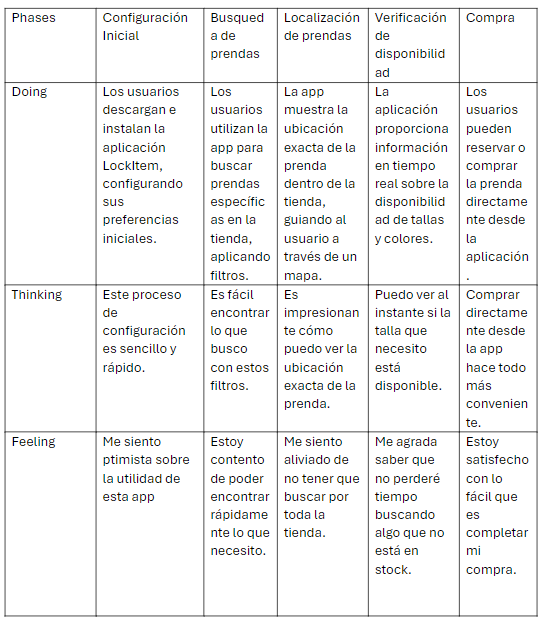
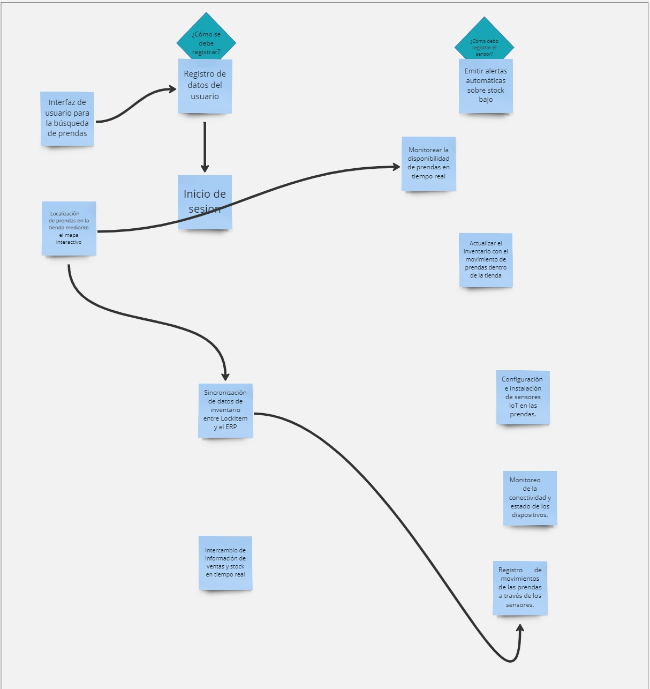
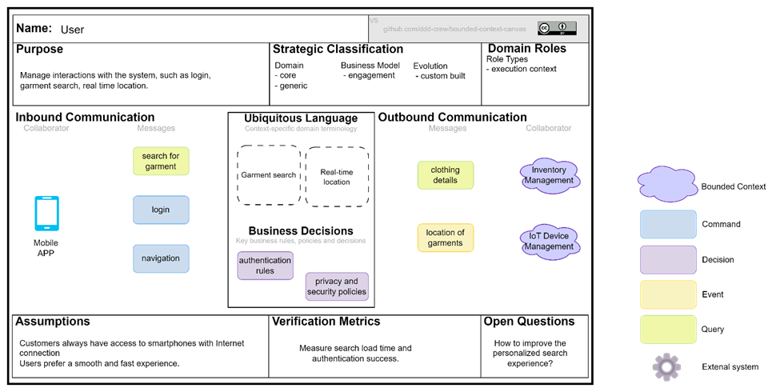
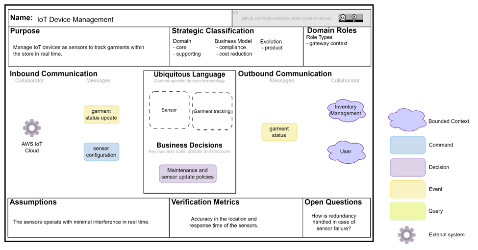
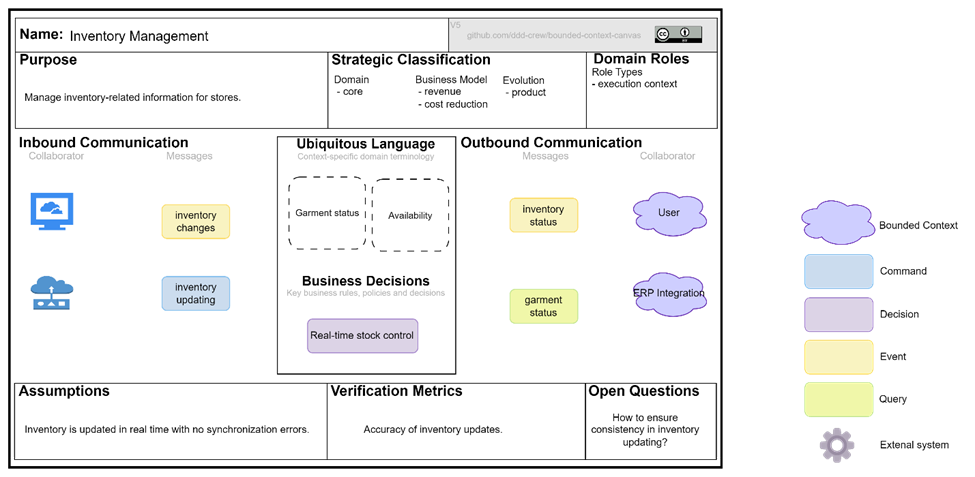
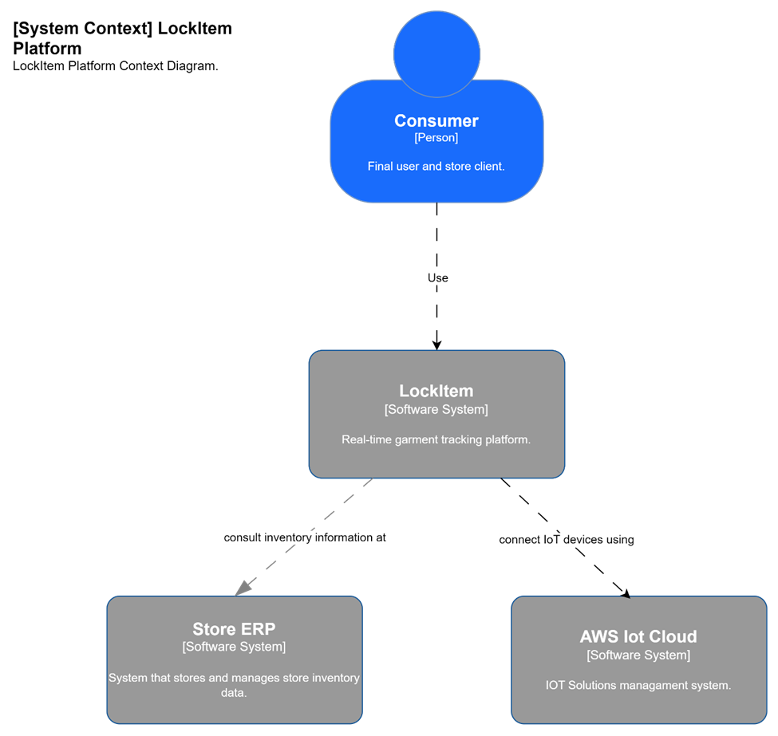
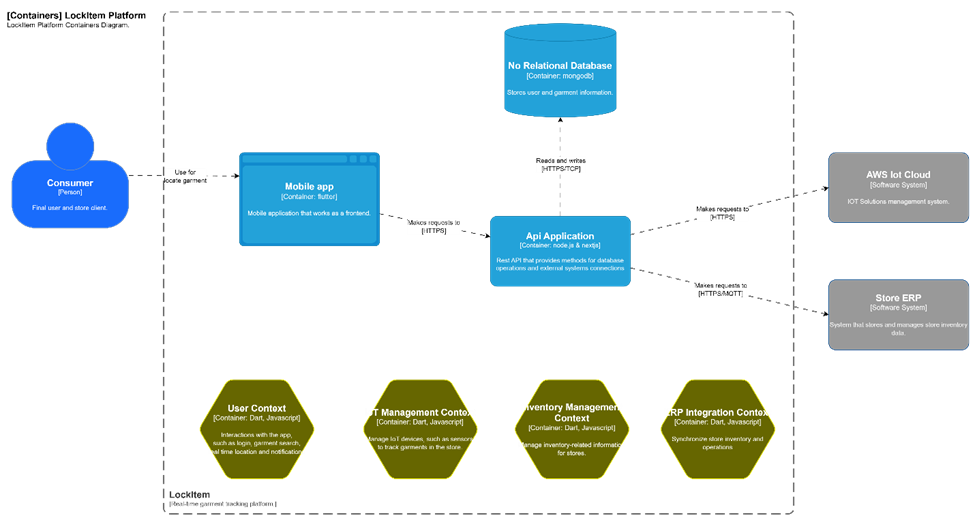
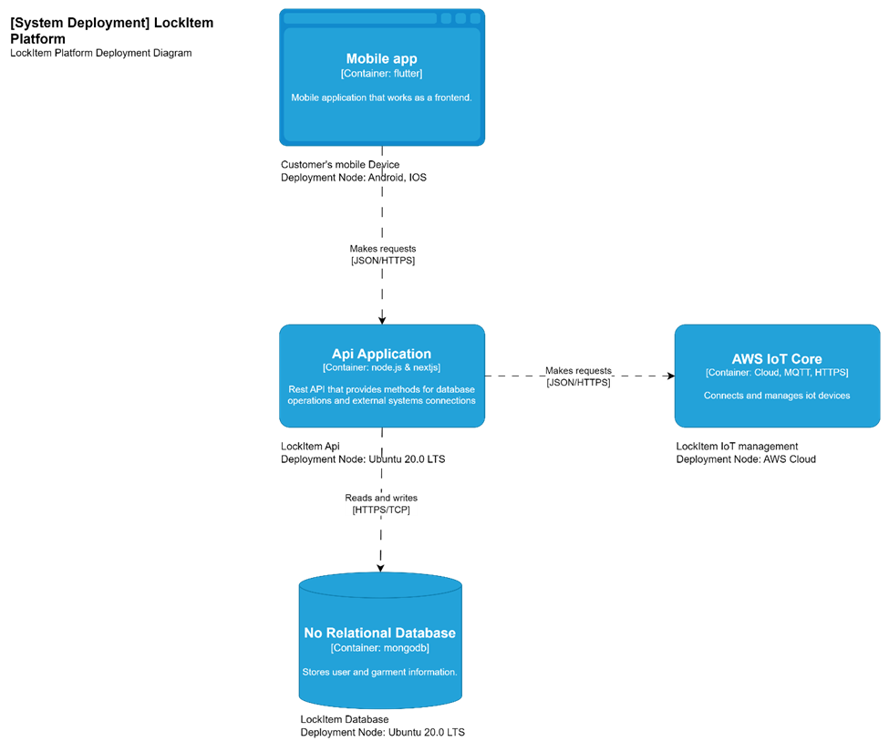

  

<h3 align="center"> Universidad Peruana de Ciencias Aplicadas</h3>
<h4 align="center"> Ingeniería de Software  </h4>
<h4 align="center"> Arquitectura de Foftware Emergentes </h4>
<h4 align="center"> Informe de Trabajo Final </h4>

### Startup: Debuggers
#### Team Members
- Arrunátegui Aguilar, Josué David 
- Causso Mariano, Giakomo Rodolfo
- Chero Eme, Eduardo Andre
- Dávila Ramirez, Yoimer Yanir
- Melgar Takahashi, Adrian Gonzalo
#### Sección: SI728
#### Royer Edelwer Rojas Malasquez
#### Producto: LockItem
#### Ciclo: 2024-02
<h4 align="center"> Agosto, 2024</h4>

___
# Registro de versiones del informe

| Versión | Fecha      | Autor            | Descripción de modificación                                                |
|---------|------------|------------------|----------------------------------------------------------------------------|
| 1.0     | 30/08/24   | Eduardo Chero    | Creación del archivo base en Markdown para el desarrollo del Final Project |
| 1.1     | 05/09/2024 | Adrian Melgar    | Desarrollo del Capítulo 1                                                  |
| 1.2     | 06/09/2024 | Josue Arrunátegui| Desarrollo del Capítulo 2                                                  |
| 1.3     | 07/09/2024 | Giakomo Causso   | Desarrollo del Capítulo 3 - Capitulo 4 hasta 4.1.2.2. Quality attribute Scenarios |
| 1.4     | 07/09/2024 | Eduardo Chero    | Desarrollo del 4.1.2.3. Constraints hasta 4.2.3. Domain Message Flows Modeling |
| 1.5     | 08/09/2024 | Yoimer Dávila    | Desarrollo del 4.2.4. Bounded Context Canvases hasta 4.3.4. Software Architecture Deployment Diagrams |

---
# Contenido 
- [Student Outcome](#student-outcome)
- [Capítulo I: Introducción](#capítulo-i-introducción)
  - [1.1. Startup Profile](#11-startup-profile)
    - [1.1.1. Descripción de la Startup](#111-descripción-de-la-startup)
    - [1.1.2. Perfiles de integrantes del equipo](#112-perfiles-de-integrantes-del-equipo)
  - [1.2. Solution Profile](#12-solution-profile)
    - [1.2.1 Antecedentes y problemática](#121-antecedentes-y-problemática)
    - [1.2.2 Lean UX Process](#122-lean-ux-process)
      - [1.2.2.1. Lean UX Problem Statements](#1221-lean-ux-problem-statements)
      - [1.2.2.2. Lean UX Assumptions](#1222-lean-ux-assumptions)
      - [1.2.2.3. Lean UX Hypothesis Statements](#1223-lean-ux-hypothesis-statements)
      - [1.2.2.4. Lean UX Canvas](#1224-lean-ux-canvas)
  - [1.3. Segmentos objetivo](#13-segmentos-objetivo)
- [Capítulo II: Requirements Elicitation \& Analysis](#capítulo-ii-requirements-elicitation--analysis)
  - [2.1. Competidores](#21-competidores)
    - [2.1.1. Análisis competitivo](#211-análisis-competitivo)
    - [2.1.2. Estrategias y tácticas frente a competidores](#212-estrategias-y-tácticas-frente-a-competidores)
  - [2.2. Entrevistas](#22-entrevistas)
    - [2.2.1. Diseño de entrevistas](#221-diseño-de-entrevistas)
    - [2.2.2. Registro de entrevistas](#222-registro-de-entrevistas)
    - [2.2.3. Análisis de entrevistas](#223-análisis-de-entrevistas)
  - [2.3. Needfinding](#23-needfinding)
    - [2.3.1. User Personas](#231-user-personas)
    - [2.3.2. User Task Matrix](#232-user-task-matrix)
    - [2.3.3. Empathy Mapping](#233-empathy-mapping)
    - [2.3.4. As-is Scenario Mapping](#234-as-is-scenario-mapping)
  - [2.4. Ubiquitous Language](#24-ubiquitous-language)
- [Capítulo III: Requirements Specification](#capítulo-iii-requirements-specification)
  - [3.1. To-Be Scenario Mapping](#31-to-be-scenario-mapping)
  - [3.2. User Stories](#32-user-stories)
  - [3.3. Impact Mapping](#33-impact-mapping)
  - [3.4. Product Backlog](#34-product-backlog)
- [Capítulo IV: Strategic-Level Software Design](#capítulo-iv-strategic-level-software-design)
  - [4.1. Strategic-Level Attribute-Driven Design](#41-strategic-level-attribute-driven-design)
    - [4.1.1. Design Purpose](#411-design-purpose)
    - [4.1.2. Attribute-Driven Design Inputs](#412-attribute-driven-design-inputs)
      - [4.1.2.1. Primary Functionality (Primary User Stories)](#4121-Primary-functionality-(-primary-user-stories-))
      - [4.1.2.2. Quality attribute Scenarios](#4122-quality-attribute-scenarios)
      - [4.1.2.3. Constraints](#4123-constraints)
    - [4.1.3. Architectural Drivers Backlog](#413-architectural-drivers-backlog)
    - [4.1.4. Architectural Design Decisions](#414-architectural-design-decisions)
    - [4.1.5. Quality Attribute Scenario Refinements](#415-quality-attribute-scenario-refinements)
  - [4.2. Strategic-Level Domain-Driven Design](#42-strategic-level-domain-driven-design)
    - [4.2.1. EventStorming](#421-eventstorming)
    - [4.2.2. Candidate Context Discovery](#422-candidate-context-discovery)
    - [4.2.3. Domain Message Flows Modeling](#423-domain-message-flows-modeling)
    - [4.2.4. Bounded Context Canvases](#424-bounded-context-canvases)
    - [4.2.5. Context Mapping](#425-context-mapping)
  - [4.3. Software Architecture](#43-software-architecture)
    - [4.3.1. Software Architecture System Landscape Diagram](#431-software-architecture-system-landscape-diagram)
    - [4.3.2. Software Architecture Context Level Diagrams](#432-software-architecture-context-level-diagrams)
    - [4.3.3. Software Architecture Container Level Diagrams](#433-software-architecture-container-level-diagrams)
    - [4.3.4. Software Architecture Deployment Diagrams](#434-software-architecture-deployment-diagrams)

---

# Student Outcome

| Criterio Específico                                                                             | Acciones Realizadas | Conclusiones |
|-------------------------------------------------------------------------------------------------|---------------------|--------------|
| ABET – EAC - Student Outcome 3: Capacidad de comunicarse efectivamente con un rango de audiencias.                                |  Giakomo Rodolfo Causso Mariano **TB1** La aplicación de la metodología Domain-Driven Design (DDD) durante el desarrollo permitió enfocar el diseño del software en torno a los dominios del negocio de tiendas de ropa. Esto incluyó la creación de modelos de dominio que reflejan fielmente los procesos y necesidades de las tiendas, facilitando así un desarrollo más orientado y coherente con las necesidades reales del usuario final. La colaboración continua con stakeholders del proyecto garantizó que los modelos y el software desarrollado alinearan precisamente con los requisitos y expectativas del negocio.   *Eduardo André Chero Emé* **TB1:** El desarrollo del event Storming nos ayudó para tener una visualizacion más definida de nuestros bounded context para una mejor implementación en el código. Clasificar los escenarios mediante el modelado de Message flows y generar los Bounded Context Canvas nos brindan un mejor entendimiento de las variables, conexiones y propisitos de los bounded context que impementamos.  *Adrian Gonzalo Melgar Takahashi* **TB1:** Durante el desarrollo de mi proyecto, estructuré la comunicación para distintas audiencias. En la Descripción de la Startup y los perfiles del equipo, destaqué información clave para inversionistas y colaboradores. En el Solution Profile, presenté los antecedentes y problemática de forma clara, y en el Lean UX Process, expuse los Problem Statements y Hypothesis Statements de manera visual para facilitar su comprensión por parte de usuarios técnicos y no técnicos. Estas acciones garantizaron una comunicación efectiva y adaptada a cada grupo.                    |     *Eduardo André Chero Emé* **TB1:**  La presente entrega sirvió para validar que la solución propuesta es adecuada para los segmentos objetivo abordados, esto en base al trabajo colaborativo realizado durante las entrevistas y el análisis de estas.  *Adrian Gonzalo Melgar Takahashi* **TB1:**  Las acciones realizadas durante el desarrollo del proyecto permitieron una comunicación efectiva y adaptada a las necesidades de cada audiencia. Desde la presentación clara de la startup y su equipo hasta la exposición visual de los aspectos técnicos en el Lean UX Process, logré transmitir la información de manera precisa y comprensible, lo que contribuyó al entendimiento general del proyecto y facilitó su avance exitoso con el apoyo de todos los involucrados.   Josué David Arrunátegui Aguilar **TB1**  Durante el desarrollo del proyecto LockItem, tuve la oportunidad de comunicarme con diversas audiencias, incluyendo clientes y usuarios finales. Llevé a cabo entrevistas para entender sus necesidades, desarrollé user personas y user task matrices, lo que me permitió adaptar nuestras soluciones a sus expectativas. Esta experiencia me ayudó a transmitir ideas complejas de forma clara, tanto a miembros técnicos del equipo como a personas sin formación técnica, mejorando así la comunicación efectiva en el proyect    Giakomo Rodolfo Causso Mariano  **TB1**  La adopción de DDD mejoró significativamente nuestra precisión en la implementación del software y en la alineación con los objetivos del negocio, asegurando que cada funcionalidad desarrollada proporcionara valor real y tangible a los usuarios finales.Este enfoque destaca cómo una metodología de desarrollo específica puede influir positivamente en la claridad del diseño y la efectividad de la implementación, lo que es relevante para tus criterios de ABET en cuanto a comunicación efectiva y adaptación a un rango de audiencias.           |

---

# Capítulo I: Introducción
## 1.1. Startup Profile
### 1.1.1. Descripción de la Startup

Debuggers ha desarrollado **LockItem**, una solución basada en IoT que permite a los clientes de tiendas de ropa localizar prendas que han sido movidas de su lugar original. Mediante sensores integrados en las etiquetas de seguridad de las prendas, los usuarios pueden acceder al catálogo de la tienda a través de una app móvil, seleccionar el artículo que desean, y recibir la ubicación precisa en tiempo real. Esta tecnología mejora la experiencia de compra al reducir el tiempo de búsqueda y aumenta la eficiencia operativa de las tiendas. 

LockItem, desarrollado por Debuggers, no solo optimiza el flujo de clientes en los establecimientos, sino que también contribuye a una gestión de inventario más efectiva para los minoristas. Al ofrecer una experiencia de compra más fluida y tecnológicamente avanzada, Debuggers se posiciona como un innovador en la transformación digital del sector minorista, conectando el mundo físico y digital a través de soluciones IoT. 

**Misión:**

En Debuggers, nuestra misión es desarrollar soluciones tecnológicas innovadoras que conecten el mundo físico y digital, proporcionando a las empresas minoristas en el Perú herramientas basadas en IoT para una gestión eficiente de productos. Nos enfocamos en mejorar la experiencia de compra de los clientes, optimizando la localización de productos en tiempo real, y ayudando a nuestros socios comerciales a maximizar su eficiencia operativa. 

**Visión:**

Convertirnos en la empresa líder en la implementación de tecnologías IoT para el sector minorista en el Perú, impulsando una transformación digital que permita a las tiendas físicas adaptarse a los desafíos del futuro. Aspiramos a que nuestras soluciones revolucionen la gestión de inventarios y la experiencia de compra, estableciendo nuevos estándares en la industria minorista peruana y contribuyendo al crecimiento de un ecosistema comercial más moderno y eficiente. 

### 1.1.2. Perfiles de integrantes del equipo

| Integrante        | Arrunátegui Aguilar, Josué David                        |
|-------------------|---------------------------------------------------------|
| **Código:** U202111033   **Carrera:** Ingeniería de Software   **Acerca de mí:** Me gusta dibujar, tocar guitarra y jugar videojuegos. Tengo conocimiento en el desarrollo frontend con lenguajes como angular y vue.js, así como desarrollo móvil con flutter. Planeo especializarme en desarrollo web o como Analista de Datos. |  |

| Integrante        | Causso Mariano, Giakomo Rodolfo                         |
|-----|-----------------------------------------------------------------------------|
| **Código:** U202118374     **Carrera:** Ingeniería de Software   **Acerca de mí:** Me gusta programar y en el progreso que obtuve respecto a mis conocimientos académicos, pude aprender lenguajes como Java, JavaScript, C++, C#, SQL, HTML y CSS. Dentro del desarrollo de la carrera de Ingeniería de software puede tener un mayor concepto referente a proyectos y gracias a eso es sido capaz de desarrollar habilidades como el liderazgo, compañerismo, compromiso, responsabilidad y creatividad |  |

| Integrante                                                                                                                                                                                                                                                                                                                               | Chero Eme, Eduardo Andre                                    |
|------------------------------------------------------------------------------------------------------------------------------------------------------------------------------------------------------------------------------------------------------------------------------------------------------------------------------------------|-------------------------------------------------------------|
| **Código:** U20201F282   **Carrera:** Ingeniería de software   **Acerca de mí:** Me gustan los videojuegos y las series, quiero especializarme en ciberseguridad para tener una ganancia estable mientras creo videojuegos aparte por pasión. Con experiencia en backend y en frontend con tecnologias como Spring Boot y Angular. |  |

| Integrante                                                                                                                                                                                                                                                                                  | Dávila Ramirez, Yoimer Yanir                              |
|---------------------------------------------------------------------------------------------------------------------------------------------------------------------------------------------------------------------------------------------------------------------------------------------|-----------------------------------------------------------|
| **Código:**  U20201B973    **Carrera:** Ingeniería de Software   **Acerca de mí:** Soy un apasionado de la programación, la tecnología y los videojuegos. Me encanta explorar nuevas herramientas y lenguajes de programación para resolver problemas de manera creativa y eficiente. |  |

| Integrante                                                                                                                                                                                                                                                                                                                               | Melgar Takahashi, Adrian Gonzalo                                     |
|------------------------------------------------------------------------------------------------------------------------------------------------------------------------------------------------------------------------------------------------------------------------------------------------------------------------------------------|-------------------------------------------------------------|
| **Código:** U201819465   **Carrera:** Ingeniería de software   **Acerca de mí:** Soy un entusiasta de la tecnología en diversas facetas, y también disfruto colaborar en proyectos en equipo. En cuanto a mis habilidades, sobresale mi experiencia en liderazgo, conocimientos en metodologías ágiles, competencia en codificación utilizando lenguajes como HTML, CSS, JavaScript y Python, y experiencia en la gestión de bases de datos como MySQL, SQL Server y MongoDB. |  |

## 1.2. Solution Profile
### 1.2.1 Antecedentes y problemática
El solution profile utilizando la metodología **5W2H** (What, Why, Where, When, Who, How, How much) te ayudará a estructurar claramente tu propuesta de LockItem. A continuación te doy una guía detallada para que puedas desarrollarlo:

**1. What (Qué):** 

LockItem es una solución tecnológica basada en IoT que permite a los clientes localizar prendas de ropa dentro de tiendas físicas, mejorando la experiencia de compra. Utiliza sensores integrados en las etiquetas de seguridad de las prendas para identificar en tiempo real su ubicación dentro de la tienda, y presenta esa información a través de una aplicación móvil conectada. 

**2. Why (Por qué):** 

El problema que se busca resolver es la dificultad que enfrentan los clientes cuando las prendas son movidas de su ubicación original. Esto puede resultar en una experiencia de compra frustrante, pérdida de tiempo y, en algunos casos, en la decisión del cliente de no realizar la compra. Además, ayuda a las tiendas a optimizar la gestión de inventario y mejorar la eficiencia operativa. 

**3. Where (Dónde):** 

LockItem está pensado para el mercado minorista de ropa en el Perú. Las tiendas afiliadas serían aquellas que buscan optimizar la experiencia de compra física mediante tecnología, principalmente en grandes centros comerciales y tiendas de departamentos en áreas urbanas. 

**4. When (Cuándo):**

La solución está diseñada para ser implementada durante las etapas de alta demanda en las tiendas, como temporadas de rebajas, campañas navideñas o de vuelta a clases, cuando la búsqueda de productos es más caótica. Además, puede funcionar de manera continua para mejorar la experiencia del cliente en cualquier momento del año. 

**5. Who (Quiénes):**

Los usuarios principales de LockItem son los clientes de las tiendas afiliadas, quienes podrán localizar sus productos de manera eficiente. Por otro lado, los empleados de las tiendas también se beneficiarán al poder tener un mayor control sobre el inventario en tiempo real. Los socios comerciales incluyen las tiendas minoristas que buscan mejorar la experiencia de compra y optimizar la gestión de sus productos. 

**6. How (Cómo):**

La solución utiliza tecnología IoT mediante sensores instalados en las etiquetas de seguridad de las prendas. Estos sensores están conectados a una plataforma que se integra con una app móvil. Los clientes usan la app para buscar una prenda, y la app les muestra la ubicación exacta dentro de la tienda en tiempo real. Las tiendas afiliadas podrán implementar los sensores en sus sistemas de seguridad y vincularlos a la base de datos de productos. 

**7. How much (Cuánto cuesta):**

El costo del sistema dependerá del tamaño de la tienda y la cantidad de productos a sensar. Se contemplan costos iniciales de implementación de los sensores y la infraestructura IoT, junto con una suscripción mensual o anual para el mantenimiento de la plataforma y la app. Además, el precio puede variar dependiendo del nivel de personalización que requiera cada tienda afiliada. 

### 1.2.2 Lean UX Process
#### 1.2.2.1. Lean UX Problem Statements

**1. Problem Statement (Cliente):** 

Nuestro entorno evidencia que los clientes de tiendas de ropa en Perú a menudo experimentan frustración y descontento al no encontrar las prendas que buscan en su lugar habitual debido a que otros compradores las mueven dentro del establecimiento. Esto no solo genera una mala experiencia de compra, sino que, en algunos casos, los clientes optan por no adquirir el producto y abandonan la tienda sin realizar una compra. 

Hemos observado que un factor crítico que afecta a los clientes es la dificultad para localizar productos dentro de la tienda cuando han sido desplazados, lo que incrementa el tiempo invertido en la búsqueda y disminuye la satisfacción general con la experiencia de compra. 

**¿Cómo podemos diseñar una solución tecnológica que permita a los clientes localizar fácilmente las prendas dentro de la tienda, mejorando así su experiencia de compra y evitando que abandonen sin realizar una compra?**

**2. Problem Statement (Negocio):**

Nuestro entorno evidencia que las tiendas de ropa en Perú enfrentan desafíos para mantener sus prendas organizadas y fácilmente accesibles para los clientes, lo que impacta negativamente en la eficiencia operativa y en las ventas. La dificultad para rastrear el movimiento de las prendas dentro del establecimiento también provoca ineficiencias en la gestión del inventario y una experiencia insatisfactoria para los compradores. 

Hemos observado que un factor crítico que afecta a las tiendas es la incapacidad para monitorear en tiempo real la ubicación de las prendas que han sido movidas, lo que conlleva a pérdidas en ventas y una mayor carga operativa para los empleados encargados de la reubicación de productos. 

**¿Cómo podemos implementar una solución IoT eficiente que permita a las tiendas rastrear el movimiento de las prendas dentro del establecimiento y optimizar la gestión de inventarios mientras se mejora la experiencia del cliente?**

#### 1.2.2.2. Lean UX Assumptions

**Business Assumptions (Suposiciones de Negocio):** 

- Las tiendas minoristas estarán dispuestas a adoptar tecnologías IoT para mejorar la localización de productos, ya que ven valor en optimizar la experiencia de compra y la gestión de inventarios. 

- El mercado minorista en Perú tiene el presupuesto y los recursos para implementar una solución como LockItem, que implica sensores IoT, una app y la integración con sus sistemas de inventario existentes. 

- La mejora en la experiencia de compra llevará a un aumento en las ventas, ya que los clientes que encuentran lo que buscan rápidamente tienen más probabilidades de realizar compras y fidelizarse con la tienda. 

- Las tiendas estarán dispuestas a pagar por una suscripción o servicio continuo para mantener el sistema LockItem funcionando, incluyendo actualizaciones y mantenimiento del sistema. 

- Las tiendas que implementen LockItem mejorarán su competitividad en el mercado peruano, ya que estarán ofreciendo una solución innovadora que optimiza la experiencia del cliente. 

**User Assumptions (Suposiciones de Usuario):**

- Los clientes valoran el tiempo y la eficiencia cuando compran en tiendas físicas y están dispuestos a usar una app móvil que les ayude a localizar rápidamente las prendas que buscan. 

- Los usuarios confían en las soluciones tecnológicas y no tendrán problemas en adoptar la aplicación móvil para mejorar su experiencia de compra, siempre que esta sea intuitiva y fácil de usar. 

- Los clientes están frustrados por no encontrar las prendas en su lugar original, lo que les genera una experiencia de compra insatisfactoria y los motiva a buscar soluciones que mejoren ese aspecto. 

- Los usuarios están familiarizados con las aplicaciones móviles y con las tecnologías de localización, lo que facilitará la adopción de LockItem sin necesidad de un aprendizaje extenso. 

- Los usuarios están dispuestos a proporcionar datos básicos a través de la app (como ubicación en la tienda o preferencias de búsqueda) si esto les permite acceder a una experiencia de compra más eficiente y personalizada. 

#### 1.2.2.3. Lean UX Hypothesis Statements

Las hipótesis son afirmaciones que pueden probarse a través de experimentos y validaciones. Aquí algunas hipótesis para LockItem: 

Creemos que permitir a los clientes localizar rápidamente las prendas que buscan a través de la app será útil para compradores que valoran su tiempo, ya que les permitirá evitar frustraciones y optimizar su proceso de compra. Esto es importante porque facilitará la búsqueda de productos, reduciendo el tiempo en la tienda. Esperamos que esto incremente la satisfacción del cliente y como resultado, observemos un aumento en la probabilidad de compra en un 15%. 

Creemos que integrar sensores IoT en las prendas será beneficioso para los empleados de las tiendas que gestionan inventarios, ya que reducirá el tiempo invertido en reubicar productos y mejorará la precisión de los inventarios. Esto es importante porque permitirá una gestión más eficiente del stock. Esperamos que los empleados puedan dedicar más tiempo a otras tareas importantes y como resultado, se reducirá el tiempo invertido en la reubicación de prendas en un 25%. 

Creemos que proporcionar a las tiendas acceso a datos analíticos sobre el movimiento de productos será útil para los gerentes y encargados de piso, ya que les permitirá reorganizar mejor el espacio de ventas en función del comportamiento del cliente. Esto es importante porque optimizar la disposición de los productos aumentará las interacciones del cliente con los artículos. Esperamos que esto incremente las ventas en las áreas más estratégicas y como resultado, veamos un aumento de las ventas en estas áreas en un 10%. 

Creemos que permitir a los clientes recibir notificaciones sobre la reubicación o disponibilidad de productos en tiempo real será útil para compradores que están interesados en productos específicos, ya que les proporcionará información personalizada. Esto es importante porque ayudará a mantener a los clientes comprometidos con la tienda. Esperamos que esto aumente la frecuencia de visitas de los clientes y como resultado, incrementemos el tráfico en la tienda en un 12%. 

Creemos que mostrar la disponibilidad de tallas y colores en tiempo real en la app será útil para compradores indecisos o que buscan múltiples opciones, ya que podrán verificar la disponibilidad antes de dirigirse a la tienda o probarse las prendas. Esto es importante porque reducirá las consultas al personal de la tienda y acelerará el proceso de compra. Esperamos que esto mejore la eficiencia operativa y como resultado, disminuya las consultas al personal en un 20%. 

#### 1.2.2.4. Lean UX Canvas

Canvas link: [Lockitem canvas](https://miro.com/app/board/uXjVKhk9JzU=/?share_link_id=865796187242)

## 1.3. Segmentos objetivo

**1. Clientes de tiendas de ropa** 

Hombres y mujeres de entre 18 y 45 años, residentes en zonas urbanas de Perú, que prefieren comprar en tiendas físicas y valoran la rapidez y eficiencia al buscar productos. Estos clientes son usuarios familiarizados con smartphones y aplicaciones móviles, y buscan una experiencia de compra fluida y sin frustraciones. Están motivados por el deseo de ahorrar tiempo y obtener un servicio más eficiente mientras realizan sus compras en tiendas de ropa. 

**2. Dueños de tiendas de ropa:** 

Propietarios de tiendas de ropa, hombres y mujeres de entre 21 y 55 años, que buscan optimizar la gestión de sus inventarios y mejorar la experiencia de compra de sus clientes. Están familiarizados con la tecnología y dispuestos a adoptar soluciones innovadoras, como IoT y aplicaciones móviles, para mejorar la eficiencia operativa y aumentar las ventas. Estos dueños están motivados por la necesidad de reducir costos de mano de obra, mejorar el servicio al cliente, y mantenerse competitivos en el mercado minorista peruano. 

# Capítulo II: Requirements Elicitation & Analysis
## 2.1. Competidores

* **Pricer:** Pricer utiliza etiquetas electrónicas de precio (ESL) para ayudar a los minoristas a actualizar precios y gestionar inventarios en tiempo real, mejorando la eficiencia operativa.
* **Neurolabs:** Neurolabs emplea visión artificial y aprendizaje automático para controlar inventarios en tiempo real y predecir el comportamiento de los consumidores sin necesidad de etiquetas físicas.

### 2.1.1. Análisis competitivo

<table border="1" cellpadding="10" cellspacing="0" style="margin-left: auto; margin-right: auto;">
  <tr>
    <th colspan="6">Competitive Analysis Landscape</th>
  </tr>
  <tr>
    <td colspan="2" rowspan="2">¿Por qué llevar a cabo este análisis?</td>
    <td colspan="4">El objetivo que tenemos con este análisis es conocer de mejor manera a nuestra competencia y así poder evaluar nuestras oportunidades y ventajas como empresa buscando poder destacar sobre las otras</td>
  </tr>
  <tr>
    <td colspan="4">¿Qué aporte de valor podría ofrecer nuestro producto en contraste al resto de competidores? </td>
  </tr>
  <tr>
   <td colspan="2"></td>
    <td>LockItem</td>
    <td>Pricer</td>
    <td>Neurolabs</td>
  </tr>
  <tr>
    <td rowspan="2">Perfil</td>
    <td>Overview</td>
    <td>Solución IoT para la localización de productos movidos en tiendas de ropa</td>
    <td>Ofrece etiquetas electrónicas de precios para minoristas</td>
    <td>Utiliza visión artificial para la gestión de inventarios</td>
  </tr>
  <tr>
    <td>Ventaja competitiva ¿Que valor ofrece a los clientes?</td>
    <td>Locaclización en tiempo real mediante sensores IoT en prendas</td>
    <td>Automatización de precios e inventarios, con actualizaciones en tiempo real</td>
    <td>Análisis predictivo y control sin necesidad de etiquetas físicas</td>
  </tr>
  <tr>
    <td rowspan="2">Perfil de Marketing</td>
    <td>Mercado objetivo</td>
    <td>Hombres y mujeres entre 18 y 45 años. Tiendas de ropa en Perú</td>
    <td>Minoristas globales, especialmente supermercados y tiendas grandes</td>
    <td>Minoristas que buscan automatizar la gestión de inventorios sin contacto</td>
  </tr>
  <tr>
    <td>Estrategias de marketing</td>
    <td>Enfocada en la eficiencia operativa y mejora de la experiencia del cliente</td>
    <td>Se posiciona como líder en automatización y eficiencia en minoristas </td>
    <td>Apuesta por la innovación y la automatización sin contacto </td>
  </tr>
  <tr>
    <td rowspan="3">Perfil de Producto</td>
    <td>Productos & Servicios</td>
    <td>Sensores IoT para etiquetas de prendas y app de localización en tiempo real</td>
    <td>Sensores IoT para etiquetas de prendas y app de localización en tiempo rea</td>
    <td>Visión artificial, IA para monitoreo de inventarios y comportamiento</td>
  </tr>
  <tr>
    <td>Precios & Costos</td>
    <td>Costos basados en suscripción y sensores según el tamaño de la tienda </td>
    <td>Dependiendo del tamaño de la tienda y volumen de etiquetas necesarias </td>
    <td>Costo de implementación de IA y software personalizado </td>
  </tr>
  <tr>
    <td>Canales de distribucion (Web y/o Movil)</td>
    <td>App móvil y web para tiendas minoristas </td>
    <td>Plataforma web y hardware de etiquetas electrónicas </td>
    <td>Plataforma basada en web con integración a sistemas de inventario </td>
  </tr>
  <tr>
    <td rowspan="5">Analisis SWOT</td>
    <td colspan="5">Realice esto para su startup y sus competidores. Sus fortalezas deberían apoyar sus
    oportunidades y contribuir a lo que ustedes definen como su posible ventaja
    competitiva. </td>
  </tr>
  <tr>
    <td>Fortalezas</td>
    <td>Integración IoT sencilla con sistema de seguridad; mejora la experiencia de compra</td>
    <td>Reducción de costos operativos, optimización de inventarios y precios en tiempo real </td>
    <td>Automatización sin necesidad de etiquetas, precisión en el monitoreo </td>
  </tr>
  <tr>
    <td>Debilidades</td>
    <td> Dependencia de hardware específico en las tiendas </td>
    <td>Costo elevado de instalación inicial de etiquetas electrónicas </td>
    <td>Necesidad de grandes volúmenes de datos para un análisis preciso </td>
  </tr>
  <tr>
    <td>Oportunidades</td>
    <td>Expansión a otros sectores minoristas más allá de la ropa </td>
    <td>Ampliar el uso de la tecnología a mercados emergentes </td>
    <td>Ampliar la tecnología para otros usos, como la personalización de experiencias </td>
  </tr>
  <tr>
    <td>Amenazas</td>
    <td>Competencia en tecnologías IoT de otros mercados </td>
    <td>Nuevas soluciones de bajo costo en el mercado de etiquetas electrónicas </td>
    <td>Competidores que ofrezcan IA con mejores modelos predictivos </td>
  </tr>
</table>

### 2.1.2. Estrategias y tácticas frente a competidores

* Diferenciar la oferta destacando la integración con sistemas de seguridad, para asegurar la protección de productos en tiendas, además de la localización en tiempo real
* Expandir el mercado objetivo más allá de tiendas de ropa, incluyendo otros sectores minoristas, para diversificar el riesgo y aprovechar nuevas oportunidades
* Fortalecer la experiencia del cliente mediante la mejora continua de la app móvil, asegurando que sea intuitiva y ofrezca funcionalidades adicionales como reportes personalizados
* Desarrollar alianzas estratégicas con proveedores de hardware y software para reducir costos de implementación y mejorar la escalabilidad del sistema
* Innovar en la tecnología IoT de sensores para ofrecer soluciones que requieran menos mantenimiento y sean más adaptables a diferentes entornos de tienda
* Optimizar la estrategia de precios para ofrecer opciones de suscripción flexible, permitiendo a las tiendas ajustar su inversión según el tamaño y el volumen de la tienda

## 2.2. Entrevistas
### 2.2.1. Diseño de entrevistas

**Clientes de tiendas de ropa:**

* ¿Qué desafíos enfrentas cuando buscas una prenda específica en una tienda de ropa?
* ¿Qué aspectos de la experiencia de compra te resultan más frustrantes?
* ¿Utilizas alguna aplicación o herramienta para ayudarte en las compras?
* ¿Qué funcionalidades esperas de una aplicación de tienda para mejorar tu experiencia de compra?
* ¿Qué tan importante es para ti poder localizar rápidamente las prendas en una tienda?
* ¿Cómo crees que la tecnología de localización podría mejorar tu experiencia de compra?
* ¿Qué características considerarías más valiosas en una solución de localización de prendas?
* ¿Qué tipo de información te gustaría recibir en una aplicación de tienda?
* ¿Alguna vez has usado una tecnología similar en tiendas? ¿Cómo fue tu experiencia?
* ¿Qué mejorarías en las soluciones actuales que has visto o usado?

**Dueños de Tiendas de Ropa:**

* ¿Cómo gestionan actualmente el inventario en su tienda?
* ¿Qué desafíos enfrentan con el seguimiento de prendas y el manejo de inventarios?
* ¿Qué tipo de tecnologías utilizan para la gestión de inventarios y la experiencia del cliente?
* ¿Qué tan abiertos están a adoptar nuevas tecnologías como la localización de prendas mediante IoT?
* ¿Cómo creen que una solución de localización de prendas podría beneficiar a su tienda?
* ¿Qué funcionalidades específicas les interesan en una solución de localización?
* ¿Cuál es su presupuesto para nuevas tecnologías y soluciones?
* ¿Cómo evalúan el retorno de inversión (ROI) para la adopción de nuevas tecnologías?
* ¿Qué aspectos consideran cruciales para la implementación de nuevas tecnologías en su tienda?
* ¿Qué tipo de soporte esperan durante y después de la implementación?

### 2.2.2. Registro de entrevistas

**Clientes de tiendas de ropa:**

<table>
  <tr>
    <th>Nombres y Apellidos: </th>
    <th>María Cabrejos</th>
  </tr>
  <tr>
    <td>Edad:</td>
    <td>20</td>
  </tr>
  <tr>
    <td>Dirección:</td>
    <td>Ate, Lima</td>
  </tr>
  <tr>
    <td colspan="2"></td>
  </tr>
  <tr>
    <td colspan="2"><a href="https://www.youtube.com/watch?v=ejemplo" target="_blank">Entrevista sector cliente.mp4</a></td>
  </tr>
  <tr>
    <td colspan="2">Entrevistador: Josué David Arrunátegui Aguilar </td>
  </tr>
  <tr>
    <td colspan="2">Resumen: María Cabrejos, de 20 años, comenta que al comprar ropa enfrenta dificultades para encontrar prendas de su talla y color, sumado a la falta de organización en algunas tiendas. Considera frustrantes las largas filas en probadores y cajas. Aunque no usa aplicaciones de tienda con frecuencia, le gustaría que mejoren la localización de productos, ofrezcan información sobre descuentos y permitan escanear prendas para más detalles. Sugiere mejorar la precisión del inventario en tiempo real y hacer las interfaces más intuitivas para facilitar el proceso de compra. </td>
  </tr>
</table>

**Dueños de Tiendas de Ropa:**

| Atributo                    | Descripción                                                                                                                                                                                                                                                                                                                                                           |
|-----------------------------|-----------------------------------------------------------------------------------------------------------------------------------------------------------------------------------------------------------------------------------------------------------------------------------------------------------------------------------------------------------------------|
| **Nombres y Apellidos**     | Nicole Gallardo                                                                                                                                                                                                                                                                                                                                                      |
| **Edad**                    | 21                                                                                                                                                                                                                                                                                                                                                                   |
| **Dirección**               | San Isidro                                                                                                                                                                                                                                                                                                                                                                    |
| Evidencia               |                                                                                                                                                                                                                                                                                                                                                                |
| **Duración del video**      | 07:20                                                                                                                                                                                                                                                                                                                                                                |
| **URL**                     | [https://youtu.be/VR74CiG1TXQ](https://youtu.be/VR74CiG1TXQ)                                                                                                                                                                                                                                                                                                          |
| **Entrevistador**           | Giakomo Rodolfo Causso Mariano                                                                                                                                                                                                                                                                                                                                       |
| **Resumen**           | Nicole Gallardo, una joven empresaria de San Isidro, Lima, maneja su propia tienda de ropa utilizando software especializado para la gestión de inventarios, complementado ocasionalmente con conteo físico. Los principales desafíos que enfrenta incluyen el robo de inventario y la capacitación del personal en nuevas tecnologías, especialmente durante períodos de alta demanda como fiestas o rebajas. Actualmente, emplea hojas de cálculo y redes sociales para gestionar inventarios y la atención al cliente, respectivamente. Aunque reticente a las innovaciones por los costos adicionales, Nicole está abierta a adoptar tecnologías que mejoren la eficiencia y productividad sin imponer grandes cargas financieras. Ve un valor particular en las soluciones de localización de prendas mediante IoT, que podrían agilizar la localización de productos y mejorar el servicio al cliente. Nicole valora funcionalidades como la sincronización en tiempo real para el registro exacto de ubicaciones de las prendas y una plataforma escalable que se adapte al crecimiento del negocio. Con un presupuesto de inversión de $20 a $70, evalúa nuevas tecnologías considerando su costo-beneficio y la recuperación de la inversión. Para la implementación de nuevas tecnologías, es crucial la seguridad en la migración de datos y el cumplimiento de los objetivos del negocio. Post-implementación, espera un soporte técnico que incluya resolución de problemas, ajustes según pruebas y soporte continuo para la capacitación del personal y actualizaciones del sistema.                                                                                                                                                                                                                                                                                                                                    |

| Atributo                    | Descripción                                                                                                                                                                                                                                                                                                                                                         |
|-----------------------------|---------------------------------------------------------------------------------------------------------------------------------------------------------------------------------------------------------------------------------------------------------------------------------------------------------------------------------------------------------------------|
| **Nombres y Apellidos**     | Araceli Gallardo                                                                                                                                                                                                                                                                                                                                                   |
| **Edad**                    | 20                                                                                                                                                                                                                                                                                                                                                                 |
| **Dirección**               | Comas                                                                                                                                                                                                                                                                                                                                                                 |
| Evidencia               |                                                                                                                                                                                                                                                                                                                                                                |
| **Duración del video**      | 06:36                                                                                                                                                                                                                                                                                                                                                              |
| **URL**                     | [https://youtu.be/xkOpKHlneiI](https://youtu.be/xkOpKHlneiI)                                                                                                                                                                                                                                                                                                        |
| **Entrevistador**           | Giakomo Rodolfo Causso Mariano                                                                                                                                                                                                                                                                                                                                     |
| **Resumen**                 | Aracely Gallardo, quien estudia contabilidad en Comas y dirige una tienda de venta de ropa al por mayor y menor, maneja su inventario con métodos manuales y un software básico. Aunque estos métodos son funcionales, enfrenta desafíos como la lentitud para localizar prendas y desórdenes que afectan la disponibilidad del producto, lo que impacta negativamente en la experiencia del cliente. Interesada en mejorar esta situación, está abierta a adoptar nuevas tecnologías como el IoT para una mejor organización y acceso rápido al stock, tanto para el personal como para los clientes. Evalúa las inversiones en tecnología basándose en su capacidad para aumentar la eficiencia y las ventas, con un presupuesto flexible que se ajusta al impacto esperado de las soluciones. Espera que cualquier nueva tecnología implementada sea eficaz, fácil de usar y mantenga la integridad de los datos importantes, con un soporte técnico que sea eficiente pero no disruptivo. |

### 2.2.3. Análisis de entrevistas

**Clientes de tiendas de ropa:**

Las entrevistas con los clientes revelan que enfrentan dificultades al comprar ropa, principalmente relacionadas con la organización en las tiendas y la localización de prendas. María Cabrejos expresa frustración por no encontrar tallas y colores específicos, además de las largas filas en probadores y cajas, sugiriendo que una aplicación que brinde información precisa sobre inventario y descuentos mejoraría su experiencia de compra. Diego, por su parte, resalta la pérdida de tiempo al buscar productos en la tienda, y ve en una solución tecnológica una forma de agilizar este proceso. En conjunto, estos comentarios destacan la necesidad de una herramienta que optimice la localización de productos y ofrezca una experiencia de compra más eficiente.

**Dueños de tiendas de ropa:**

Los dueños de tiendas de ropa, como Nicole Gallardo, Aracely Gallardo y Piero Palomino, enfrentan desafíos comunes en la gestión de inventarios, destacando problemas como el robo, errores por procesos manuales y la lentitud en la localización de prendas. Mientras Nicole ya utiliza software especializado, valora soluciones IoT que mejoren la precisión y rapidez del inventario en tiempo real, con énfasis en la eficiencia, bajo costo y soporte post-implementación. Aracely, que usa métodos más tradicionales, también ve en la tecnología una oportunidad para optimizar la organización de su tienda, siempre que sea sencilla y rentable. Piero, por su parte, muestra gran interés en adoptar tecnologías IoT, resaltando la importancia de una rápida actualización del inventario y una implementación eficiente que no afecte la experiencia de los clientes. Los tres coinciden en la necesidad de soluciones tecnológicas que mejoren la eficiencia operativa sin generar grandes complicaciones.

## 2.3. Needfinding
### 2.3.1. User Personas

**Clientes de tiendas de ropa**

**Dueños de tiendas de ropa**

### 2.3.2. User Task Matrix

<table>
  <tr>
    <th colspan="3">User Persona 1: Clientes de tiendas de ropa </th>
  </tr>
  <tr>
    <td>Descripción</td>
    <td>Frecuencia</td>
    <td>Importancia</td>
  </tr>
  <tr>
    <td>Buscar prendas específicas en la tienda</td>
    <td>Often</td>
    <td>High</td>
  </tr>
  <tr>
    <td>Recibir alertas de promociones</td>
    <td>Sometime</td>
    <td>Medium</td>
  </tr>
  <tr>
    <td>Obtener información de stock</td>
    <td>Often</td>
    <td>High</td>
  </tr>
</table>

<table>
  <tr>
    <th colspan="3">User Persona 2: Dueños de Tiendas de Ropa</th>
  </tr>
  <tr>
    <td>Descripción</td>
    <td>Frecuencia</td>
    <td>Importancia</td>
  </tr>
  <tr>
    <td>Gestionar el inventario de la tienda</td>
    <td>Often</td>
    <td>High</td>
  </tr>
  <tr>
    <td>Monitorear la ubicación de las prendas</td>
    <td>Often</td>
    <td>High</td>
  </tr>
  <tr>
    <td>Analizar las preferencias de los clientes</td>
    <td>Sometime</td>
    <td>Medium</td>
  </tr>
</table>

### 2.3.3. Empathy Mapping

**Clientes de tiendas de ropa**

**Dueños de tiendas de ropa**

### 2.3.4. As-is Scenario Mapping

**Clientes de tiendas de ropa**

<table>
  <tr>
    <th>Steps</th>
    <th>Buscando una prenda específica en la tienda</th>
    <th>Solicitando ayuda al personal</th>
    <th>Completando la compra o desistiendo</th>
  </tr>
  <tr>
    <td>Doing</td>
    <td>Recorre diferentes áreas de la tienda, deteniéndose a buscar entre varias prendas</td>
    <td>Le pide a un empleado de la tienda que le ayude a localizar el producto específico</td>
    <td>Analiza si el producto encontrado es lo que busca y si su experiencia fue satisfactoria</td>
  </tr>
  <tr>
    <td>Thinking</td>
    <td>Espero que esté disponible</td>
    <td>¿Por qué es tan difícil encontrar lo que necesito?</td>
    <td>¿Debería seguir buscando?</td>
  </tr>
  <tr>
    <td>Feeling</td>
    <td>Frustración</td>
    <td>Esperanza</td>
    <td>Satisfacción o decepción</td>
  </tr>
</table>

**Dueños de tiendas de ropa**

<table>
  <tr>
    <th>Steps</th>
    <th>Supervisando el inventario</th>
    <th>Recibiendo quejas o solicitudes de los clientes</th>
    <th>Evaluando mejoras operativas</th>
  </tr>
  <tr>
    <td>Doing</td>
    <td>Se asegura de que las prendas estén bien distribuidas y visibles en las diferentes secciones</td>
    <td>Responde a los empleados que reportan quejas o problemas con la ubicación de productos</td>
    <td>Observa cómo la falta de organización afecta las ventas y el rendimiento general de la tienda</td>
  </tr>
  <tr>
    <td>Thinking</td>
    <td>¿Cómo puedo mejorar la experiencia de compra?</td>
    <td>Esta situación podría costarnos ventas</td>
    <td>¿Debo invertir en una solución tecnológica?</td>
  </tr>
  <tr>
    <td>Feeling</td>
    <td>Frustración</td>
    <td>Motivación</td>
    <td>Alivio o ansiedad</td>
  </tr>
</table>

## 2.4. Ubiquitous Language
En el contexto de la startup LockItem, se ha definido un lenguaje compartido que permite una mejor comunicación entre desarrolladores, diseñadores, clientes, y usuarios. Estos son algunos de los términos clave:

* **Prenda:** Hace referencia a cualquier tipo de vestimenta disponible en la tienda. Las prendas pueden ser localizadas a través del sistema.
* **Cliente:** Persona que ingresa a la tienda y busca una prenda específica. El cliente puede solicitar ayuda para encontrar el producto que desea.
* **Inventario:** Conjunto de todas las prendas disponibles en la tienda. La gestión del inventario es esencial para asegurar que los productos estén localizados y disponibles para los clientes.
* **Localizador de Prendas:** Sistema que permite a los usuarios, ya sea el personal de la tienda o los clientes, encontrar la ubicación exacta de una prenda en tiempo real dentro de la tienda.
* **Sensor IoT:** Dispositivos instalados en las prendas que permiten el rastreo en tiempo real, ayudando a determinar la ubicación precisa de cada artículo en el inventario.

# Capítulo III: Requirements Specification
## 3.1. To-Be Scenario Mapping
- Segmento de los clientes de tiendas de ropa:

- Segmento de los dueños de tiendas de ropa: 

## 3.2. User Stories

- Epicas

| Epic ID | Título                                 | Descripción                                                                                                         |
|---------|----------------------------------------|---------------------------------------------------------------------------------------------------------------------|
| EP01    | Optimización de la Experiencia de Compra | Como gerente de tienda, quiero que los clientes puedan localizar rápidamente las prendas desplazadas para mejorar la experiencia de compra y aumentar las ventas. |
| EP02    | Gestión de Inventario                  | Como encargado de inventario, necesito una herramienta que me permita rastrear el movimiento de las prendas en tiempo real para mantener el orden y la precisión del inventario. |
| EP03    | Integración Tecnológica                | Como CTO, quiero integrar tecnología IoT dentro de las operaciones de la tienda sin interrumpir las actividades diarias para asegurar una transición suave y funcional. |
| EP04    | Seguridad y Privacidad de Datos        | Como responsable de seguridad, requiero que la aplicación garantice la seguridad de los datos de los usuarios y cumpla con las regulaciones de privacidad. |
| EP05    | Personalización de la Aplicación       | Como usuario, deseo personalizar la aplicación en términos de notificaciones y preferencias de búsqueda para facilitar mi experiencia de compra. |

- UserStories

| User Story ID | Título                            | Descripción                                                                                                     | Criterios de Aceptación                                                                                                                                                                                                                                          | Relacionado con (Epic ID) |
|---------------|-----------------------------------|-----------------------------------------------------------------------------------------------------------------|-----------------------------------------------------------------------------------------------------------------------------------------------------------------------------------------------------------------------------------------------------------------|---------------------------|
| US01          | Localización de prendas           | Como cliente, quiero poder localizar fácilmente prendas específicas usando la app para ahorrar tiempo en la tienda. | Escenario 1: Localizar una prenda. DADO que tengo la app abierta, CUANDO ingreso el nombre de la prenda en la búsqueda, ENTONCES se me muestra la ubicación exacta de la prenda en el mapa de la tienda.                                                           | EP01                      |
| US02          | Notificaciones de disponibilidad  | Como cliente, quiero recibir notificaciones sobre la disponibilidad de prendas que busco.                         | Escenario 1: Recibir notificaciones de disponibilidad. DADO que una prenda buscada está de nuevo en stock, CUANDO la prenda está disponible, ENTONCES recibo una notificación en tiempo real.                                                                   | EP01                      |
| US03          | Búsqueda rápida en la app         | Como cliente, quiero utilizar una función de búsqueda rápida para encontrar prendas en la app.                    | Escenario 1: Búsqueda rápida de prenda. DADO que ingreso el nombre de la prenda en la búsqueda, CUANDO selecciono buscar, ENTONCES los resultados aparecen en menos de 3 segundos.                                                                               | EP01                      |
| US04          | Mapas interactivos de la tienda   | Como cliente, quiero ver un mapa interactivo de la tienda en la app para dirigirme directamente a la prenda deseada. | Escenario 1: Usar el mapa interactivo. DADO que busco la ubicación de una prenda, CUANDO selecciono la prenda en la app, ENTONCES el mapa me guía directamente a su ubicación.                                                                                  | EP01                      |
| US05          | Reserva de prendas                | Como cliente, quiero reservar prendas a través de la app antes de llegar a la tienda.                             | Escenario 1: Reservar una prenda. DADO que encuentro la prenda que quiero, CUANDO selecciono la opción de reservar, ENTONCES la prenda queda reservada bajo mi nombre y recibo una confirmación.                                                                 | EP01                      |
| US06          | Monitor de stock en tiempo real   | Como encargado de inventario, necesito ver el stock actualizado en tiempo real.                                   | Escenario 1: Verificar stock en tiempo real. DADO que accedo al panel de control de inventario, CUANDO consulto el stock de una prenda, ENTONCES veo el número actualizado de unidades disponibles.                                                               | EP02                      |
| US07          | Alertas de stock bajo             | Como encargado de inventario, quiero recibir alertas cuando el stock de ciertas prendas sea bajo.                 | Escenario 1: Recibir alerta de stock bajo. DADO que el stock de una prenda específica baja del mínimo establecido, CUANDO esto sucede, ENTONCES recibo una alerta en la interfaz de la app.                                                                      | EP02                      |
| US08          | Seguimiento de prendas robadas    | Como encargado de seguridad, quiero rastrear las prendas que han sido robadas o perdidas.                         | Escenario 1: Rastrear una prenda robada. DADO que se reporta una prenda como robada, CUANDO consulto el sistema, ENTONCES puedo ver el último lugar donde fue detectada por los sensores.                                                                       | EP02                      |
| US09          | Reportes de inventario            | Como gerente de tienda, quiero generar reportes automáticos de inventario para análisis periódicos.               | Escenario 1: Generar un reporte de inventario. DADO que es fin de mes, CUANDO selecciono generar reporte de inventario, ENTONCES el sistema produce un reporte detallado que puedo exportar.                                                                     | EP02                      |
| US10          | Integración con sistemas ERP      | Como CTO (Chief Technology Officer), quiero que la app se integre con los sistemas ERP existentes para mejorar la gestión de inventario. | Escenario 1: Integrar con ERP. DADO que necesito sincronizar los datos de inventario, CUANDO configuro la integración con el ERP, ENTONCES la app se sincroniza sin errores y soporta las funciones principales del ERP.                                          | EP02                      |
| US11          | Implementación de hardware IoT    | Como técnico, necesito instalar y configurar el hardware IoT sin interrumpir las ventas diarias.                  | Escenario 1: Instalar hardware IoT. DADO que el hardware ha llegado, CUANDO lo instalo durante el horario de menor afluencia, ENTONCES la instalación se completa sin afectar las operaciones de venta.                                                          | EP03                      |
| US12          | Pruebas de sistema en la tienda   | Como ingeniero de pruebas, quiero realizar pruebas de sistema en un entorno de tienda real.                       | Escenario 1: Probar el sistema en la tienda. DADO que el sistema está instalado, CUANDO realizo pruebas funcionales, ENTONCES todas las funciones operan como se espera sin fallos.                                                                               | EP03                      |
| US13          | Soporte técnico continuo          | Como gerente de tienda, quiero garantizar un soporte técnico continuo para la solución IoT.                       | Escenario 1: Obtener soporte técnico. DADO que encuentro un problema técnico, CUANDO contacto al soporte, ENTONCES recibo asistencia en menos de 2 horas.                                                                                                       | EP03                      |
| US14          | Capacitación del personal         | Como gerente de RRHH, quiero que el personal reciba capacitación sobre cómo usar la tecnología IoT.               | Escenario 1: Capacitar al personal. DADO que nuevo hardware ha sido instalado, CUANDO organizo una sesión de capacitación, ENTONCES el personal demuestra comprensión y eficiencia en el uso del sistema.                                                        | EP03                      |
| US15          | Evaluación de impacto tecnológico  | Como CTO, quiero evaluar el impacto de la tecnología IoT en las operaciones diarias de la tienda.                 | Escenario 1: Evaluar el impacto tecnológico. DADO que la tecnología ha sido implementada por un trimestre, CUANDO reviso los reportes de rendimiento, ENTONCES veo mejoras cuantificables en la eficiencia operativa.                                           | EP03                      |
| US16          | Inicio de Sesión Seguro           | Como usuario, quiero iniciar sesión de manera segura para proteger mi cuenta y datos personales.                  | Escenario 1: Iniciar sesión con seguridad. DADO que ingreso mi usuario y contraseña, CUANDO selecciono iniciar sesión, ENTONCES debo recibir una confirmación de acceso seguro.                                                                                  | EP04                      |
| US17          | Cerrar Sesión                     | Como usuario, quiero poder cerrar sesión de manera segura para asegurar que mi cuenta no quede accesible a otros. | Escenario 1: Cerrar sesión de forma segura. DADO que he terminado de usar la aplicación, CUANDO selecciono cerrar sesión, ENTONCES mi sesión debe terminarse y la app debe cerrarse.                                                                            | EP04                      |
| US18          | Gestión de Privacidad de Datos    | Como usuario, quiero gestionar mis preferencias de privacidad para controlar cómo se usan mis datos personales.   | Escenario 1: Ajustar preferencias de privacidad. DADO que accedo a la configuración de mi cuenta, CUANDO modifico mis preferencias de privacidad, ENTONCES los cambios deben guardarse y respetarse.                                                            | EP04                      |
| US19          | Verificación de Seguridad en Cambios Críticos | Como usuario, quiero que se verifiquen los cambios críticos mediante autenticación adicional para aumentar la seguridad. | Escenario 1: Verificar cambios críticos. DADO que intento cambiar información sensible (como mi contraseña), CUANDO envío el cambio, ENTONCES debo ser verificado a través de un segundo factor antes de aplicar el cambio.                               | EP04                      |
| US20          | Alertas de Seguridad               | Como usuario, quiero recibir alertas de seguridad si se detecta actividad sospechosa en mi cuenta.               | Escenario 1: Recibir alertas de actividad sospechosa. DADO que se detecta un intento de inicio de sesión inusual, CUANDO esto ocurre, ENTONCES debo recibir una alerta inmediata para tomar medidas.                                                             | EP04                      |
| US21          | Personalización de notificaciones  | Como usuario, quiero personalizar las notificaciones que recibo para mejorar mi experiencia de uso.               | Escenario 1: Ajustar notificaciones. DADO que quiero controlar las alertas que recibo, CUANDO modifico mis preferencias en la app, ENTONCES las notificaciones se ajustan según mis especificaciones.                                                            | EP05                      |
| US22          | Temas y colores de la app          | Como usuario, quiero cambiar los temas y colores de la app para que se ajuste a mis preferencias visuales.        | Escenario 1: Cambiar tema de la app. DADO que deseo personalizar la interfaz, CUANDO selecciono un nuevo tema en la configuración, ENTONCES la app refleja mi elección inmediatamente.                                                                          | EP05                      |
| US23          | Configuración de perfil            | Como usuario nuevo, quiero configurar mi perfil fácilmente para comenzar a usar la app rápidamente.              | Escenario 1: Configurar perfil. DADO que estoy configurando mi perfil por primera vez, CUANDO ingreso mi información básica, ENTONCES la app guarda mi perfil sin errores.                                                                                     | EP05                      |
| US24          | Favoritos y listas de deseos       | Como cliente, quiero guardar prendas en favoritos o listas de deseos para acceder a ellas rápidamente en futuras visitas. | Escenario 1: Añadir prendas a favoritos. DADO que encuentro una prenda que me gusta, CUANDO la añado a mi lista de deseos, ENTONCES puedo acceder a ella rápidamente desde mi perfil.                                                                        | EP05                      |
| US25          | Feedback y valoraciones            | Como usuario, quiero dejar feedback y valorar la app para compartir mi experiencia con otros usuarios.            | Escenario 1: Dejar feedback. DADO que he usado la app y quiero compartir mi experiencia, CUANDO escribo una reseña y la califico, ENTONCES otros usuarios pueden ver mi feedback en la app.                                                                    | EP05                      |

## 3.3. Impact Mapping

## 3.4. Product Backlog

| Orden | User Story ID                              | Description                                                                          | Story Points (1 / 2 / 3 / 5 / 8) |
|-------|--------------------------------------------|--------------------------------------------------------------------------------------|----------------------------------|
| 1     | Implementación de Autenticación Segura     | Desarrollar un sistema de autenticación robusto con multi-factor.                    | 8                                |
| 2     | Gestión de Inventario en Tiempo Real       | Permitir a las tiendas visualizar y gestionar el inventario en tiempo real.         | 8                                |
| 3     | Alertas de Stock Bajo                      | Configurar alertas automáticas para cuando el inventario de ciertas prendas esté bajo. | 5                              |
| 4     | Localización de Prendas                    | Desarrollar la funcionalidad para que los clientes puedan localizar prendas mediante la app. | 8                              |
| 5     | Integración con ERP (Enterprise Resource Planning) | Integrar la solución LockItem con sistemas ERP de las tiendas.                       | 8                                |
| 6     | Reportes de Ventas y Análisis              | Generar reportes automatizados de ventas y ofrecer análisis de tendencias.           | 5                                |
| 7     | Personalización de la Aplicación           | Permitir a los usuarios personalizar la interfaz y las notificaciones de la app.    | 3                                |
| 8     | Sistema de Reservas de Prendas             | Desarrollar un sistema para que los clientes puedan reservar prendas a través de la app. | 5                              |
| 9     | Auditorías de Seguridad                    | Implementar auditorías de seguridad regulares y correcciones basadas en sus resultados. | 5                              |
| 10    | Soporte Técnico Continuo                   | Establecer un servicio de soporte técnico 24/7 para las tiendas.                     | 3                                |
| 11    | Capacitación del Personal                  | Desarrollar materiales y sesiones de capacitación para el personal de las tiendas sobre cómo utilizar LockItem. | 2    |
| 12    | Mejoras de UI/UX                           | Mejorar la interfaz de usuario y la experiencia del usuario basada en el feedback de los usuarios. | 5                                |
| 13    | Actualizaciones de Seguridad               | Implementar actualizaciones de seguridad para proteger los datos de los usuarios.    | 5                                |
| 14    | Cifrado de Datos                           | Asegurar que todos los datos sensibles estén cifrados tanto en tránsito como en reposo. | 8                              |
| 15    | Monitoreo de Actividad del Usuario         | Desarrollar herramientas para que los gerentes puedan monitorear la actividad de los usuarios en la app | 3                              |

# Capítulo IV: Strategic-Level Software Design
## 4.1. Strategic-Level Attribute-Driven Design

El objetivo es diseñar una solución que mejore la experiencia de compra en tiendas de ropa mediante el uso de tecnología IoT para la localización precisa de prendas. Esto no solo facilitará la búsqueda de productos por parte de los clientes, sino que también optimizará la gestión de inventarios y la operación general de las tiendas. 

### 4.1.1. Design Purpose

El propósito del diseño de LockItem es desarrollar una solución que integra tecnología IoT con la experiencia de compra en tiendas de ropa, abordando desafíos específicos que afectan tanto a clientes como a los operadores de las tiendas. Este diseño busca resolver dos problemas principales: 

1. Dificultad de los Clientes para Localizar Prendas: Frecuentemente, las prendas de ropa no se encuentran en su lugar esperado debido a que otros clientes las mueven. Esto puede llevar a una experiencia de compra frustrante y a un aumento en el tiempo que los clientes pasan en la tienda, lo cual a veces resulta en la pérdida de ventas cuando los clientes deciden no realizar una compra. 

2. Gestión Ineficiente del Inventario por Parte de las Tiendas: La dificultad para rastrear el movimiento de las prendas dentro de la tienda conlleva a ineficiencias en la gestión del inventario y requiere un esfuerzo adicional del personal para reorganizar las prendas. 

Objetivos del Diseño: 

- Mejorar la Experiencia de Compra del Cliente: Mediante sensores integrados en las etiquetas de seguridad (piochas), LockItem permitirá a los clientes localizar rápidamente cualquier prenda a través de una aplicación móvil, mostrando su ubicación exacta dentro de la tienda en tiempo real. 

- Optimizar la Gestión de Inventario: La solución proporcionará a las tiendas una herramienta efectiva para monitorear la ubicación de las prendas en tiempo real, mejorando la precisión del inventario y reduciendo el tiempo necesario para gestionarlo. 

- Integración con Sistemas Existentes: LockItem se diseñará para integrarse sin problemas con los sistemas ERP (Enterprise Resource Planning) de las tiendas, asegurando que la información del inventario esté siempre actualizada y sea accesible. 

Beneficios Esperados: 

- Reducción en el Tiempo de Búsqueda de los Clientes: Al proporcionar a los clientes una herramienta para localizar rápidamente las prendas, esperamos reducir significativamente el tiempo que pasan en la tienda, mejorando así su satisfacción y aumentando las probabilidades de que realicen compras. 

- Eficiencia Operativa Mejorada: Con mejor visibilidad del inventario y menor necesidad de reorganización manual, las tiendas pueden operar más eficientemente, lo que se traduce en costos operativos reducidos y menos errores en el manejo del inventario. 

- Experiencia de Compra Mejorada: Al eliminar uno de los principales puntos de fricción en la experiencia de compra en tiendas de ropa, LockItem ayudará a mejorar la satisfacción general del cliente, incentivando a los clientes a volver y potencialmente aumentando la fidelidad del cliente. 

Este diseño se alinea estrechamente con la misión de Debuggers de proporcionar soluciones tecnológicas innovadoras que conectan el mundo físico y digital, mejorando las operaciones de las empresas minoristas y la experiencia de sus clientes. 

### 4.1.2. Attribute-Driven Design Inputs

La metodología de diseño basada en atributos (ADD) es fundamental para asegurar que la solución LockItem sea robusta, escalable y satisfaga las necesidades tanto de los usuarios finales como de las tiendas asociadas. Esta sección describe los tres tipos de inputs utilizados en el proceso de ADD para el diseño de LockItem, cada uno enfocado en distintos aspectos críticos del sistema. 

Inputs para el Proceso de Diseño con ADD: 

- Funcionalidad Primaria (Historias de Usuario Primarias) 

- Escenarios de Atributos de Calidad 

- Restricciones 

#### 4.1.2.1. Primary Functionality (Primary User Stories)

| Epic / User Story ID | Título                         | Descripción                                                                      | Criterios de Aceptación                                                                                                                       | Relacionado con (Epic ID) |
|----------------------|--------------------------------|----------------------------------------------------------------------------------|----------------------------------------------------------------------------------------------------------------------------------------------|---------------------------|
| US01                 | Localización de prendas        | Como cliente, quiero poder localizar fácilmente prendas específicas usando la app para ahorrar tiempo en la tienda. | Escenario 1: Localizar una prenda. DADO que tengo la app abierta, CUANDO ingreso el nombre de la prenda en la búsqueda, ENTONCES se me muestra la ubicación exacta de la prenda en el mapa de la tienda. | EP01                      |
| US06                 | Monitor de stock en tiempo real | Como encargado de inventario, necesito ver el stock actualizado en tiempo real.  | Escenario 1: Verificar stock en tiempo real. DADO que accedo al panel de control de inventario, CUANDO consulto el stock de una prenda, ENTONCES veo el número actualizado de unidades disponibles.  | EP02                      |

#### 4.1.2.2. Quality attribute Scenarios

| Atributo      | Fuente    | Estímulo                           | Artefacto         | Entorno            | Respuesta                                       | Medida                             |
|---------------|-----------|------------------------------------|-------------------|--------------------|-------------------------------------------------|------------------------------------|
| Rendimiento   | Usuario   | Solicitud de localización de prenda | Sistema LockItem  | App en tiempo real | Mostrar ubicación en menos de 2 segundos        | Tiempo de respuesta < 2 segundos   |
| Seguridad     | Ataque externo | Intento de acceso no autorizado     | Servidor de datos | Operación normal   | Bloqueo de acceso y alerta al administrador     | Tiempo de detección < 1 minuto     |
| Disponibilidad| Sistema   | Fallo de un servidor                | Servidores        | Operación bajo carga | Re-direccionamiento a servidor backup          | Recuperación < 10 segundos         |
| Usabilidad    | Cliente   | Interacción con la interfaz         | App móvil         | Uso diario         | Interfaz intuitiva y responsive                 | Tasa de error < 1%                 |
| Escalabilidad | Crecimiento del sistema | Aumento en el número de usuarios | Sistema LockItem  | Expansión comercial | Escalar automáticamente sin degradar el rendimiento | Tiempo de escalado < 5 minutos   |

#### 4.1.2.3. Constraints

<table border="1" cellpadding="10">
  <thead>
    <tr>
      <th>Technical Story ID</th>
      <th>Título</th>
      <th>Descripción</th>
      <th>Criterios de Aceptación</th>
      <th>Relacionado con (Epic ID)</th>
    </tr>
  </thead>
  <tbody>
    <tr>
      <td>CS01</td>
      <td>Seguridad de Datos</td>
      <td>La seguridad es una prioridad. La información del cliente y del inventario debe ser protegida contra accesos no autorizados y cumplir con las normativas de protección de datos locales (GDPR/LPDP).</td>
      <td>DADO que un intento de acceso no autorizado es detectado, ENTONCES el sistema debe bloquear el acceso y notificar al administrador en menos de 1 minuto.</td>
      <td>EP02</td>
    </tr>
    <tr>
      <td>CS02</td>
      <td>Rendimiento de Respuesta</td>
      <td>El sistema debe ser capaz de responder rápidamente a las solicitudes de localización de prendas, sin comprometer la experiencia de usuario, independientemente de la carga del sistema.</td>
      <td>DADO que un cliente busque una prenda en la app, ENTONCES la ubicación debe mostrarse en menos de 2 segundos bajo condiciones normales de operación.</td>
      <td>EP01</td>
    </tr>
    <tr>
      <td>CS03</td>
      <td>Alta Disponibilidad</td>
      <td>El sistema debe asegurar alta disponibilidad, garantizando que la aplicación esté operativa incluso en casos de fallos de servidores o incrementos repentinos de tráfico.</td>
      <td>DADO que falle un servidor, ENTONCES el sistema debe redirigir las operaciones a un servidor de respaldo en menos de 10 segundos para asegurar continuidad de servicio.</td>
      <td>EP02</td>
    </tr>
    <tr>
      <td>CS04</td>
      <td>Escalabilidad Automática</td>
      <td>El sistema debe escalar automáticamente para soportar incrementos en el número de usuarios, asegurando un desempeño continuo sin degradación, particularmente durante eventos de alto tráfico como promociones o rebajas.</td>
      <td>DADO que el número de usuarios del sistema aumente significativamente, ENTONCES la infraestructura debe escalar automáticamente sin afectar el tiempo de respuesta, en menos de 5 minutos.</td>
      <td>EP02</td>
    </tr>
    <tr>
      <td>CS05</td>
      <td>Integración con Sistemas ERP</td>
      <td>El sistema debe integrarse de manera fluida con los sistemas ERP existentes en las tiendas, garantizando que los datos de inventario estén siempre sincronizados y actualizados en tiempo real.</td>
      <td>DADO que se realice una operación de inventario en el sistema ERP, ENTONCES los cambios deben reflejarse en el sistema <strong>LockItem</strong> en menos de 10 segundos.</td>
      <td>EP02</td>
    </tr>
    <tr>
      <td>CS06</td>
      <td>Compatibilidad de Dispositivos</td>
      <td>La aplicación móvil debe ser compatible con una amplia gama de dispositivos móviles y sistemas operativos para maximizar la cantidad de usuarios potenciales.</td>
      <td>DADO que un cliente utilice la app en dispositivos Android o iOS, ENTONCES la app debe funcionar de manera fluida y sin errores, manteniendo la interfaz responsive en todos los casos.</td>
      <td>EP01</td>
    </tr>
  </tbody>
</table>

### 4.1.3. Architectural Drivers Backlog

<table border="1" cellpadding="10">
  <thead>
    <tr>
      <th>Driver ID</th>
      <th>Título de Driver</th>
      <th>Descripción</th>
      <th>Importancia para Stakeholders</th>
      <th>Impacto en Architecture Technical Complexity</th>
    </tr>
  </thead>
  <tbody>
    <tr>
      <td>AD01</td>
      <td>Rendimiento en la Localización de Prendas</td>
      <td>El sistema debe permitir la localización rápida y precisa de prendas para mejorar la experiencia del cliente, mostrando la ubicación en menos de 2 segundos.</td>
      <td>High</td>
      <td>High</td>
    </tr>
    <tr>
      <td>AD02</td>
      <td>Seguridad de Datos</td>
      <td>La protección de la información del cliente y del inventario es crítica, cumpliendo con las normativas de privacidad y bloqueando accesos no autorizados.</td>
      <td>High</td>
      <td>High</td>
    </tr>
    <tr>
      <td>AD03</td>
      <td>Alta Disponibilidad</td>
      <td>El sistema debe asegurar su operatividad continua, incluso en caso de fallos de servidor o sobrecarga de tráfico, garantizando un tiempo de recuperación menor a 10 segundos.</td>
      <td>High</td>
      <td>High</td>
    </tr>
    <tr>
      <td>AD04</td>
      <td>Escalabilidad Automática</td>
      <td>La infraestructura debe escalar automáticamente para soportar aumentos en el número de usuarios sin afectar el rendimiento.</td>
      <td>Medium</td>
      <td>High</td>
    </tr>
    <tr>
      <td>AD05</td>
      <td>Integración con ERP</td>
      <td>El sistema debe integrarse con los sistemas ERP existentes en las tiendas, sincronizando el inventario en tiempo real con un desfase máximo de 10 segundos.</td>
      <td>High</td>
      <td>Medium</td>
    </tr>
    <tr>
      <td>AD06</td>
      <td>Compatibilidad con Dispositivos Móviles</td>
      <td>La app móvil debe ser compatible con una amplia gama de dispositivos, incluyendo sistemas operativos Android e iOS, y ofrecer una interfaz fluida y responsive.</td>
      <td>Medium</td>
      <td>Medium</td>
    </tr>
    <tr>
      <td>AD07</td>
      <td>Monitoreo de Stock en Tiempo Real</td>
      <td>El sistema debe mostrar el stock actualizado en tiempo real, permitiendo a los operadores ver la cantidad exacta de prendas disponibles en todo momento.</td>
      <td>Medium</td>
      <td>Medium</td>
    </tr>
  </tbody>
</table>

### 4.1.4. Architectural Design Decisions

<table border="1" cellpadding="10">
  <thead>
    <tr>
      <th>Driver ID</th>
      <th>Título de Driver</th>
      <th>Pattern 1</th>
      <th>Pro</th>
      <th>Con</th>
      <th>Pattern 2</th>
      <th>Pro</th>
      <th>Con</th>
      <th>Pattern 3</th>
      <th>Pro</th>
      <th>Con</th>
    </tr>
  </thead>
  <tbody>
    <tr>
      <td>AD01</td>
      <td>Rendimiento en la Localización de Prendas</td>
      <td>Event-Driven Architecture</td>
      <td>Alta capacidad de respuesta</td>
      <td>Complejidad en el manejo de eventos</td>
      <td>Microservices</td>
      <td>Escalabilidad independiente</td>
      <td>Mayor complejidad de gestión</td>
      <td>Monolithic</td>
      <td>Simplicidad de implementación</td>
      <td>Escalabilidad limitada</td>
    </tr>
    <tr>
      <td>AD02</td>
      <td>Seguridad de Datos</td>
      <td>Layered Security</td>
      <td>Defensa en profundidad</td>
      <td>Mayor coste de implementación</td>
      <td>Token-Based Authentication</td>
      <td>Menor latencia en autenticación</td>
      <td>Complejidad de integración</td>
      <td>OAuth 2.0</td>
      <td>Estándar ampliamente adoptado</td>
      <td>Configuración compleja</td>
    </tr>
    <tr>
      <td>AD03</td>
      <td>Alta Disponibilidad</td>
      <td>Load Balancing</td>
      <td>Distribución eficiente de tráfico</td>
      <td>Configuración inicial compleja</td>
      <td>Failover Clustering</td>
      <td>Redundancia de servidores</td>
      <td>Costo adicional en infraestructura</td>
      <td>Redundancy via Replication</td>
      <td>Alta disponibilidad de datos</td>
      <td>Sincronización lenta en grandes volúmenes</td>
    </tr>
    <tr>
      <td>AD04</td>
      <td>Escalabilidad Automática</td>
      <td>Horizontal Scaling</td>
      <td>Escalabilidad flexible</td>
      <td>Mayor complejidad de orquestación</td>
      <td>Vertical Scaling</td>
      <td>Simplicidad en administración</td>
      <td>Limitaciones físicas del hardware</td>
      <td>Containerization</td>
      <td>Implementación ágil y flexible</td>
      <td>Mayor uso de recursos</td>
    </tr>
    <tr>
      <td>AD05</td>
      <td>Integración con ERP</td>
      <td>RESTful API</td>
      <td>Interoperabilidad sencilla</td>
      <td>Limitaciones en manejo de grandes datos</td>
      <td>Message Queues</td>
      <td>Desacoplamiento de servicios</td>
      <td>Mayor latencia en la comunicación</td>
      <td>SOAP</td>
      <td>Estándar robusto</td>
      <td>Mayor sobrecarga en mensajes</td>
    </tr>
  </tbody>
</table>

### 4.1.5. Quality Attribute Scenario Refinements

## 4.2. Strategic-Level Domain-Driven Design
### 4.2.1. EventStorming

### 4.2.2. Candidate Context Discovery
Paso 1:  

Paso 2: 

Paso 3: 

Paso 4: 

Paso 5: 

Paso 6: 

Paso 7: 

### 4.2.3. Domain Message Flows Modeling
Escenario: Buscar Prenda  
  
Escenario: Ver Detalle Prenda  
  
Escenario: Localizar Prenda   
  
### 4.2.4. Bounded Context Canvases
#### User bounded context canvas

#### Iot device management bounded context canvas

#### Inventory management bounded context canvas

#### ERP integration bounded context canvas

### 4.2.5. Context Mapping
## 4.3. Software Architecture
### 4.3.1. Software Architecture System Landscape Diagram

### 4.3.2. Software Architecture Context Level Diagrams

### 4.3.3. Software Architecture Container Level Diagrams

### 4.3.4. Software Architecture Deployment Diagrams

